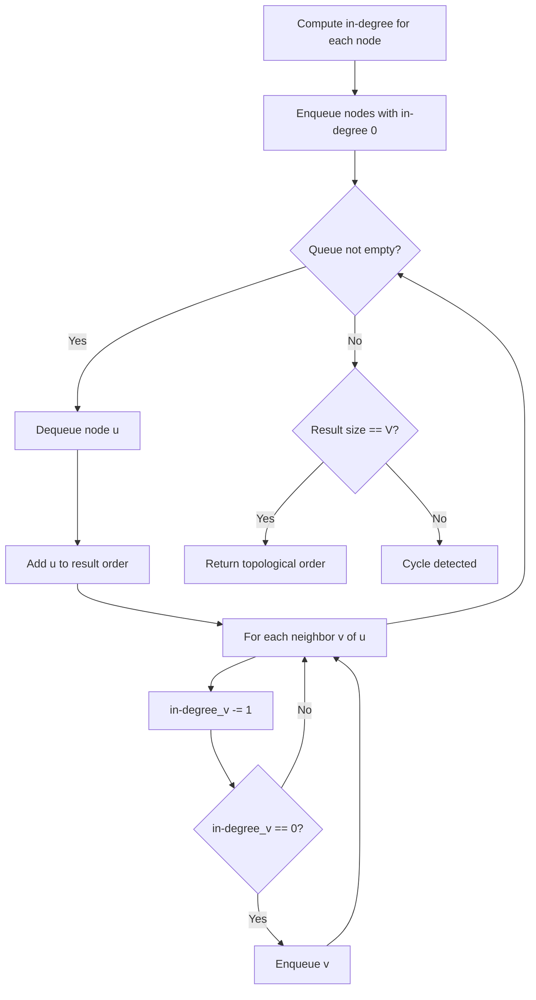
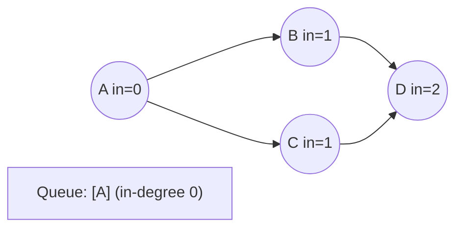
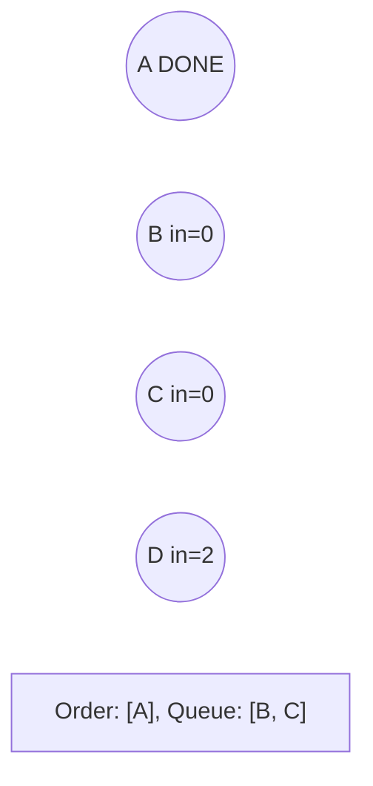
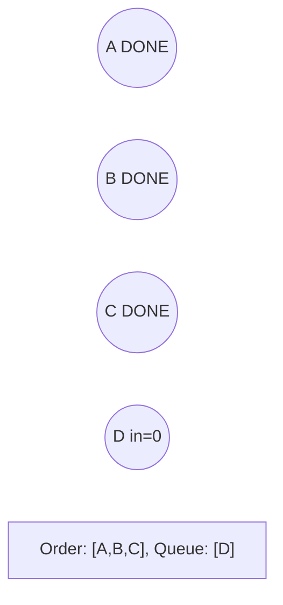
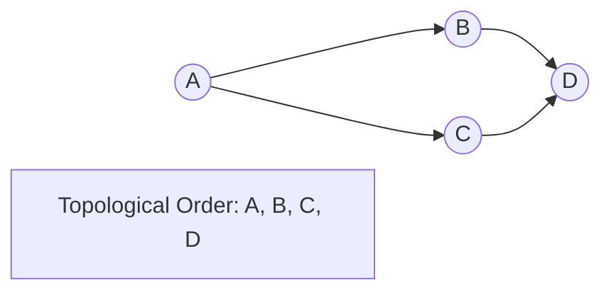

# Problem 210: Course Schedule II

**Difficulty:** Medium  
**Tags:** Depth-First Search, Breadth-First Search, Graph Theory, Topological Sort  
**Pattern:** Topological Sort  
**Link:** [leetcode.com/problems/course-schedule-ii](https://leetcode.com/problems/course-schedule-ii/)

## Description

There are a total of `numCourses` courses you have to take, labeled from `0` to `numCourses - 1`. You are given an array `prerequisites` where `prerequisites[i] = [ai, bi]` indicates that you **must** take course `bi` first if you want to take course `ai`.

	- For example, the pair `[0, 1]`, indicates that to take course `0` you have to first take course `1`.

Return *the ordering of courses you should take to finish all courses*. If there are many valid answers, return **any** of them. If it is impossible to finish all courses, return **an empty array**.

 

Example 1:

```

**Input:** numCourses = 2, prerequisites = [[1,0]]
**Output:** [0,1]
**Explanation:** There are a total of 2 courses to take. To take course 1 you should have finished course 0. So the correct course order is [0,1].

```

Example 2:

```

**Input:** numCourses = 4, prerequisites = [[1,0],[2,0],[3,1],[3,2]]
**Output:** [0,2,1,3]
**Explanation:** There are a total of 4 courses to take. To take course 3 you should have finished both courses 1 and 2. Both courses 1 and 2 should be taken after you finished course 0.
So one correct course order is [0,1,2,3]. Another correct ordering is [0,2,1,3].

```

Example 3:

```

**Input:** numCourses = 1, prerequisites = []
**Output:** [0]

```

 

**Constraints:**

	- `1 <= numCourses <= 2000`
	- `0 <= prerequisites.length <= numCourses * (numCourses - 1)`
	- `prerequisites[i].length == 2`
	- `0 <= ai, bi < numCourses`
	- `ai != bi`
	- All the pairs `[ai, bi]` are **distinct**.

## Approach: Topological Sort

Order nodes in a DAG so every edge u->v has u before v. Use Kahn's algorithm (BFS with in-degree tracking) or DFS-based ordering.

## Pseudocode

```
1. Compute in-degree for every node
2. Enqueue all nodes with in-degree 0
3. While queue not empty:
   a. Dequeue node u, add to result order
   b. For each neighbor v of u:
      - Decrease in-degree of v
      - If in-degree becomes 0: enqueue v
4. If result size != V: cycle exists
5. Return topological order
```

## Algorithm Flow



## Visual State Transitions

**Topological Sort (Kahn's Algorithm):**

**Frame 1: Compute in-degrees**


**Frame 2: Process A, reduce neighbors**


**Frame 3: Process B and C**


**Frame 4: Complete**



## Complexity Analysis

- **Time:** O(V + E)
- **Space:** O(V + E)

## Solution (Python3)

```python
class Solution:
    def findOrder(self, numCourses: int, prerequisites: List[List[int]]) -> List[int]:
        # Topological sort (Kahn's algorithm) - O(V+E)
        from collections import deque, defaultdict
        graph = defaultdict(list)
        n = numCourses if isinstance(numCourses, int) else len(numCourses)
        indegree = [0] * n
        # Build graph from prerequisites
        prereqs = prerequisites if isinstance(prerequisites, list) else numCourses
        for edge in prereqs:
            if isinstance(edge, (list, tuple)) and len(edge) >= 2:
                graph[edge[1]].append(edge[0])
                indegree[edge[0]] += 1
        queue = deque([i for i in range(n) if indegree[i] == 0])
        order = []
        while queue:
            node = queue.popleft()
            order.append(node)
            for neighbor in graph[node]:
                indegree[neighbor] -= 1
                if indegree[neighbor] == 0:
                    queue.append(neighbor)
        return len(order) == n if isinstance([], bool) else order
```

## Solution (C++)

```cpp
#include <queue>
#include <string>
#include <vector>
using namespace std;

class Solution {
public:
    vector<int> findOrder(int numCourses, vector<vector<int>>& prerequisites) {
        // Topological sort (Kahn's) - O(V+E)
        int n = numCourses;
        vector<vector<int>> graph(n);
        vector<int> indegree(n, 0);
        for (auto& edge : prerequisites) {
            graph[edge[1]].push_back(edge[0]);
            indegree[edge[0]]++;
        }
        queue<int> q;
        for (int i = 0; i < n; i++)
            if (indegree[i] == 0) q.push(i);
        vector<int> order;
        while (!q.empty()) {
            int node = q.front(); q.pop();
            order.push_back(node);
            for (int neighbor : graph[node]) {
                if (--indegree[neighbor] == 0) q.push(neighbor);
            }
        }
        return order.size() == n;
    }
};
```
