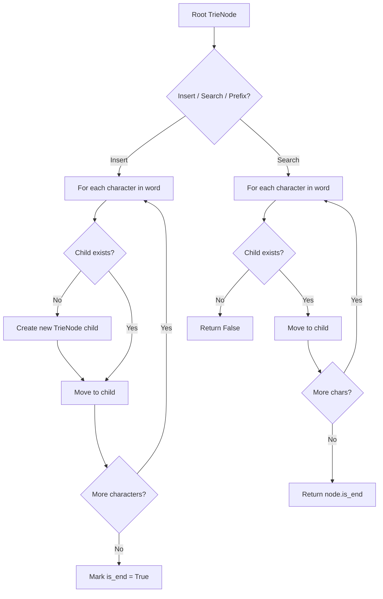
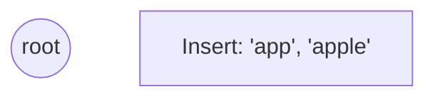
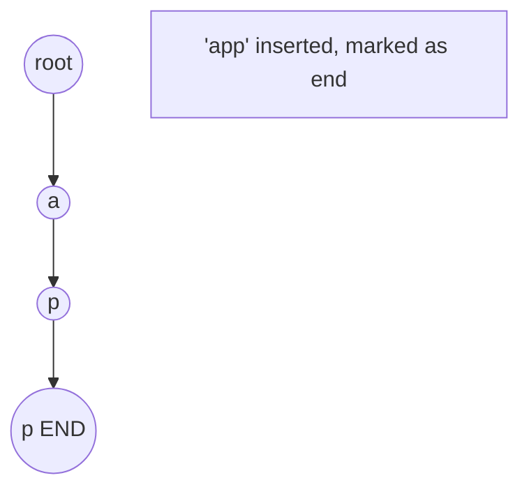
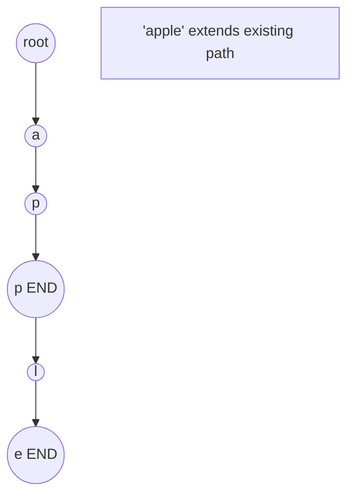
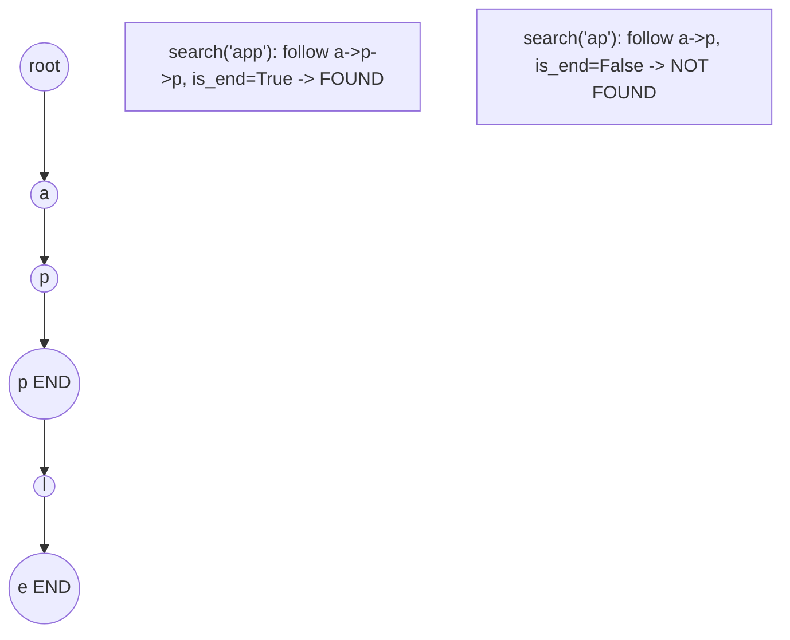

# Problem 211: Design Add and Search Words Data Structure

**Difficulty:** Medium  
**Tags:** String, Depth-First Search, Design, Trie  
**Pattern:** Trie / Prefix Tree  
**Link:** [leetcode.com/problems/design-add-and-search-words-data-structure](https://leetcode.com/problems/design-add-and-search-words-data-structure/)

## Description

Design a data structure that supports adding new words and finding if a string matches any previously added string.

Implement the `WordDictionary` class:

	- `WordDictionary()` Initializes the object.
	- `void addWord(word)` Adds `word` to the data structure, it can be matched later.
	- `bool search(word)` Returns `true` if there is any string in the data structure that matches `word` or `false` otherwise. `word` may contain dots `'.'` where dots can be matched with any letter.

 

Example:

```

**Input**
["WordDictionary","addWord","addWord","addWord","search","search","search","search"]
[[],["bad"],["dad"],["mad"],["pad"],["bad"],[".ad"],["b.."]]
**Output**
[null,null,null,null,false,true,true,true]

**Explanation**
WordDictionary wordDictionary = new WordDictionary();
wordDictionary.addWord("bad");
wordDictionary.addWord("dad");
wordDictionary.addWord("mad");
wordDictionary.search("pad"); // return False
wordDictionary.search("bad"); // return True
wordDictionary.search(".ad"); // return True
wordDictionary.search("b.."); // return True

```

 

**Constraints:**

	- `1 <= word.length <= 25`
	- `word` in `addWord` consists of lowercase English letters.
	- `word` in `search` consist of `'.'` or lowercase English letters.
	- There will be at most `2` dots in `word` for `search` queries.
	- At most `10^4` calls will be made to `addWord` and `search`.

## Approach: Trie / Prefix Tree

Build a trie (prefix tree) where each node represents a character. Insert words character by character, and search by following child pointers. Supports efficient prefix matching.

## Pseudocode

```
1. TrieNode: children = {}, is_end = False
2. Insert(word):
   - For each char: create child if absent, move to child
   - Mark last node as end
3. Search(word):
   - For each char: if child absent return False, move to child
   - Return node.is_end
4. StartsWith(prefix): same as search but return True at end
```

## Algorithm Flow



## Visual State Transitions

**Trie Insert and Search:**

**Frame 1: Empty trie**


**Frame 2: Insert 'app'**


**Frame 3: Insert 'apple'**


**Frame 4: Search 'app' = True, 'ap' = False**



## Complexity Analysis

- **Time:** O(L) per operation
- **Space:** O(N * L)

## Solution (Python3)

```python
class WordDictionary:
    def __init__(self):
        # Initialize data structure
        pass

    def addWord(self, word: str) -> None:
        return None

    def search(self, word: str) -> bool:
        return False

```

## Solution (C++)

```cpp
#include <string>
#include <vector>
using namespace std;

class WordDictionary {
public:
    WordDictionary() {
        // Initialize
    }

    void addWord(string& word) {
        return ;
    }

    bool search(string& word) {
        return false;
    }

};
```
