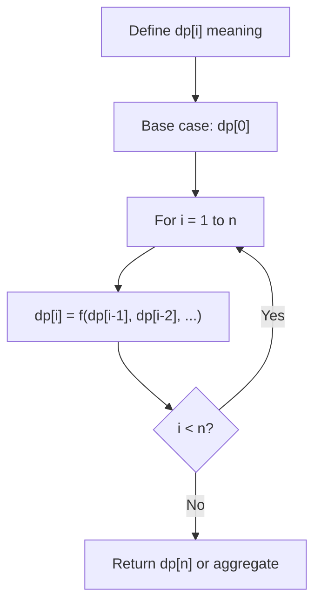
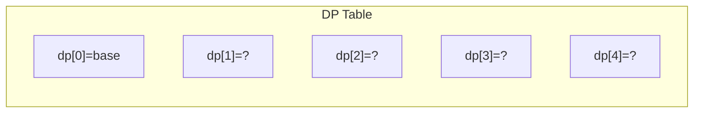
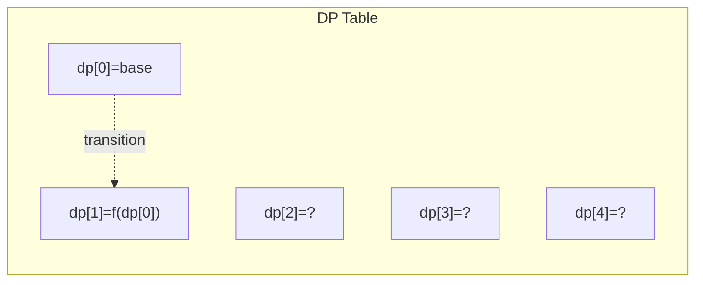
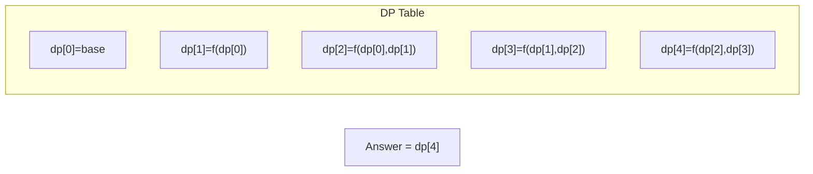

# Problem 213: House Robber II

**Difficulty:** Medium  
**Tags:** Array, Dynamic Programming  
**Pattern:** Dynamic Programming (1D)  
**Link:** [leetcode.com/problems/house-robber-ii](https://leetcode.com/problems/house-robber-ii/)

## Description

You are a professional robber planning to rob houses along a street. Each house has a certain amount of money stashed. All houses at this place are **arranged in a circle.** That means the first house is the neighbor of the last one. Meanwhile, adjacent houses have a security system connected, and **it will automatically contact the police if two adjacent houses were broken into on the same night**.

Given an integer array `nums` representing the amount of money of each house, return *the maximum amount of money you can rob tonight **without alerting the police***.

 

Example 1:

```

**Input:** nums = [2,3,2]
**Output:** 3
**Explanation:** You cannot rob house 1 (money = 2) and then rob house 3 (money = 2), because they are adjacent houses.

```

Example 2:

```

**Input:** nums = [1,2,3,1]
**Output:** 4
**Explanation:** Rob house 1 (money = 1) and then rob house 3 (money = 3).
Total amount you can rob = 1 + 3 = 4.

```

Example 3:

```

**Input:** nums = [1,2,3]
**Output:** 3

```

 

**Constraints:**

	- `1 <= nums.length <= 100`
	- `0 <= nums[i] <= 1000`

## Approach: Dynamic Programming (1D)

Break the problem into overlapping subproblems. Define dp[i] as the optimal value for the subproblem ending at or considering index i. Build the solution bottom-up, using previously computed dp values.

## Pseudocode

```
1. Define dp[i] = optimal value for subproblem i
2. Base case: dp[0] = initial value
3. For i from 1 to n:
   a. dp[i] = recurrence(dp[i-1], dp[i-2], ...)
4. Return dp[n] or max/min of dp
```

## Algorithm Flow



## Visual State Transitions

**1D Dynamic Programming Table Build:**

**Frame 1: Initialize base cases**


**Frame 2: Fill dp[1] from dp[0]**


**Frame 3: Fill remaining cells**



## Complexity Analysis

- **Time:** O(n)
- **Space:** O(n)

## Solution (Python3)

```python
class Solution:
    def rob(self, nums: List[int]) -> int:
        # Dynamic programming (1D) - O(n) time, O(n) space
        if not nums:
            return 0
        n = len(nums) if isinstance(nums, list) else nums
        dp = [0] * (n + 1)
        dp[0] = 1  # base case
        for i in range(1, n + 1):
            dp[i] = dp[i-1]  # transition (customize per problem)
            if i >= 2:
                dp[i] += dp[i-2]
        return dp[n]
```

## Solution (C++)

```cpp
#include <string>
#include <vector>
using namespace std;

class Solution {
public:
    int rob(vector<int>& nums) {
        // Dynamic programming (1D) - O(n) time, O(n) space
        int n = nums;
        if (n <= 0) return 0;
        vector<int> dp(n + 1, 0);
        dp[0] = 1;
        for (int i = 1; i <= n; i++) {
            dp[i] = dp[i-1];
            if (i >= 2) dp[i] += dp[i-2];
        }
        return dp[n];
    }
};
```
