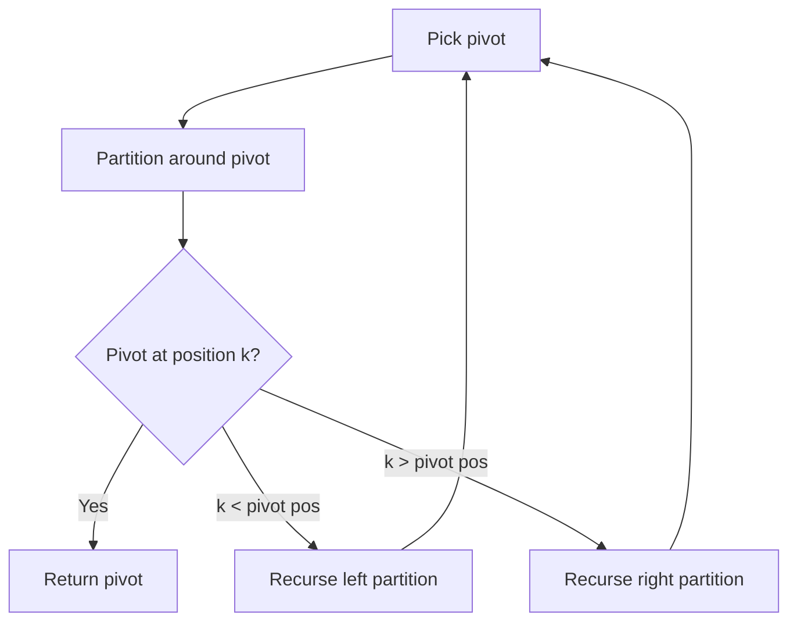

# Problem 215: Kth Largest Element in an Array

**Difficulty:** Medium  
**Tags:** Array, Divide and Conquer, Sorting, Heap (Priority Queue), Quickselect  
**Pattern:** Heap / Quickselect  
**Link:** [leetcode.com/problems/kth-largest-element-in-an-array](https://leetcode.com/problems/kth-largest-element-in-an-array/)

## Description

Given an integer array `nums` and an integer `k`, return *the* `k^th` *largest element in the array*.

Note that it is the `k^th` largest element in the sorted order, not the `k^th` distinct element.

Can you solve it without sorting?

 

Example 1:

```
**Input:** nums = [3,2,1,5,6,4], k = 2
**Output:** 5

```
Example 2:

```
**Input:** nums = [3,2,3,1,2,4,5,5,6], k = 4
**Output:** 4

```

 

**Constraints:**

	- `1 <= k <= nums.length <= 10^5`
	- `-10^4 <= nums[i] <= 10^4`

## Approach: Heap / Quickselect

Use a min-heap of size k, or heapq.nlargest for simplicity.

## Pseudocode

```
1. Return the kth largest using heap
2. heapq.nlargest(k, nums)[-1]
```

## Algorithm Flow



## Complexity Analysis

- **Time:** O(n log k)
- **Space:** O(k)

## Solution (Python3)

```python
import heapq

class Solution:
    def findKthLargest(self, nums: list[int], k: int) -> int:
        return heapq.nlargest(k, nums)[-1]
```

## Solution (C++)

```cpp
#include <algorithm>
#include <string>
#include <vector>
using namespace std;

class Solution {
public:
    int findKthLargest(vector<int>& nums, int k) {
        // Quickselect - O(n) average time
        int k = k;
        nth_element(nums.begin(), nums.begin() + nums.size() - k, nums.end());
        return nums[nums.size() - k];
    }
};
```
