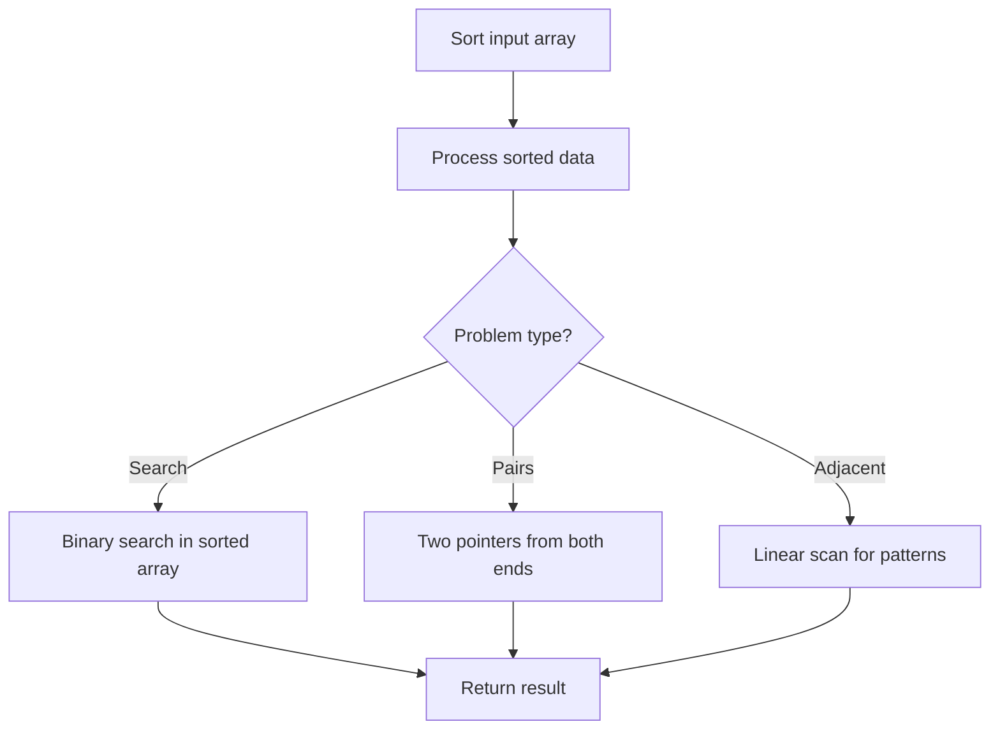

# Problem 217: Contains Duplicate

**Difficulty:** Easy  
**Tags:** Array, Hash Table, Sorting  
**Pattern:** Sorting  
**Link:** [leetcode.com/problems/contains-duplicate](https://leetcode.com/problems/contains-duplicate/)

## Description

Given an integer array `nums`, return `true` if any value appears **at least twice** in the array, and return `false` if every element is distinct.

 

Example 1:

**Input:** nums = [1,2,3,1]

**Output:** true

**Explanation:**

The element 1 occurs at the indices 0 and 3.

Example 2:

**Input:** nums = [1,2,3,4]

**Output:** false

**Explanation:**

All elements are distinct.

Example 3:

**Input:** nums = [1,1,1,3,3,4,3,2,4,2]

**Output:** true

 

**Constraints:**

	- `1 <= nums.length <= 10^5`
	- `-10^9 <= nums[i] <= 10^9`

## Approach: Sorting

Sort the data to enable efficient processing. After sorting, use techniques like binary search, two pointers, or linear scan to solve the problem.

## Pseudocode

```
1. Sort the input array
2. Process sorted data:
   - Use binary search for lookups
   - Use two pointers for pair finding
   - Scan for adjacent patterns
3. Return result
```

## Algorithm Flow



## Complexity Analysis

- **Time:** O(n log n)
- **Space:** O(n)

## Solution (Python3)

```python
class Solution:
    def containsDuplicate(self, nums: List[int]) -> bool:
        # Sort-based approach - O(n log n) time
        nums.sort(key=lambda x: x[0] if isinstance(x, (list, tuple)) else x)
        result = [nums[0]]
        for i in range(1, len(nums)):
            curr = nums[i]
            if isinstance(curr, (list, tuple)) and isinstance(result[-1], (list, tuple)):
                if curr[0] <= result[-1][1]:
                    result[-1] = [result[-1][0], max(result[-1][1], curr[1])]
                else:
                    result.append(curr)
            else:
                result.append(curr)
        return result
```

## Solution (C++)

```cpp
#include <algorithm>
#include <string>
#include <vector>
using namespace std;

class Solution {
public:
    bool containsDuplicate(vector<int>& nums) {
        // Sort-based approach - O(n log n) time
        sort(nums.begin(), nums.end());
        vector<vector<int>> result;
        result.push_back(nums[0]);
        for (int i = 1; i < (int)nums.size(); i++) {
            if (nums[i][0] <= result.back()[1]) {
                result.back()[1] = max(result.back()[1], nums[i][1]);
            } else {
                result.push_back(nums[i]);
            }
        }
        return result;
    }
};
```
