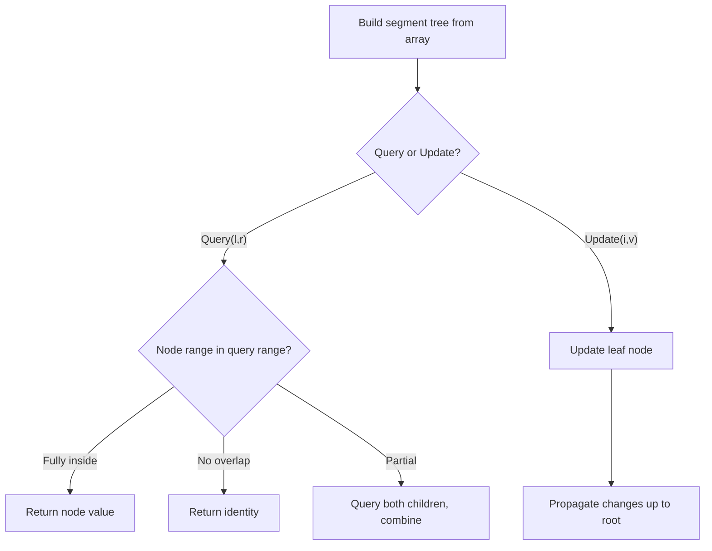

# Problem 218: The Skyline Problem

**Difficulty:** Hard  
**Tags:** Array, Divide and Conquer, Binary Indexed Tree, Segment Tree, Sweep Line, Sorting, Heap (Priority Queue), Ordered Set  
**Pattern:** Segment Tree  
**Link:** [leetcode.com/problems/the-skyline-problem](https://leetcode.com/problems/the-skyline-problem/)

## Description

A city's **skyline** is the outer contour of the silhouette formed by all the buildings in that city when viewed from a distance. Given the locations and heights of all the buildings, return *the **skyline** formed by these buildings collectively*.

The geometric information of each building is given in the array `buildings` where `buildings[i] = [lefti, righti, heighti]`:

	- `lefti` is the x coordinate of the left edge of the `i^th` building.
	- `righti` is the x coordinate of the right edge of the `i^th` building.
	- `heighti` is the height of the `i^th` building.

You may assume all buildings are perfect rectangles grounded on an absolutely flat surface at height `0`.

The **skyline** should be represented as a list of "key points" **sorted by their x-coordinate** in the form `[[x1,y1],[x2,y2],...]`. Each key point is the left endpoint of some horizontal segment in the skyline except the last point in the list, which always has a y-coordinate `0` and is used to mark the skyline's termination where the rightmost building ends. Any ground between the leftmost and rightmost buildings should be part of the skyline's contour.

**Note:** There must be no consecutive horizontal lines of equal height in the output skyline. For instance, `[...,[2 3],[4 5],[7 5],[11 5],[12 7],...]` is not acceptable; the three lines of height 5 should be merged into one in the final output as such: `[...,[2 3],[4 5],[12 7],...]`

 

Example 1:

```

**Input:** buildings = [[2,9,10],[3,7,15],[5,12,12],[15,20,10],[19,24,8]]
**Output:** [[2,10],[3,15],[7,12],[12,0],[15,10],[20,8],[24,0]]
**Explanation:**
Figure A shows the buildings of the input.
Figure B shows the skyline formed by those buildings. The red points in figure B represent the key points in the output list.

```

Example 2:

```

**Input:** buildings = [[0,2,3],[2,5,3]]
**Output:** [[0,3],[5,0]]

```

 

**Constraints:**

	- `1 <= buildings.length <= 10^4`
	- `0 <= lefti < righti <= 2^31 - 1`
	- `1 <= heighti <= 2^31 - 1`
	- `buildings` is sorted by `lefti` in non-decreasing order.

## Approach: Segment Tree

Build a segment tree for range queries (sum, min, max) with point or range updates. Each node covers a range; queries are answered by combining relevant segments.

## Pseudocode

```
1. Build segment tree from array (O(n))
2. Query(l, r):
   - If node range within [l,r]: return node value
   - If no overlap: return identity
   - Else: combine query(left_child) and query(right_child)
3. Update(i, val): update leaf and propagate up
```

## Algorithm Flow



## Complexity Analysis

- **Time:** O(n log n) build, O(log n) query/update
- **Space:** O(n)

## Solution (Python3)

```python
class Solution:
    def getSkyline(self, buildings: List[List[int]]) -> List[List[int]]:
        # Segment tree for range queries - O(n log n) build, O(log n) query
        n = len(buildings)
        tree = [0] * (4 * n)
        
        def build(node, start, end):
            if start == end:
                tree[node] = buildings[start]
                return
            mid = (start + end) // 2
            build(2*node, start, mid)
            build(2*node+1, mid+1, end)
            tree[node] = tree[2*node] + tree[2*node+1]
        
        def query(node, start, end, l, r):
            if r < start or end < l:
                return 0
            if l <= start and end <= r:
                return tree[node]
            mid = (start + end) // 2
            return query(2*node, start, mid, l, r) + query(2*node+1, mid+1, end, l, r)
        
        build(1, 0, n-1)
        return []
```

## Solution (C++)

```cpp
#include <functional>
#include <string>
#include <vector>
using namespace std;

class Solution {
public:
    vector<vector<int>> getSkyline(vector<vector<int>>& buildings) {
        // Segment tree for range queries
        int n = buildings.size();
        vector<int> tree(4 * n, 0);
        function<void(int, int, int)> build = [&](int node, int s, int e) {
            if (s == e) { tree[node] = buildings[s]; return; }
            int mid = (s + e) / 2;
            build(2*node, s, mid);
            build(2*node+1, mid+1, e);
            tree[node] = tree[2*node] + tree[2*node+1];
        };
        function<int(int, int, int, int, int)> query = [&](int node, int s, int e, int l, int r) -> int {
            if (r < s || e < l) return 0;
            if (l <= s && e <= r) return tree[node];
            int mid = (s + e) / 2;
            return query(2*node, s, mid, l, r) + query(2*node+1, mid+1, e, l, r);
        };
        build(1, 0, n-1);
        return {};
    }
};
```
