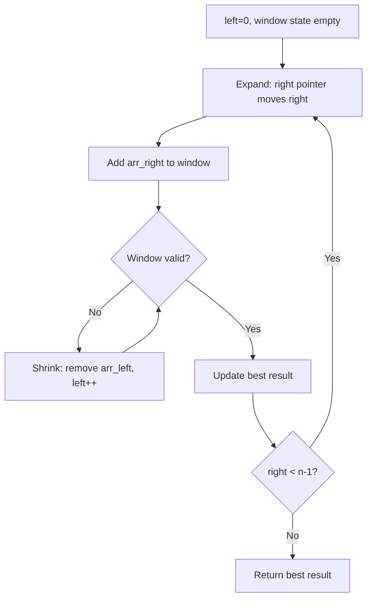
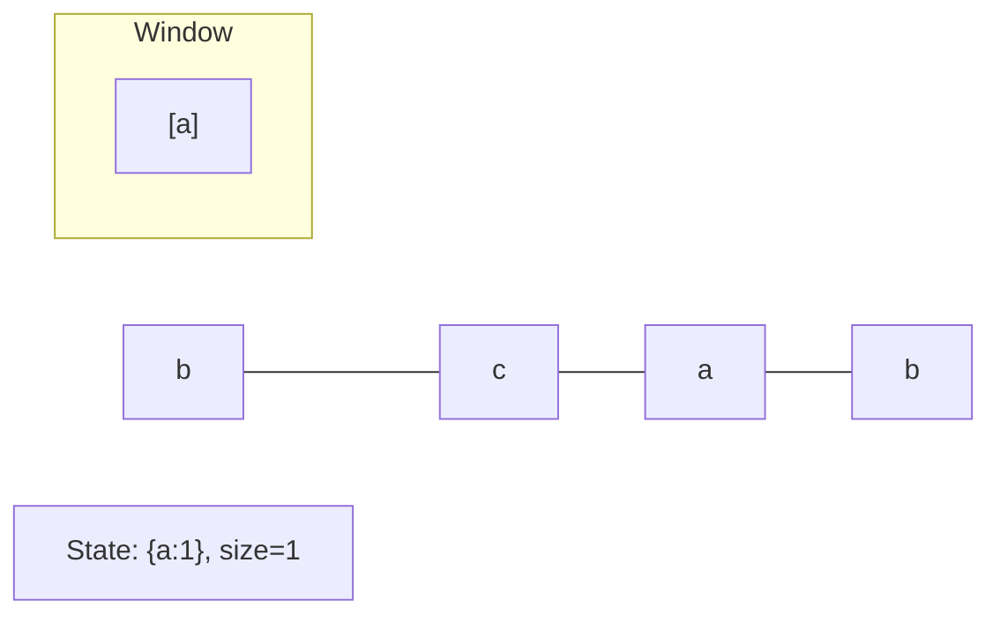
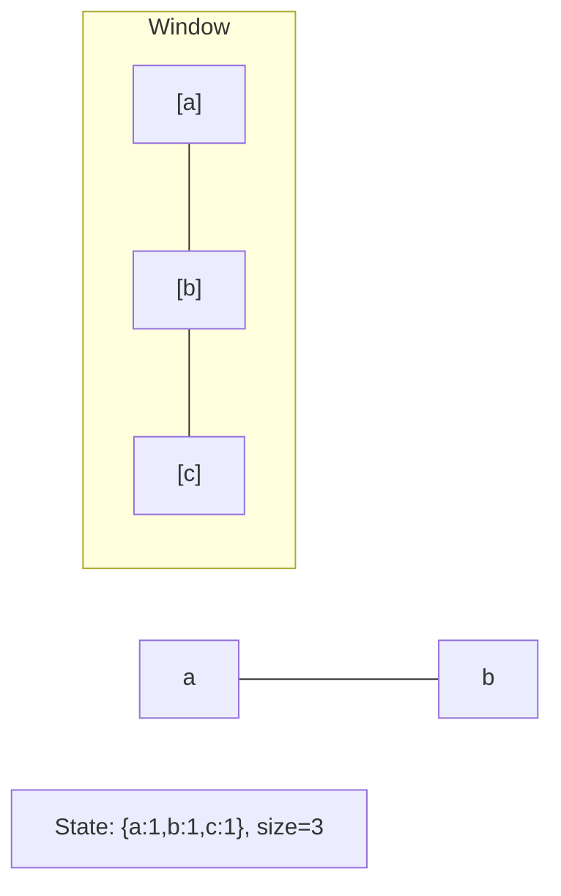
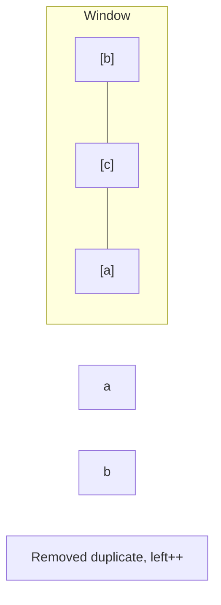
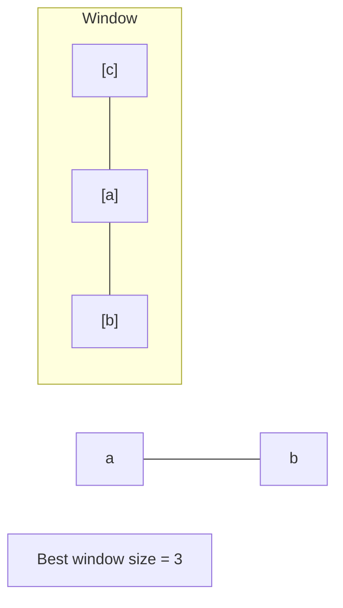

# Problem 220: Contains Duplicate III

**Difficulty:** Hard  
**Tags:** Array, Sliding Window, Sorting, Bucket Sort, Ordered Set  
**Pattern:** Sliding Window  
**Link:** [leetcode.com/problems/contains-duplicate-iii](https://leetcode.com/problems/contains-duplicate-iii/)

## Description

You are given an integer array `nums` and two integers `indexDiff` and `valueDiff`.

Find a pair of indices `(i, j)` such that:

	- `i != j`,
	- `abs(i - j) <= indexDiff`.
	- `abs(nums[i] - nums[j]) <= valueDiff`, and

Return `true`* if such pair exists or *`false`* otherwise*.

 

Example 1:

```

**Input:** nums = [1,2,3,1], indexDiff = 3, valueDiff = 0
**Output:** true
**Explanation:** We can choose (i, j) = (0, 3).
We satisfy the three conditions:
i != j --> 0 != 3
abs(i - j) <= indexDiff --> abs(0 - 3) <= 3
abs(nums[i] - nums[j]) <= valueDiff --> abs(1 - 1) <= 0

```

Example 2:

```

**Input:** nums = [1,5,9,1,5,9], indexDiff = 2, valueDiff = 3
**Output:** false
**Explanation:** After trying all the possible pairs (i, j), we cannot satisfy the three conditions, so we return false.

```

 

**Constraints:**

	- `2 <= nums.length <= 10^5`
	- `-10^9 <= nums[i] <= 10^9`
	- `1 <= indexDiff <= nums.length`
	- `0 <= valueDiff <= 10^9`

## Approach: Sliding Window

Maintain a window over the data using two pointers. Expand the right boundary to include new elements, and shrink the left boundary when the window constraint is violated. Track the optimal window.

## Pseudocode

```
1. Initialize left = 0, result = initial_value
2. For right in range(n):
   a. Add element at right to window state
   b. While window is invalid:
      - Remove element at left from window state
      - left++
   c. Update result = best of (result, window size/value)
3. Return result
```

## Algorithm Flow



## Visual State Transitions

**Sliding Window Step-by-Step:**

**Frame 1: Initial window (left=0, right=0)**


**Frame 2: Expand right (right=2)**


**Frame 3: Violation - shrink left**


**Frame 4: Continue expanding**



## Complexity Analysis

- **Time:** O(n)
- **Space:** O(k)

## Solution (Python3)

```python
class Solution:
    def containsNearbyAlmostDuplicate(self, nums: List[int], indexDiff: int, valueDiff: int) -> bool:
        # Sliding window approach - O(n) time, O(k) space
        from collections import defaultdict
        window = defaultdict(int)
        left = 0
        result = 0
        for right in range(len(nums)):
            window[nums[right]] += 1
            while len(window) > (indexDiff if isinstance(indexDiff, int) else len(nums)):
                window[nums[left]] -= 1
                if window[nums[left]] == 0:
                    del window[nums[left]]
                left += 1
            result = max(result, right - left + 1)
        return result
```

## Solution (C++)

```cpp
#include <algorithm>
#include <string>
#include <unordered_map>
#include <vector>
using namespace std;

class Solution {
public:
    bool containsNearbyAlmostDuplicate(vector<int>& nums, int indexDiff, int valueDiff) {
        // Sliding window approach - O(n) time, O(k) space
        unordered_map<char, int> window;
        int left = 0, result = 0;
        for (int right = 0; right < nums.size(); right++) {
            window[nums[right]]++;
            while ((int)window.size() > indexDiff) {
                window[nums[left]]--;
                if (window[nums[left]] == 0)
                    window.erase(nums[left]);
                left++;
            }
            result = max(result, right - left + 1);
        }
        return result;
    }
};
```
