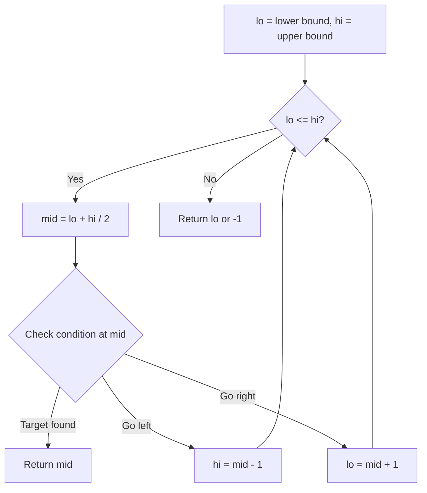
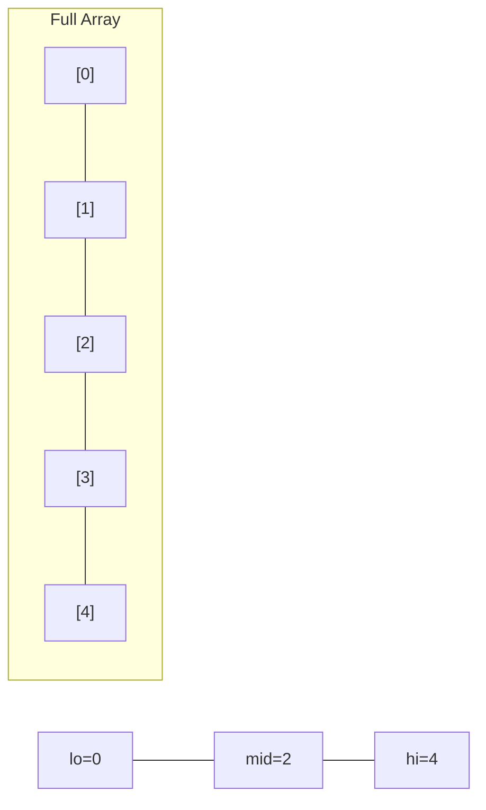
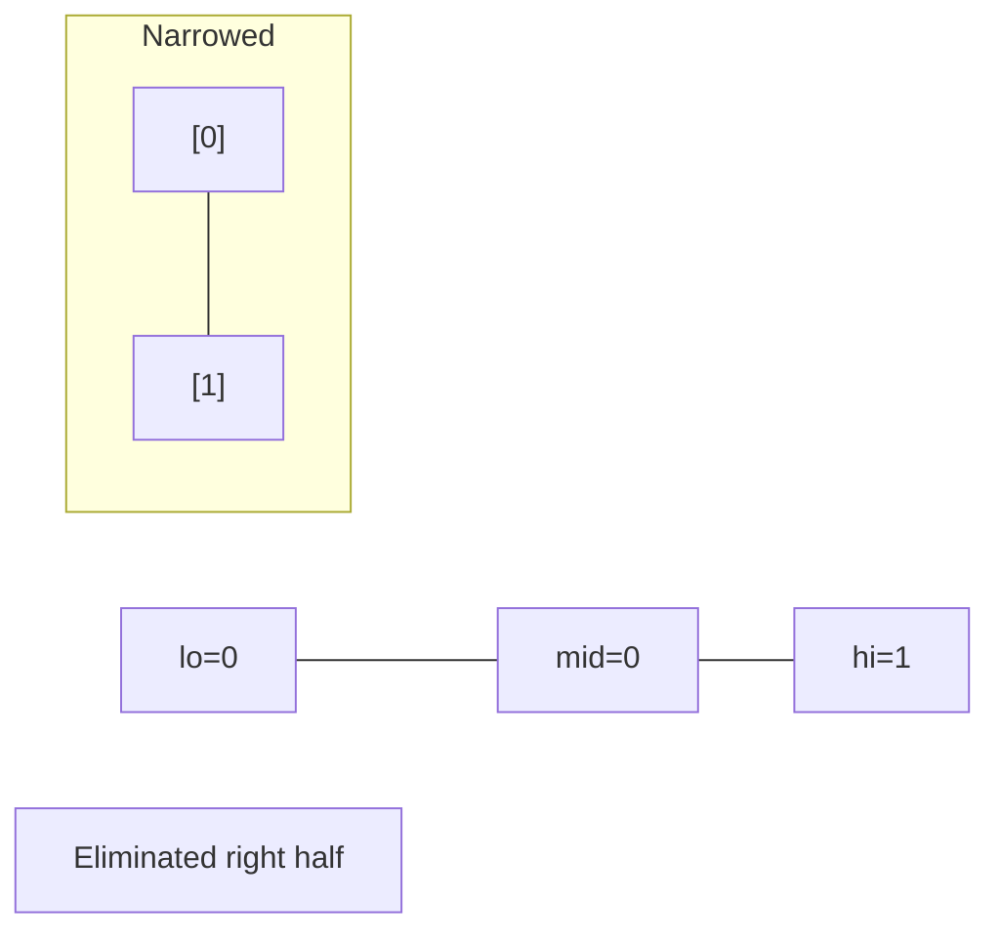
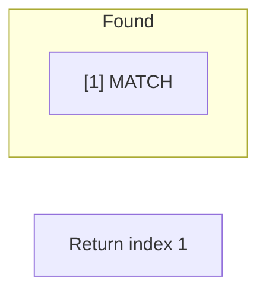

# Problem 222: Count Complete Tree Nodes

**Difficulty:** Easy  
**Tags:** Binary Search, Bit Manipulation, Tree, Binary Tree  
**Pattern:** Binary Search  
**Link:** [leetcode.com/problems/count-complete-tree-nodes](https://leetcode.com/problems/count-complete-tree-nodes/)

## Description

Given the `root` of a **complete** binary tree, return the number of the nodes in the tree.

According to **Wikipedia**, every level, except possibly the last, is completely filled in a complete binary tree, and all nodes in the last level are as far left as possible. It can have between `1` and `2^h` nodes inclusive at the last level `h`.

Design an algorithm that runs in less than O(n) time complexity.

 

Example 1:

```

**Input:** root = [1,2,3,4,5,6]
**Output:** 6

```

Example 2:

```

**Input:** root = []
**Output:** 0

```

Example 3:

```

**Input:** root = [1]
**Output:** 1

```

 

**Constraints:**

	- The number of nodes in the tree is in the range `[0, 5 * 10^4]`.
	- `0 <= Node.val <= 5 * 10^4`
	- The tree is guaranteed to be **complete**.

## Approach: Binary Search

Use binary search to halve the search space each iteration. Define the search range [lo, hi], compute mid, and decide which half to keep based on the problem's monotonic condition.

## Pseudocode

```
1. lo = lower_bound, hi = upper_bound
2. While lo <= hi (or lo < hi):
   a. mid = (lo + hi) // 2
   b. If condition(mid) is satisfied: record answer, search left half
   c. Else: search right half
3. Return answer
```

## Algorithm Flow



## Visual State Transitions

**Binary Search Step-by-Step:**

**Frame 1: Initial search space**


**Frame 2: Compare mid, narrow search**


**Frame 3: Found target**



## Complexity Analysis

- **Time:** O(log n)
- **Space:** O(1)

## Solution (Python3)

```python
class Solution:
    def countNodes(self, root: Optional[TreeNode]) -> int:
        # Binary search - O(log n) time, O(1) space
        lo, hi = 0, len(root) - 1
        while lo <= hi:
            mid = lo + (hi - lo) // 2
            if root[mid] == root:
                return mid
            elif root[mid] < root:
                lo = mid + 1
            else:
                hi = mid - 1
        return 0
```

## Solution (C++)

```cpp
#include <string>
#include <vector>
using namespace std;

class Solution {
public:
    int countNodes(TreeNode* root) {
        // Binary search - O(log n) time, O(1) space
        int lo = 0, hi = root.size() - 1;
        while (lo <= hi) {
            int mid = lo + (hi - lo) / 2;
            if (root[mid] == root) {
                return mid;
            } else if (root[mid] < root) {
                lo = mid + 1;
            } else {
                hi = mid - 1;
            }
        }
        return 0;
    }
};
```
