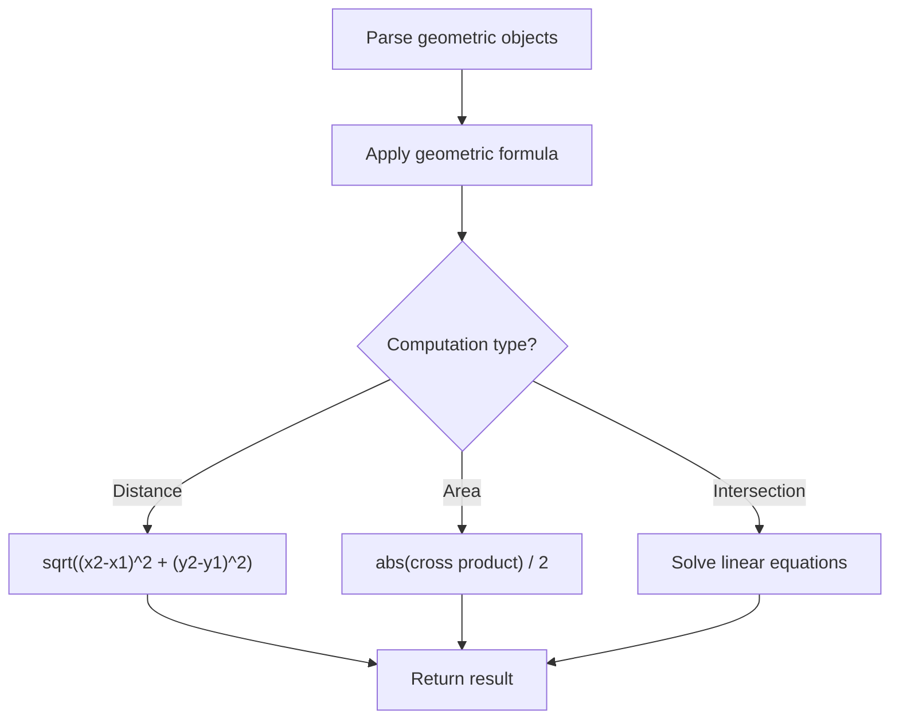

# Problem 223: Rectangle Area

**Difficulty:** Medium  
**Tags:** Math, Geometry  
**Pattern:** Geometry  
**Link:** [leetcode.com/problems/rectangle-area](https://leetcode.com/problems/rectangle-area/)

## Description

Given the coordinates of two **rectilinear** rectangles in a 2D plane, return *the total area covered by the two rectangles*.

The first rectangle is defined by its **bottom-left** corner `(ax1, ay1)` and its **top-right** corner `(ax2, ay2)`.

The second rectangle is defined by its **bottom-left** corner `(bx1, by1)` and its **top-right** corner `(bx2, by2)`.

 

Example 1:

```

**Input:** ax1 = -3, ay1 = 0, ax2 = 3, ay2 = 4, bx1 = 0, by1 = -1, bx2 = 9, by2 = 2
**Output:** 45

```

Example 2:

```

**Input:** ax1 = -2, ay1 = -2, ax2 = 2, ay2 = 2, bx1 = -2, by1 = -2, bx2 = 2, by2 = 2
**Output:** 16

```

 

**Constraints:**

	- `-10^4 <= ax1 <= ax2 <= 10^4`
	- `-10^4 <= ay1 <= ay2 <= 10^4`
	- `-10^4 <= bx1 <= bx2 <= 10^4`
	- `-10^4 <= by1 <= by2 <= 10^4`

## Approach: Geometry

Apply geometric formulas: distance, area, cross product, convex hull, line intersection. Handle floating-point precision carefully.

## Pseudocode

```
1. Parse geometric objects (points, lines, shapes)
2. Apply geometric operations:
   - Distance formula
   - Cross/dot product
   - Area computation
3. Handle precision and edge cases
4. Return result
```

## Algorithm Flow



## Complexity Analysis

- **Time:** O(n^2) or O(n log n)
- **Space:** O(n)

## Solution (Python3)

```python
class Solution:
    def computeArea(self, ax1: int, ay1: int, ax2: int, ay2: int, bx1: int, by1: int, bx2: int, by2: int) -> int:
        # Geometry approach
        import math
        result = 0
        for i in range(len(ax1)):
            for j in range(i + 1, len(ax1)):
                dx = ax1[i][0] - ax1[j][0]
                dy = ax1[i][1] - ax1[j][1]
                dist = math.sqrt(dx*dx + dy*dy)
                result = max(result, dist)
        return result
```

## Solution (C++)

```cpp
#include <algorithm>
#include <cmath>
#include <string>
#include <vector>
using namespace std;

class Solution {
public:
    int computeArea(int ax1, int ay1, int ax2, int ay2, int bx1, int by1, int bx2, int by2) {
        // Geometry approach
        double result = 0;
        for (int i = 0; i < (int)ax1.size(); i++) {
            for (int j = i + 1; j < (int)ax1.size(); j++) {
                double dx = ax1[i][0] - ax1[j][0];
                double dy = ax1[i][1] - ax1[j][1];
                result = max(result, sqrt(dx*dx + dy*dy));
            }
        }
        return result;
    }
};
```
