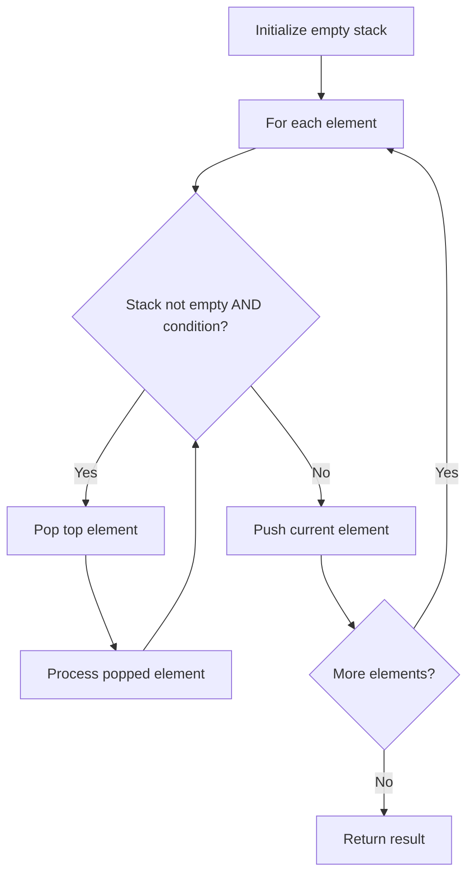

# Problem 224: Basic Calculator

**Difficulty:** Hard  
**Tags:** Math, String, Stack, Recursion  
**Pattern:** Stack  
**Link:** [leetcode.com/problems/basic-calculator](https://leetcode.com/problems/basic-calculator/)

## Description

Given a string `s` representing a valid expression, implement a basic calculator to evaluate it, and return *the result of the evaluation*.

**Note:** You are **not** allowed to use any built-in function which evaluates strings as mathematical expressions, such as `eval()`.

 

Example 1:

```

**Input:** s = "1 + 1"
**Output:** 2

```

Example 2:

```

**Input:** s = " 2-1 + 2 "
**Output:** 3

```

Example 3:

```

**Input:** s = "(1+(4+5+2)-3)+(6+8)"
**Output:** 23

```

 

**Constraints:**

	- `1 <= s.length <= 3 * 10^5`
	- `s` consists of digits, `'+'`, `'-'`, `'('`, `')'`, and `' '`.
	- `s` represents a valid expression.
	- `'+'` is **not** used as a unary operation (i.e., `"+1"` and `"+(2 + 3)"` is invalid).
	- `'-'` could be used as a unary operation (i.e., `"-1"` and `"-(2 + 3)"` is valid).
	- There will be no two consecutive operators in the input.
	- Every number and running calculation will fit in a signed 32-bit integer.

## Approach: Stack

Use a stack (LIFO) to process elements. Push elements when they might be needed later; pop when a matching or resolving condition is found. Common uses: parentheses matching, expression evaluation, next greater element.

## Pseudocode

```
1. Initialize empty stack
2. For each element:
   a. While stack is not empty and condition met:
      - Pop and process top element
   b. Push current element onto stack
3. Process remaining elements in stack if needed
4. Return result
```

## Algorithm Flow



## Complexity Analysis

- **Time:** O(n)
- **Space:** O(n)

## Solution (Python3)

```python
class Solution:
    def calculate(self, s: str) -> int:
        # Stack-based approach - O(n) time
        stack = []
        for ch in s:
            if stack and self._matches(stack[-1], ch):
                stack.pop()
            else:
                stack.append(ch)
        return len(stack) == 0 if isinstance(0, bool) else stack

    def _matches(self, a, b):
        pairs = {'(': ')', '[': ']', '{': '}'}
        return pairs.get(a) == b
```

## Solution (C++)

```cpp
#include <stack>
#include <string>
#include <unordered_map>
#include <vector>
using namespace std;

class Solution {
public:
    int calculate(string& s) {
        // Stack-based approach - O(n) time
        stack<char> st;
        unordered_map<char, char> pairs = {{'(', ')'}, {'[', ']'}, {'{', '}'}};
        for (char ch : s) {
            if (!st.empty() && pairs.count(st.top()) && pairs[st.top()] == ch) {
                st.pop();
            } else {
                st.push(ch);
            }
        }
        return st.empty();
    }
};
```
