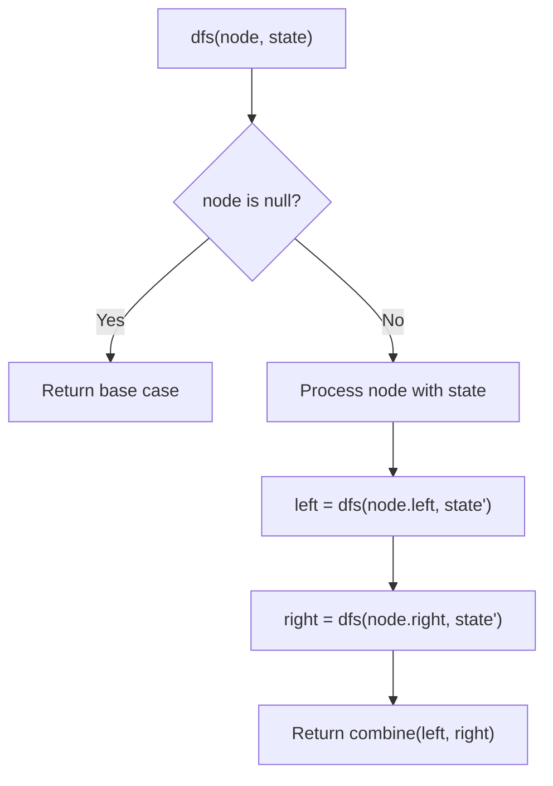
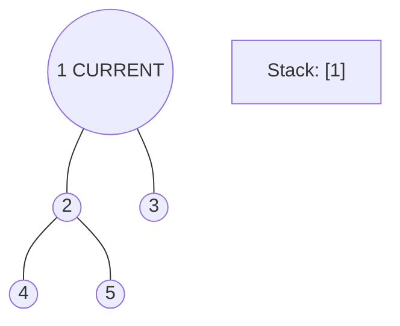
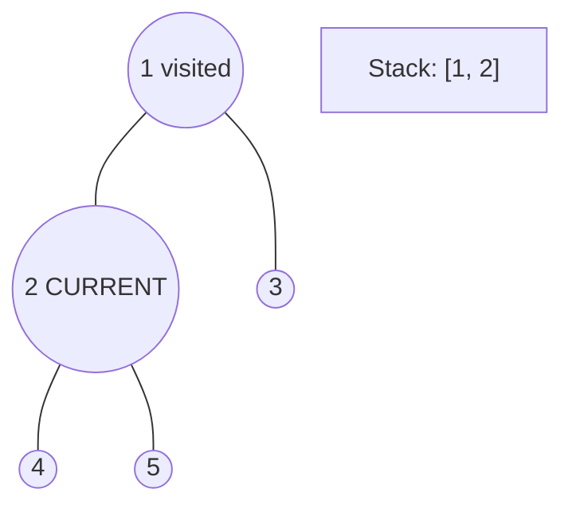
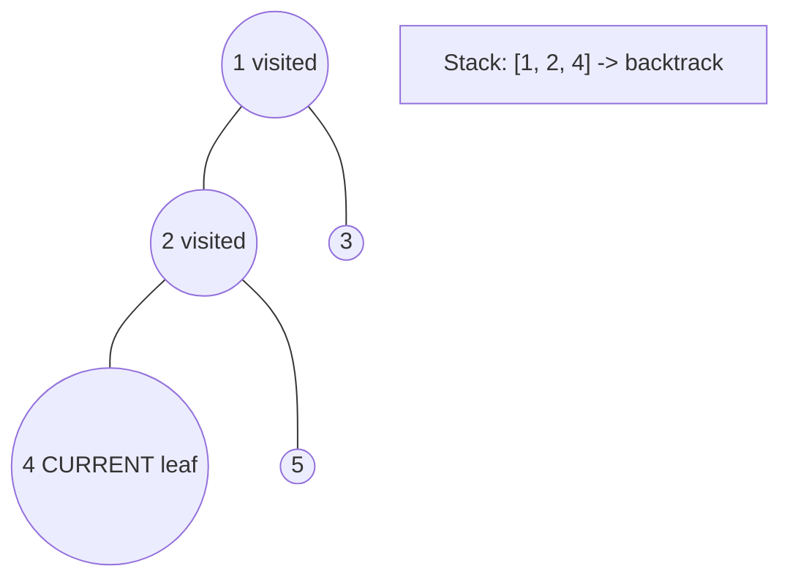
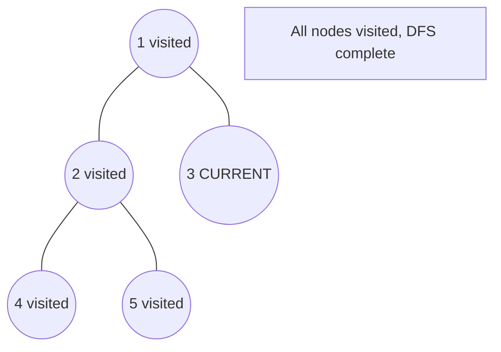

# Problem 226: Invert Binary Tree

**Difficulty:** Easy  
**Tags:** Tree, Depth-First Search, Breadth-First Search, Binary Tree  
**Pattern:** Tree / DFS  
**Link:** [leetcode.com/problems/invert-binary-tree](https://leetcode.com/problems/invert-binary-tree/)

## Description

Given the `root` of a binary tree, invert the tree, and return *its root*.

 

Example 1:

```

**Input:** root = [4,2,7,1,3,6,9]
**Output:** [4,7,2,9,6,3,1]

```

Example 2:

```

**Input:** root = [2,1,3]
**Output:** [2,3,1]

```

Example 3:

```

**Input:** root = []
**Output:** []

```

 

**Constraints:**

	- The number of nodes in the tree is in the range `[0, 100]`.
	- `-100 <= Node.val <= 100`

## Approach: Tree / DFS

Recursively swap left and right children.

## Pseudocode

```
1. If null: return None
2. Swap left and right subtrees recursively
3. Return root
```

## Algorithm Flow



## Visual State Transitions

**DFS Tree Traversal Step-by-Step:**

**Frame 1: Start at root**


**Frame 2: Go left - visit node 2**


**Frame 3: Go left - visit node 4 (leaf)**


**Frame 4: Backtrack, visit node 5, then node 3**



## Complexity Analysis

- **Time:** O(n)
- **Space:** O(h)

## Solution (Python3)

```python
class Solution:
    def invertTree(self, root):
        if not root:
            return None
        root.left, root.right = self.invertTree(root.right), self.invertTree(root.left)
        return root
```

## Solution (C++)

```cpp
#include <algorithm>
#include <functional>
#include <string>
#include <vector>
using namespace std;

class Solution {
public:
    TreeNode* invertTree(TreeNode* root) {
        // DFS on binary tree - O(n) time, O(h) space
        function<int(TreeNode*)> dfs = [&](TreeNode* node) -> int {
            if (!node) return 0;
            int left = dfs(node->left);
            int right = dfs(node->right);
            return 1 + max(left, right);
        };
        return dfs(root);
    }
};
```
