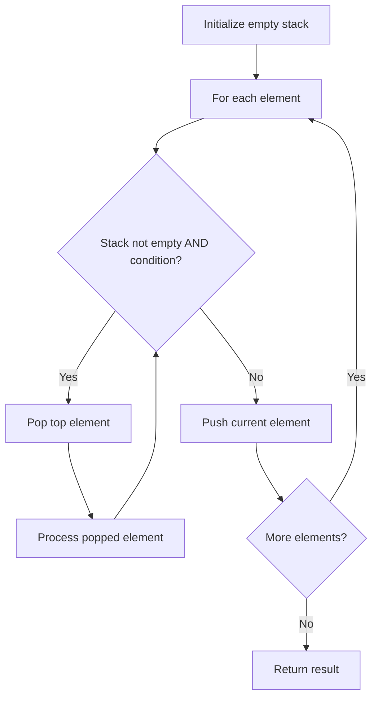

# Problem 227: Basic Calculator II

**Difficulty:** Medium  
**Tags:** Math, String, Stack  
**Pattern:** Stack  
**Link:** [leetcode.com/problems/basic-calculator-ii](https://leetcode.com/problems/basic-calculator-ii/)

## Description

Given a string `s` which represents an expression, *evaluate this expression and return its value*. 

The integer division should truncate toward zero.

You may assume that the given expression is always valid. All intermediate results will be in the range of `[-2^31, 2^31 - 1]`.

**Note:** You are not allowed to use any built-in function which evaluates strings as mathematical expressions, such as `eval()`.

 

Example 1:

```
**Input:** s = "3+2*2"
**Output:** 7

```
Example 2:

```
**Input:** s = " 3/2 "
**Output:** 1

```
Example 3:

```
**Input:** s = " 3+5 / 2 "
**Output:** 5

```

 

**Constraints:**

	- `1 <= s.length <= 3 * 10^5`
	- `s` consists of integers and operators `('+', '-', '*', '/')` separated by some number of spaces.
	- `s` represents **a valid expression**.
	- All the integers in the expression are non-negative integers in the range `[0, 2^31 - 1]`.
	- The answer is **guaranteed** to fit in a **32-bit integer**.

## Approach: Stack

Use a stack (LIFO) to process elements. Push elements when they might be needed later; pop when a matching or resolving condition is found. Common uses: parentheses matching, expression evaluation, next greater element.

## Pseudocode

```
1. Initialize empty stack
2. For each element:
   a. While stack is not empty and condition met:
      - Pop and process top element
   b. Push current element onto stack
3. Process remaining elements in stack if needed
4. Return result
```

## Algorithm Flow



## Complexity Analysis

- **Time:** O(n)
- **Space:** O(n)

## Solution (Python3)

```python
class Solution:
    def calculate(self, s: str) -> int:
        # Stack-based approach - O(n) time
        stack = []
        for ch in s:
            if stack and self._matches(stack[-1], ch):
                stack.pop()
            else:
                stack.append(ch)
        return len(stack) == 0 if isinstance(0, bool) else stack

    def _matches(self, a, b):
        pairs = {'(': ')', '[': ']', '{': '}'}
        return pairs.get(a) == b
```

## Solution (C++)

```cpp
#include <stack>
#include <string>
#include <unordered_map>
#include <vector>
using namespace std;

class Solution {
public:
    int calculate(string& s) {
        // Stack-based approach - O(n) time
        stack<char> st;
        unordered_map<char, char> pairs = {{'(', ')'}, {'[', ']'}, {'{', '}'}};
        for (char ch : s) {
            if (!st.empty() && pairs.count(st.top()) && pairs[st.top()] == ch) {
                st.pop();
            } else {
                st.push(ch);
            }
        }
        return st.empty();
    }
};
```
