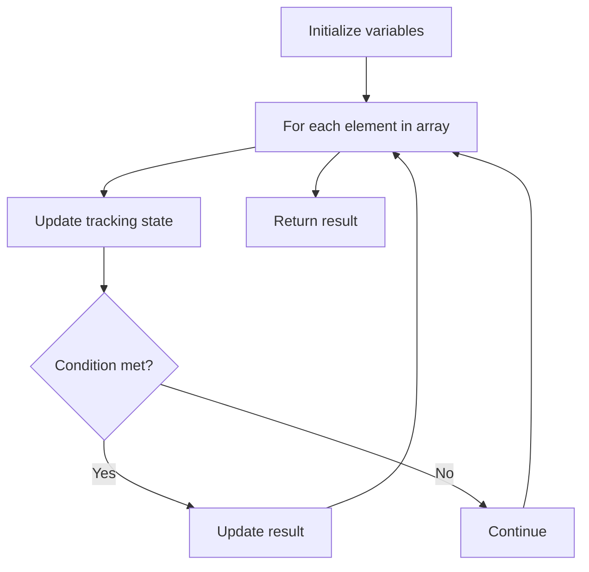

# Problem 228: Summary Ranges

**Difficulty:** Easy  
**Tags:** Array  
**Pattern:** Array Processing  
**Link:** [leetcode.com/problems/summary-ranges](https://leetcode.com/problems/summary-ranges/)

## Description

You are given a **sorted unique** integer array `nums`.

A **range** `[a,b]` is the set of all integers from `a` to `b` (inclusive).

Return *the **smallest sorted** list of ranges that **cover all the numbers in the array exactly***. That is, each element of `nums` is covered by exactly one of the ranges, and there is no integer `x` such that `x` is in one of the ranges but not in `nums`.

Each range `[a,b]` in the list should be output as:

	- `"a->b"` if `a != b`
	- `"a"` if `a == b`

 

Example 1:

```

**Input:** nums = [0,1,2,4,5,7]
**Output:** ["0->2","4->5","7"]
**Explanation:** The ranges are:
[0,2] --> "0->2"
[4,5] --> "4->5"
[7,7] --> "7"

```

Example 2:

```

**Input:** nums = [0,2,3,4,6,8,9]
**Output:** ["0","2->4","6","8->9"]
**Explanation:** The ranges are:
[0,0] --> "0"
[2,4] --> "2->4"
[6,6] --> "6"
[8,9] --> "8->9"

```

 

**Constraints:**

	- `0 <= nums.length <= 20`
	- `-2^31 <= nums[i] <= 2^31 - 1`
	- All the values of `nums` are **unique**.
	- `nums` is sorted in ascending order.

## Approach: Array Processing

Process the array with a linear scan, tracking state variables. Look for patterns: running maximum/minimum, counting, or transformations.

## Pseudocode

```
1. Initialize tracking variables
2. Iterate through array:
   a. Update tracking state
   b. Check conditions
   c. Update result
3. Return result
```

## Algorithm Flow



## Complexity Analysis

- **Time:** O(n)
- **Space:** O(1)

## Solution (Python3)

```python
class Solution:
    def summaryRanges(self, nums: List[int]) -> List[str]:
        # Array processing - O(n) time
        result = []
        for i in range(len(nums)):
            # Process element
            pass
        return result
```

## Solution (C++)

```cpp
#include <string>
#include <vector>
using namespace std;

class Solution {
public:
    vector<string> summaryRanges(vector<int>& nums) {
        // Array processing - O(n) time
        for (int i = 0; i < (int)nums.size(); i++) {
            // Process element
        }
        return {};
    }
};
```
