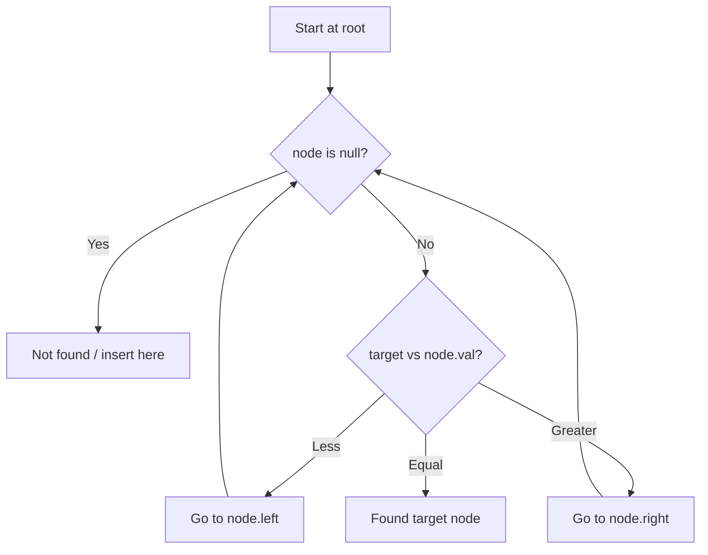

# Problem 230: Kth Smallest Element in a BST

**Difficulty:** Medium  
**Tags:** Tree, Depth-First Search, Binary Search Tree, Binary Tree  
**Pattern:** Tree / Inorder Traversal  
**Link:** [leetcode.com/problems/kth-smallest-element-in-a-bst](https://leetcode.com/problems/kth-smallest-element-in-a-bst/)

## Description

Given the `root` of a binary search tree, and an integer `k`, return *the* `k^th` *smallest value (**1-indexed**) of all the values of the nodes in the tree*.

 

Example 1:

```

**Input:** root = [3,1,4,null,2], k = 1
**Output:** 1

```

Example 2:

```

**Input:** root = [5,3,6,2,4,null,null,1], k = 3
**Output:** 3

```

 

**Constraints:**

	- The number of nodes in the tree is `n`.
	- `1 <= k <= n <= 10^4`
	- `0 <= Node.val <= 10^4`

 

**Follow up:** If the BST is modified often (i.e., we can do insert and delete operations) and you need to find the kth smallest frequently, how would you optimize?

## Approach: Tree / Inorder Traversal

Inorder traversal gives sorted order. Stop at kth element.

## Pseudocode

```
1. Inorder traversal with stack
2. Decrement k on each visit
3. When k==0: return current value
```

## Algorithm Flow



## Complexity Analysis

- **Time:** O(h+k)
- **Space:** O(h)

## Solution (Python3)

```python
class Solution:
    def kthSmallest(self, root, k: int) -> int:
        stack = []
        curr = root
        while curr or stack:
            while curr:
                stack.append(curr)
                curr = curr.left
            curr = stack.pop()
            k -= 1
            if k == 0:
                return curr.val
            curr = curr.right
        return -1
```

## Solution (C++)

```cpp
#include <functional>
#include <string>
#include <vector>
using namespace std;

class Solution {
public:
    int kthSmallest(TreeNode* root, int k) {
        // BST search/insert - O(h) time
        function<TreeNode*(TreeNode*, int)> search = [&](TreeNode* node, int target) -> TreeNode* {
            if (!node) return nullptr;
            if (target == node->val) return node;
            else if (target < node->val) return search(node->left, target);
            else return search(node->right, target);
        };
        return search(root, k);
    }
};
```
