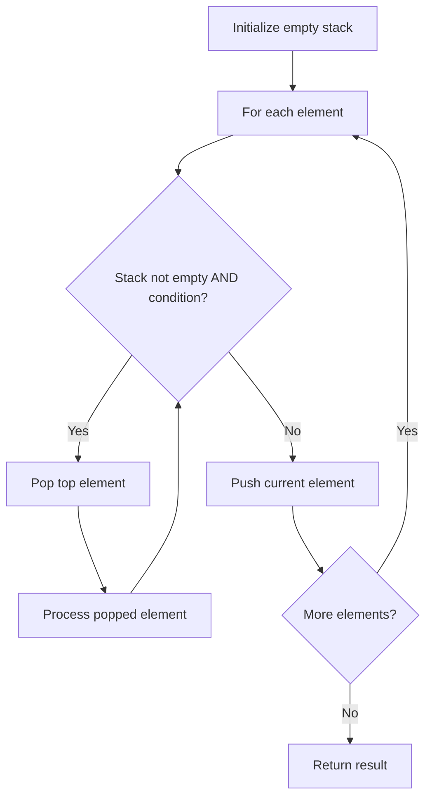

# Problem 232: Implement Queue using Stacks

**Difficulty:** Easy  
**Tags:** Stack, Design, Queue  
**Pattern:** Stack  
**Link:** [leetcode.com/problems/implement-queue-using-stacks](https://leetcode.com/problems/implement-queue-using-stacks/)

## Description

Implement a first in first out (FIFO) queue using only two stacks. The implemented queue should support all the functions of a normal queue (`push`, `peek`, `pop`, and `empty`).

Implement the `MyQueue` class:

	- `void push(int x)` Pushes element x to the back of the queue.
	- `int pop()` Removes the element from the front of the queue and returns it.
	- `int peek()` Returns the element at the front of the queue.
	- `boolean empty()` Returns `true` if the queue is empty, `false` otherwise.

**Notes:**

	- You must use **only** standard operations of a stack, which means only `push to top`, `peek/pop from top`, `size`, and `is empty` operations are valid.
	- Depending on your language, the stack may not be supported natively. You may simulate a stack using a list or deque (double-ended queue) as long as you use only a stack's standard operations.

 

Example 1:

```

**Input**
["MyQueue", "push", "push", "peek", "pop", "empty"]
[[], [1], [2], [], [], []]
**Output**
[null, null, null, 1, 1, false]

**Explanation**
MyQueue myQueue = new MyQueue();
myQueue.push(1); // queue is: [1]
myQueue.push(2); // queue is: [1, 2] (leftmost is front of the queue)
myQueue.peek(); // return 1
myQueue.pop(); // return 1, queue is [2]
myQueue.empty(); // return false

```

 

**Constraints:**

	- `1 <= x <= 9`
	- At most `100` calls will be made to `push`, `pop`, `peek`, and `empty`.
	- All the calls to `pop` and `peek` are valid.

 

**Follow-up:** Can you implement the queue such that each operation is **amortized** `O(1)` time complexity? In other words, performing `n` operations will take overall `O(n)` time even if one of those operations may take longer.

## Approach: Stack

Use a stack (LIFO) to process elements. Push elements when they might be needed later; pop when a matching or resolving condition is found. Common uses: parentheses matching, expression evaluation, next greater element.

## Pseudocode

```
1. Initialize empty stack
2. For each element:
   a. While stack is not empty and condition met:
      - Pop and process top element
   b. Push current element onto stack
3. Process remaining elements in stack if needed
4. Return result
```

## Algorithm Flow



## Complexity Analysis

- **Time:** O(n)
- **Space:** O(n)

## Solution (Python3)

```python
class MyQueue:
    def __init__(self):
        # Initialize data structure
        pass

    def push(self, x: int) -> None:
        return None

    def pop(self) -> int:
        return 0

    def peek(self) -> int:
        return 0

    def empty(self) -> bool:
        return False

```

## Solution (C++)

```cpp
#include <stack>
#include <string>
#include <unordered_map>
#include <vector>
using namespace std;

class MyQueue {
public:
    MyQueue() {
        // Initialize
    }

    void push(int x) {
        return ;
    }

    int pop() {
        return 0;
    }

    int peek() {
        return 0;
    }

    bool empty() {
        return false;
    }

};
```
