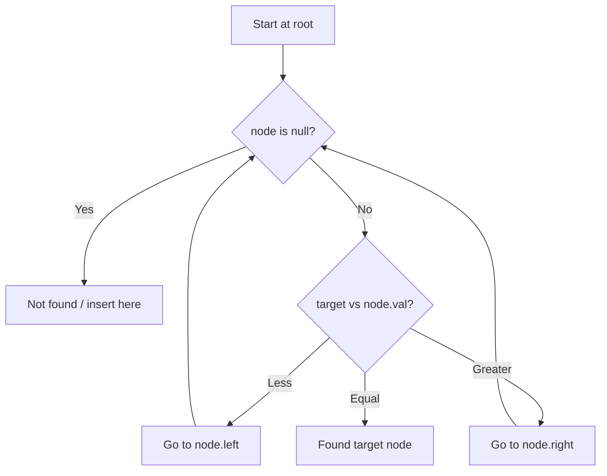

# Problem 235: Lowest Common Ancestor of a Binary Search Tree

**Difficulty:** Medium  
**Tags:** Tree, Depth-First Search, Binary Search Tree, Binary Tree  
**Pattern:** Binary Search Tree  
**Link:** [leetcode.com/problems/lowest-common-ancestor-of-a-binary-search-tree](https://leetcode.com/problems/lowest-common-ancestor-of-a-binary-search-tree/)

## Description

Given a binary search tree (BST), find the lowest common ancestor (LCA) node of two given nodes in the BST.

According to the definition of LCA on Wikipedia: “The lowest common ancestor is defined between two nodes `p` and `q` as the lowest node in `T` that has both `p` and `q` as descendants (where we allow **a node to be a descendant of itself**).”

 

Example 1:

```

**Input:** root = [6,2,8,0,4,7,9,null,null,3,5], p = 2, q = 8
**Output:** 6
**Explanation:** The LCA of nodes 2 and 8 is 6.

```

Example 2:

```

**Input:** root = [6,2,8,0,4,7,9,null,null,3,5], p = 2, q = 4
**Output:** 2
**Explanation:** The LCA of nodes 2 and 4 is 2, since a node can be a descendant of itself according to the LCA definition.

```

Example 3:

```

**Input:** root = [2,1], p = 2, q = 1
**Output:** 2

```

 

**Constraints:**

	- The number of nodes in the tree is in the range `[2, 10^5]`.
	- `-10^9 <= Node.val <= 10^9`
	- All `Node.val` are **unique**.
	- `p != q`
	- `p` and `q` will exist in the BST.

## Approach: Binary Search Tree

Leverage BST property: left < root < right. Navigate left for smaller values, right for larger values. Inorder traversal yields sorted order.

## Pseudocode

```
1. Start at root
2. Compare target with current node:
   a. If target < node.val: go left
   b. If target > node.val: go right
   c. If equal: found
3. Return result
```

## Algorithm Flow



## Complexity Analysis

- **Time:** O(h)
- **Space:** O(h)

## Solution (Python3)

```python
class Solution:
    def lowestCommonAncestor(self, root: 'TreeNode', p: 'TreeNode', q: 'TreeNode') -> 'TreeNode':
        # BST search/insert - O(h) time
        def search(node, target):
            if not node:
                return None
            if target == node.val:
                return node
            elif target < node.val:
                return search(node.left, target)
            else:
                return search(node.right, target)
        return search(root, p if 'p' != 'root' else 0)
```

## Solution (C++)

```cpp
#include <functional>
#include <string>
#include <vector>
using namespace std;

class Solution {
public:
    TreeNode* lowestCommonAncestor(TreeNode* root, TreeNode* p, TreeNode* q) {
        // BST search/insert - O(h) time
        function<TreeNode*(TreeNode*, int)> search = [&](TreeNode* node, int target) -> TreeNode* {
            if (!node) return nullptr;
            if (target == node->val) return node;
            else if (target < node->val) return search(node->left, target);
            else return search(node->right, target);
        };
        return search(root, p);
    }
};
```
