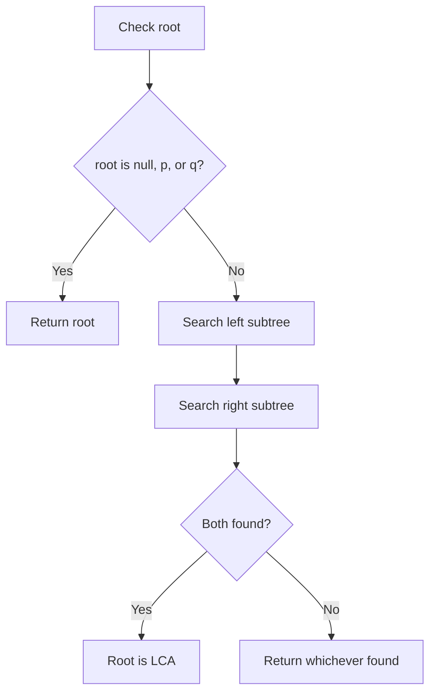
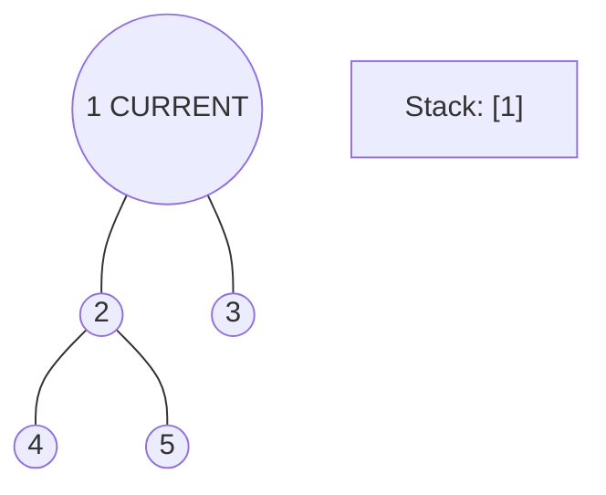
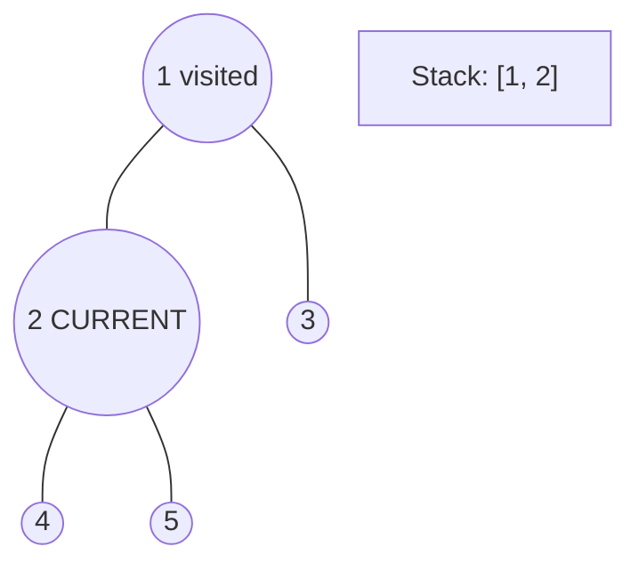
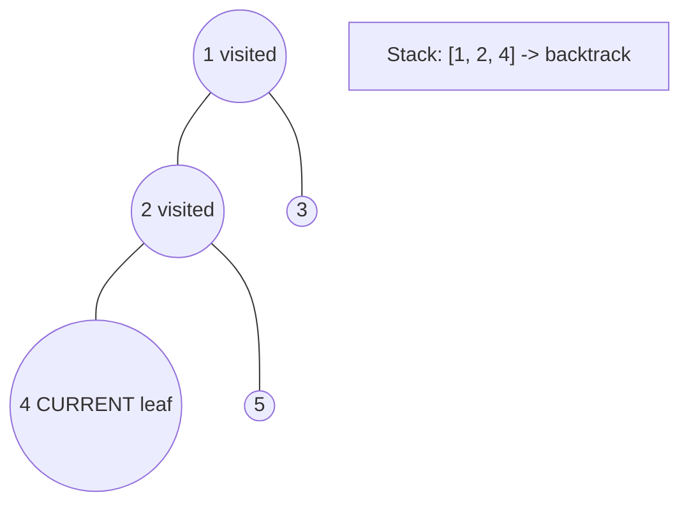
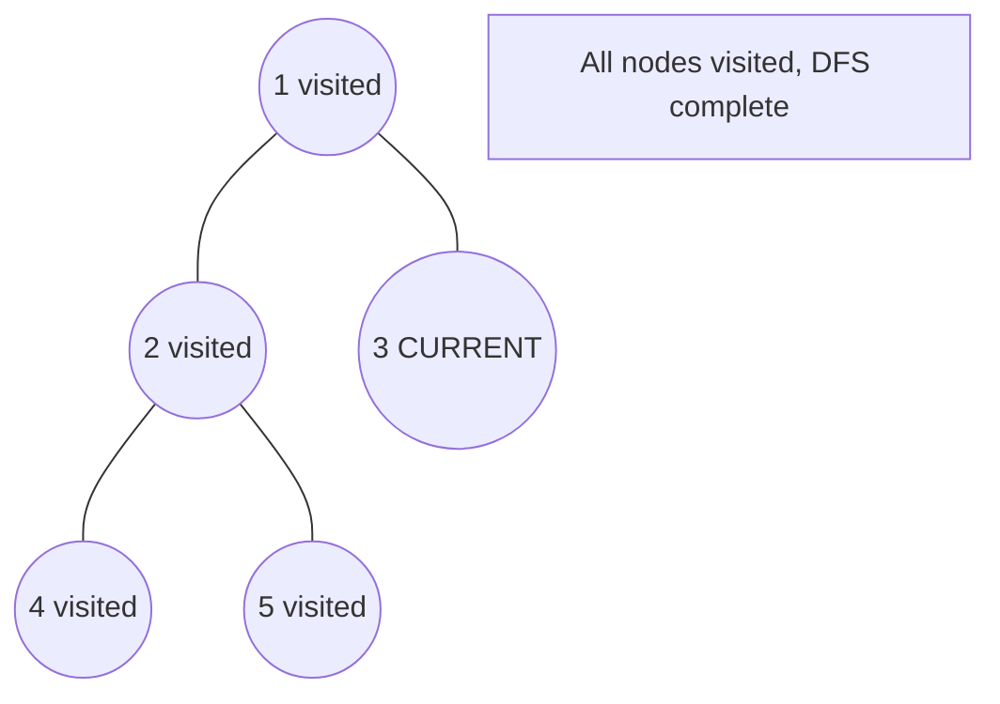

# Problem 236: Lowest Common Ancestor of a Binary Tree

**Difficulty:** Medium  
**Tags:** Tree, Depth-First Search, Binary Tree  
**Pattern:** Tree / DFS  
**Link:** [leetcode.com/problems/lowest-common-ancestor-of-a-binary-tree](https://leetcode.com/problems/lowest-common-ancestor-of-a-binary-tree/)

## Description

Given a binary tree, find the lowest common ancestor (LCA) of two given nodes in the tree.

According to the definition of LCA on Wikipedia: “The lowest common ancestor is defined between two nodes `p` and `q` as the lowest node in `T` that has both `p` and `q` as descendants (where we allow **a node to be a descendant of itself**).”

 

Example 1:

```

**Input:** root = [3,5,1,6,2,0,8,null,null,7,4], p = 5, q = 1
**Output:** 3
**Explanation:** The LCA of nodes 5 and 1 is 3.

```

Example 2:

```

**Input:** root = [3,5,1,6,2,0,8,null,null,7,4], p = 5, q = 4
**Output:** 5
**Explanation:** The LCA of nodes 5 and 4 is 5, since a node can be a descendant of itself according to the LCA definition.

```

Example 3:

```

**Input:** root = [1,2], p = 1, q = 2
**Output:** 1

```

 

**Constraints:**

	- The number of nodes in the tree is in the range `[2, 10^5]`.
	- `-10^9 <= Node.val <= 10^9`
	- All `Node.val` are **unique**.
	- `p != q`
	- `p` and `q` will exist in the tree.

## Approach: Tree / DFS

**Key Insight:** If p and q are in different subtrees, current node is LCA. If both in same subtree, recurse.

## Pseudocode

```
1. If root is null, p, or q: return root
2. Recurse left and right
3. If both found: root is LCA
4. Else return whichever found
```

## Algorithm Flow



## Visual State Transitions

**DFS Tree Traversal Step-by-Step:**

**Frame 1: Start at root**


**Frame 2: Go left - visit node 2**


**Frame 3: Go left - visit node 4 (leaf)**


**Frame 4: Backtrack, visit node 5, then node 3**



## Complexity Analysis

- **Time:** O(n)
- **Space:** O(h)

## Solution (Python3)

```python
class Solution:
    def lowestCommonAncestor(self, root, p, q):
        if not root or root == p or root == q:
            return root
        left = self.lowestCommonAncestor(root.left, p, q)
        right = self.lowestCommonAncestor(root.right, p, q)
        if left and right:
            return root
        return left or right
```

## Solution (C++)

```cpp
#include <algorithm>
#include <functional>
#include <string>
#include <vector>
using namespace std;

class Solution {
public:
    TreeNode* lowestCommonAncestor(TreeNode* root, TreeNode* p, TreeNode* q) {
        // DFS on binary tree - O(n) time, O(h) space
        function<int(TreeNode*)> dfs = [&](TreeNode* node) -> int {
            if (!node) return 0;
            int left = dfs(node->left);
            int right = dfs(node->right);
            return 1 + max(left, right);
        };
        return dfs(root);
    }
};
```
