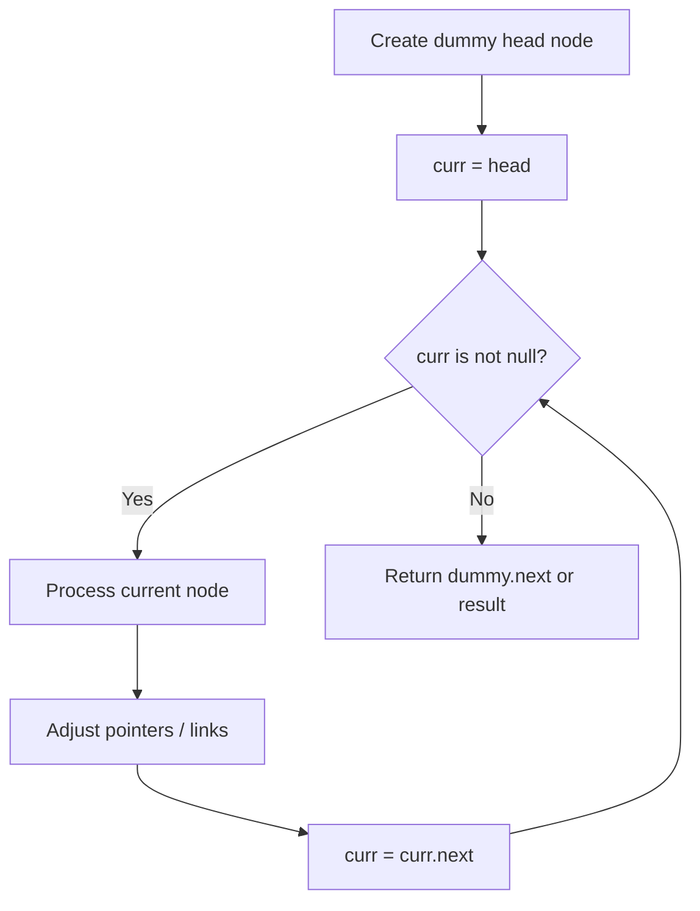
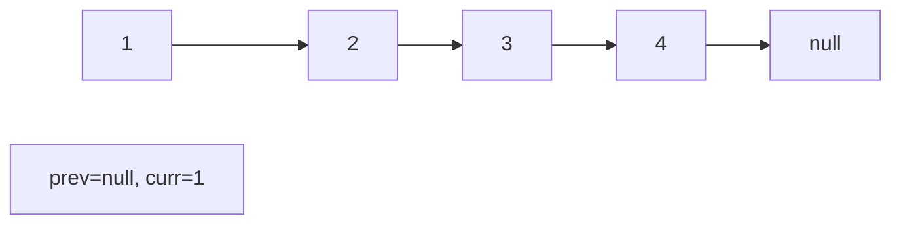
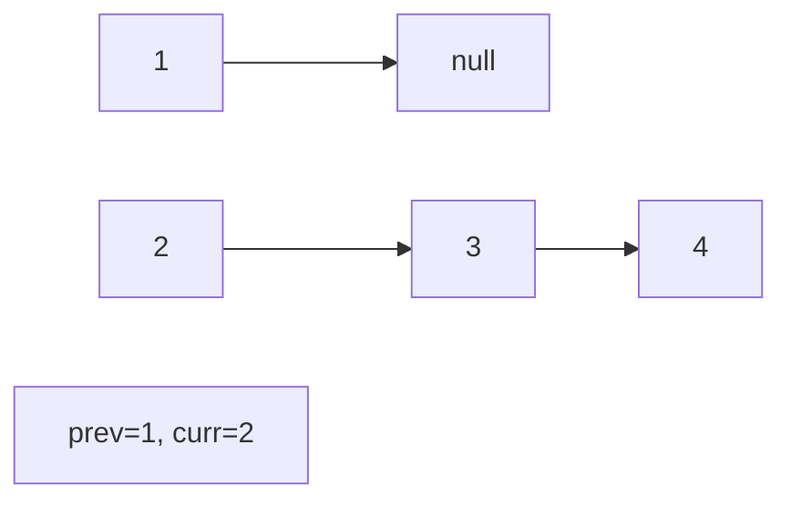
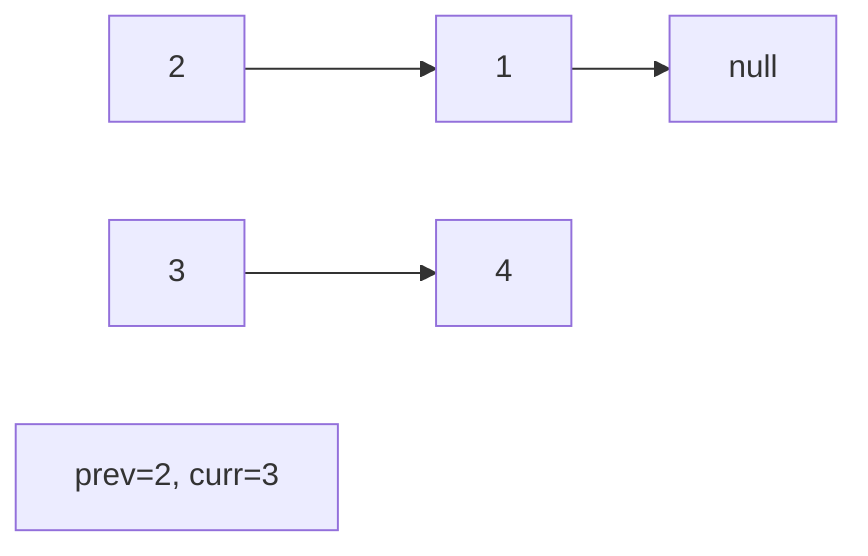
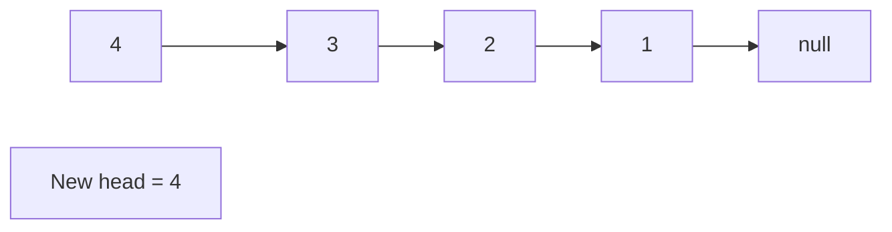

# Problem 237: Delete Node in a Linked List

**Difficulty:** Medium  
**Tags:** Linked List  
**Pattern:** Linked List  
**Link:** [leetcode.com/problems/delete-node-in-a-linked-list](https://leetcode.com/problems/delete-node-in-a-linked-list/)

## Description

There is a singly-linked list `head` and we want to delete a node `node` in it.

You are given the node to be deleted `node`. You will **not be given access** to the first node of `head`.

All the values of the linked list are **unique**, and it is guaranteed that the given node `node` is not the last node in the linked list.

Delete the given node. Note that by deleting the node, we do not mean removing it from memory. We mean:

	- The value of the given node should not exist in the linked list.
	- The number of nodes in the linked list should decrease by one.
	- All the values before `node` should be in the same order.
	- All the values after `node` should be in the same order.

**Custom testing:**

	- For the input, you should provide the entire linked list `head` and the node to be given `node`. `node` should not be the last node of the list and should be an actual node in the list.
	- We will build the linked list and pass the node to your function.
	- The output will be the entire list after calling your function.

 

Example 1:

```

**Input:** head = [4,5,1,9], node = 5
**Output:** [4,1,9]
**Explanation: **You are given the second node with value 5, the linked list should become 4 -> 1 -> 9 after calling your function.

```

Example 2:

```

**Input:** head = [4,5,1,9], node = 1
**Output:** [4,5,9]
**Explanation: **You are given the third node with value 1, the linked list should become 4 -> 5 -> 9 after calling your function.

```

 

**Constraints:**

	- The number of the nodes in the given list is in the range `[2, 1000]`.
	- `-1000 <= Node.val <= 1000`
	- The value of each node in the list is **unique**.
	- The `node` to be deleted is **in the list** and is **not a tail** node.

## Approach: Linked List

Traverse or manipulate the linked list using pointer techniques. Common patterns: dummy head node for edge cases, fast/slow pointers for cycle detection or middle finding, in-place reversal, and merge operations.

## Pseudocode

```
1. Create dummy head if needed
2. Initialize pointer(s) at head
3. Traverse / modify list:
   a. Process current node
   b. Adjust next pointers as needed
   c. Move to next node
4. Return dummy.next or result
```

## Algorithm Flow



## Visual State Transitions

**Linked List Operation (Reverse):**

**Frame 1: Initial list**


**Frame 2: Reverse first link**


**Frame 3: Reverse second link**


**Frame 4: Fully reversed**



## Complexity Analysis

- **Time:** O(n)
- **Space:** O(1)

## Solution (Python3)

```python
class Solution:
    def deleteNode(self, node: int) -> None:
        # Linked list traversal/manipulation
        dummy = ListNode(0)
        dummy.next = node
        prev, curr = dummy, node
        while curr:
            nxt = curr.next
            # Process current node
            prev = curr
            curr = nxt
        return dummy.next
```

## Solution (C++)

```cpp
#include <string>
#include <vector>
using namespace std;

class Solution {
public:
    void deleteNode(int node) {
        // Linked list traversal/manipulation
        ListNode dummy(0);
        dummy.next = node;
        ListNode* prev = &dummy;
        ListNode* curr = node;
        while (curr) {
            ListNode* nxt = curr->next;
            // Process current node
            prev = curr;
            curr = nxt;
        }
        return dummy.next;
    }
};
```
