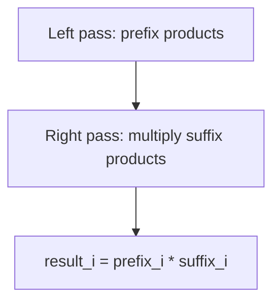

# Problem 238: Product of Array Except Self

**Difficulty:** Medium  
**Tags:** Array, Prefix Sum  
**Pattern:** Prefix/Suffix Products  
**Link:** [leetcode.com/problems/product-of-array-except-self](https://leetcode.com/problems/product-of-array-except-self/)

## Description

Given an integer array `nums`, return *an array* `answer` *such that* `answer[i]` *is equal to the product of all the elements of* `nums` *except* `nums[i]`.

The product of any prefix or suffix of `nums` is **guaranteed** to fit in a **32-bit** integer.

You must write an algorithm that runs in `O(n)` time and without using the division operation.

 

Example 1:

```
**Input:** nums = [1,2,3,4]
**Output:** [24,12,8,6]

```
Example 2:

```
**Input:** nums = [-1,1,0,-3,3]
**Output:** [0,0,9,0,0]

```

 

**Constraints:**

	- `2 <= nums.length <= 10^5`
	- `-30 <= nums[i] <= 30`
	- The input is generated such that `answer[i]` is **guaranteed** to fit in a **32-bit** integer.

 

**Follow up:** Can you solve the problem in `O(1)` extra space complexity? (The output array **does not** count as extra space for space complexity analysis.)

## Approach: Prefix/Suffix Products

**Key Insight:** product except self = prefix product * suffix product. Two passes, no division.

## Pseudocode

```
1. Left pass: result[i] = product of all left elements
2. Right pass: multiply by product of all right elements
```

## Algorithm Flow



## Complexity Analysis

- **Time:** O(n)
- **Space:** O(1) extra

## Solution (Python3)

```python
class Solution:
    def productExceptSelf(self, nums: list[int]) -> list[int]:
        n = len(nums)
        result = [1] * n
        prefix = 1
        for i in range(n):
            result[i] = prefix
            prefix *= nums[i]
        suffix = 1
        for i in range(n - 1, -1, -1):
            result[i] *= suffix
            suffix *= nums[i]
        return result
```

## Solution (C++)

```cpp
#include <algorithm>
#include <string>
#include <unordered_map>
#include <vector>
using namespace std;

class Solution {
public:
    vector<int> productExceptSelf(vector<int>& nums) {
        // Prefix sum approach - O(n) time, O(n) space
        unordered_map<int, int> prefix;
        prefix[0] = -1;
        int curr_sum = 0, result = 0;
        int target = nums;
        for (int i = 0; i < (int)nums.size(); i++) {
            curr_sum += nums[i];
            if (prefix.count(curr_sum - target)) {
                result = max(result, i - prefix[curr_sum - target]);
            }
            if (!prefix.count(curr_sum)) {
                prefix[curr_sum] = i;
            }
        }
        return result;
    }
};
```
