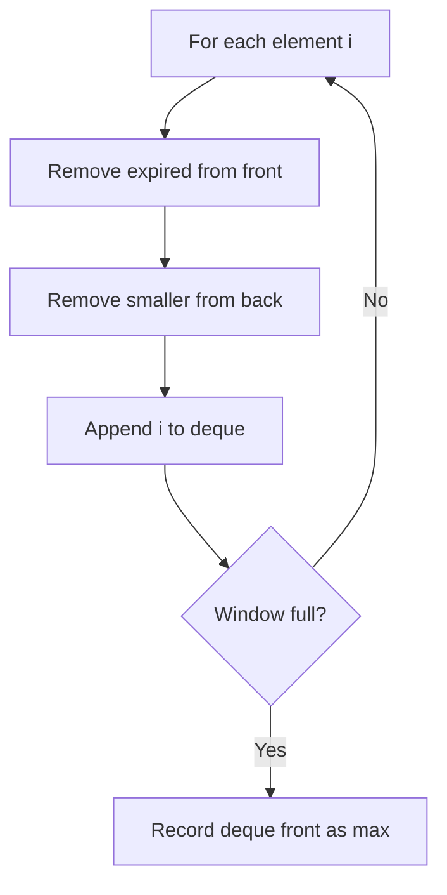

# Problem 239: Sliding Window Maximum

**Difficulty:** Hard  
**Tags:** Array, Queue, Sliding Window, Heap (Priority Queue), Monotonic Queue  
**Pattern:** Monotonic Deque  
**Link:** [leetcode.com/problems/sliding-window-maximum](https://leetcode.com/problems/sliding-window-maximum/)

## Description

You are given an array of integers `nums`, there is a sliding window of size `k` which is moving from the very left of the array to the very right. You can only see the `k` numbers in the window. Each time the sliding window moves right by one position.

Return *the max sliding window*.

 

Example 1:

```

**Input:** nums = [1,3,-1,-3,5,3,6,7], k = 3
**Output:** [3,3,5,5,6,7]
**Explanation:** 
Window position                Max
---------------               -----
[1  3  -1] -3  5  3  6  7       **3**
 1 [3  -1  -3] 5  3  6  7       **3**
 1  3 [-1  -3  5] 3  6  7      ** 5**
 1  3  -1 [-3  5  3] 6  7       **5**
 1  3  -1  -3 [5  3  6] 7       **6**
 1  3  -1  -3  5 [3  6  7]      **7**

```

Example 2:

```

**Input:** nums = [1], k = 1
**Output:** [1]

```

 

**Constraints:**

	- `1 <= nums.length <= 10^5`
	- `-10^4 <= nums[i] <= 10^4`
	- `1 <= k <= nums.length`

## Approach: Monotonic Deque

**Monotonic decreasing deque:** Front is always the window max. Remove expired and smaller elements.

## Pseudocode

```
1. Deque stores indices in decreasing order of values
2. Remove expired (outside window)
3. Remove smaller than current from back
4. Front = window max
```

## Algorithm Flow



## Complexity Analysis

- **Time:** O(n)
- **Space:** O(k)

## Solution (Python3)

```python
from collections import deque

class Solution:
    def maxSlidingWindow(self, nums: list[int], k: int) -> list[int]:
        dq = deque()
        result = []
        for i in range(len(nums)):
            while dq and dq[0] < i - k + 1:
                dq.popleft()
            while dq and nums[dq[-1]] < nums[i]:
                dq.pop()
            dq.append(i)
            if i >= k - 1:
                result.append(nums[dq[0]])
        return result
```

## Solution (C++)

```cpp
#include <deque>
#include <string>
#include <vector>
using namespace std;

class Solution {
public:
    vector<int> maxSlidingWindow(vector<int>& nums, int k) {
        // Monotonic deque - O(n) time
        deque<int> dq;
        vector<int> result;
        int k = k;
        for (int i = 0; i < (int)nums.size(); i++) {
            while (!dq.empty() && dq.front() < i - k + 1)
                dq.pop_front();
            while (!dq.empty() && nums[dq.back()] < nums[i])
                dq.pop_back();
            dq.push_back(i);
            if (i >= k - 1)
                result.push_back(nums[dq.front()]);
        }
        return result;
    }
};
```
