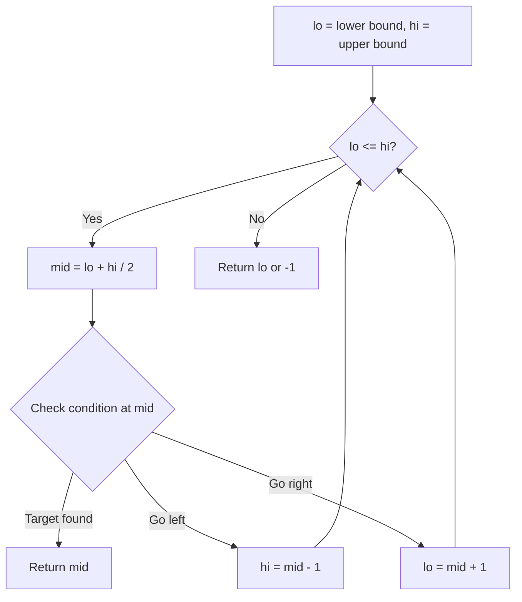
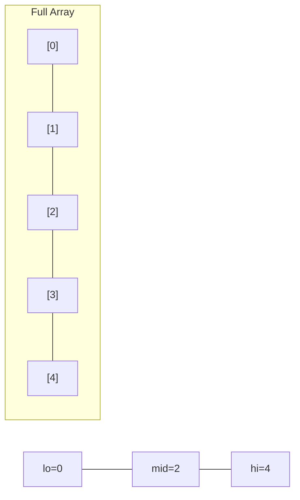
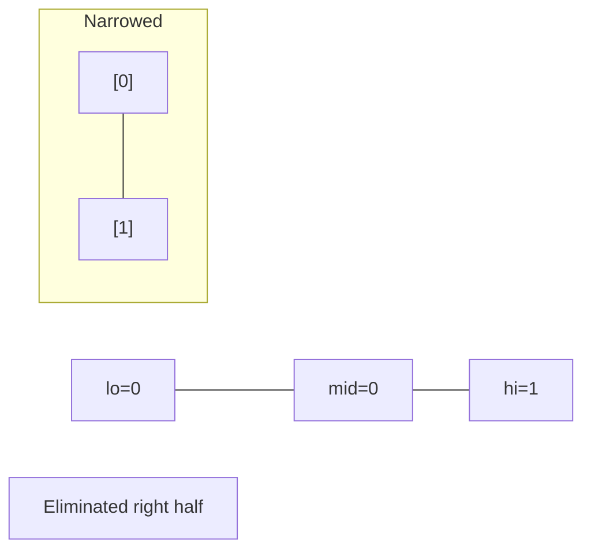
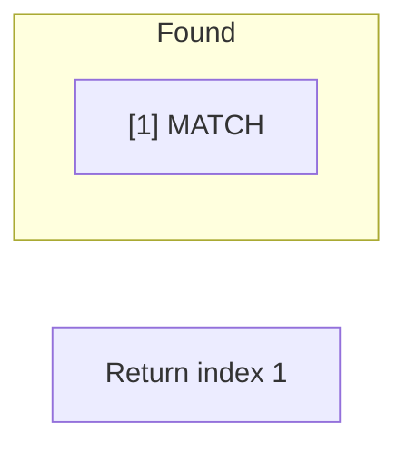

# Problem 240: Search a 2D Matrix II

**Difficulty:** Medium  
**Tags:** Array, Binary Search, Divide and Conquer, Matrix  
**Pattern:** Binary Search  
**Link:** [leetcode.com/problems/search-a-2d-matrix-ii](https://leetcode.com/problems/search-a-2d-matrix-ii/)

## Description

Write an efficient algorithm that searches for a value `target` in an `m x n` integer matrix `matrix`. This matrix has the following properties:

	- Integers in each row are sorted in ascending from left to right.
	- Integers in each column are sorted in ascending from top to bottom.

 

Example 1:

```

**Input:** matrix = [[1,4,7,11,15],[2,5,8,12,19],[3,6,9,16,22],[10,13,14,17,24],[18,21,23,26,30]], target = 5
**Output:** true

```

Example 2:

```

**Input:** matrix = [[1,4,7,11,15],[2,5,8,12,19],[3,6,9,16,22],[10,13,14,17,24],[18,21,23,26,30]], target = 20
**Output:** false

```

 

**Constraints:**

	- `m == matrix.length`
	- `n == matrix[i].length`
	- `1 <= n, m <= 300`
	- `-10^9 <= matrix[i][j] <= 10^9`
	- All the integers in each row are **sorted** in ascending order.
	- All the integers in each column are **sorted** in ascending order.
	- `-10^9 <= target <= 10^9`

## Approach: Binary Search

Use binary search to halve the search space each iteration. Define the search range [lo, hi], compute mid, and decide which half to keep based on the problem's monotonic condition.

## Pseudocode

```
1. lo = lower_bound, hi = upper_bound
2. While lo <= hi (or lo < hi):
   a. mid = (lo + hi) // 2
   b. If condition(mid) is satisfied: record answer, search left half
   c. Else: search right half
3. Return answer
```

## Algorithm Flow



## Visual State Transitions

**Binary Search Step-by-Step:**

**Frame 1: Initial search space**


**Frame 2: Compare mid, narrow search**


**Frame 3: Found target**



## Complexity Analysis

- **Time:** O(log n)
- **Space:** O(1)

## Solution (Python3)

```python
class Solution:
    def searchMatrix(self, matrix: List[List[int]], target: int) -> bool:
        # Binary search - O(log n) time, O(1) space
        lo, hi = 0, len(matrix) - 1
        while lo <= hi:
            mid = lo + (hi - lo) // 2
            if matrix[mid] == target:
                return mid
            elif matrix[mid] < target:
                lo = mid + 1
            else:
                hi = mid - 1
        return False
```

## Solution (C++)

```cpp
#include <string>
#include <vector>
using namespace std;

class Solution {
public:
    bool searchMatrix(vector<vector<int>>& matrix, int target) {
        // Binary search - O(log n) time, O(1) space
        int lo = 0, hi = matrix.size() - 1;
        while (lo <= hi) {
            int mid = lo + (hi - lo) / 2;
            if (matrix[mid] == target) {
                return mid;
            } else if (matrix[mid] < target) {
                lo = mid + 1;
            } else {
                hi = mid - 1;
            }
        }
        return false;
    }
};
```
