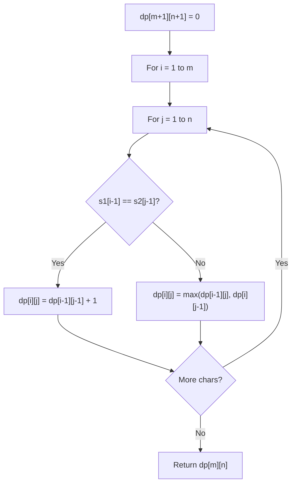

# Problem 241: Different Ways to Add Parentheses

**Difficulty:** Medium  
**Tags:** Math, String, Dynamic Programming, Recursion, Memoization  
**Pattern:** Dynamic Programming (String)  
**Link:** [leetcode.com/problems/different-ways-to-add-parentheses](https://leetcode.com/problems/different-ways-to-add-parentheses/)

## Description

Given a string `expression` of numbers and operators, return *all possible results from computing all the different possible ways to group numbers and operators*. You may return the answer in **any order**.

The test cases are generated such that the output values fit in a 32-bit integer and the number of different results does not exceed `10^4`.

 

Example 1:

```

**Input:** expression = "2-1-1"
**Output:** [0,2]
**Explanation:**
((2-1)-1) = 0 
(2-(1-1)) = 2

```

Example 2:

```

**Input:** expression = "2*3-4*5"
**Output:** [-34,-14,-10,-10,10]
**Explanation:**
(2*(3-(4*5))) = -34 
((2*3)-(4*5)) = -14 
((2*(3-4))*5) = -10 
(2*((3-4)*5)) = -10 
(((2*3)-4)*5) = 10

```

 

**Constraints:**

	- `1 <= expression.length <= 20`
	- `expression` consists of digits and the operator `'+'`, `'-'`, and `'*'`.
	- All the integer values in the input expression are in the range `[0, 99]`.
	- The integer values in the input expression do not have a leading `'-'` or `'+'` denoting the sign.

## Approach: Dynamic Programming (String)

Compare or match two strings using a 2D DP table. dp[i][j] represents the answer for substrings s1[0..i-1] and s2[0..j-1]. Common patterns: LCS, edit distance, regex matching.

## Pseudocode

```
1. Create dp[m+1][n+1]
2. Initialize base cases
3. For i from 1 to m:
   For j from 1 to n:
     If s1[i-1] == s2[j-1]: dp[i][j] = dp[i-1][j-1] + 1
     Else: dp[i][j] = best of (dp[i-1][j], dp[i][j-1], dp[i-1][j-1])
4. Return dp[m][n]
```

## Algorithm Flow



## Complexity Analysis

- **Time:** O(m * n)
- **Space:** O(m * n)

## Solution (Python3)

```python
class Solution:
    def diffWaysToCompute(self, expression: str) -> List[int]:
        # String DP - O(m*n) time and space
        m, n = len(expression), len(expression)
        dp = [[0] * (n + 1) for _ in range(m + 1)]
        for i in range(1, m + 1):
            for j in range(1, n + 1):
                if expression[i-1] == expression[j-1]:
                    dp[i][j] = dp[i-1][j-1] + 1
                else:
                    dp[i][j] = max(dp[i-1][j], dp[i][j-1])
        return dp[m][n]
```

## Solution (C++)

```cpp
#include <algorithm>
#include <string>
#include <vector>
using namespace std;

class Solution {
public:
    vector<int> diffWaysToCompute(string& expression) {
        // String DP - O(m*n) time and space
        int m = expression.size(), n = expression.size();
        vector<vector<int>> dp(m + 1, vector<int>(n + 1, 0));
        for (int i = 1; i <= m; i++) {
            for (int j = 1; j <= n; j++) {
                if (expression[i-1] == expression[j-1])
                    dp[i][j] = dp[i-1][j-1] + 1;
                else
                    dp[i][j] = max(dp[i-1][j], dp[i][j-1]);
            }
        }
        return dp[m][n];
    }
};
```
