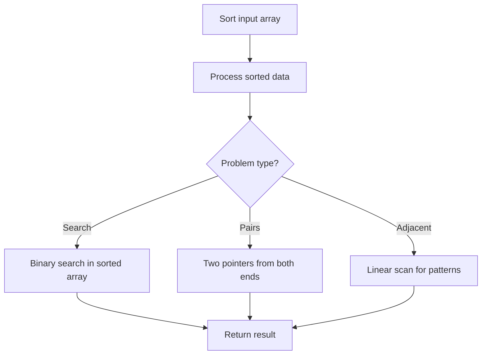

# Problem 242: Valid Anagram

**Difficulty:** Easy  
**Tags:** Hash Table, String, Sorting  
**Pattern:** Sorting  
**Link:** [leetcode.com/problems/valid-anagram](https://leetcode.com/problems/valid-anagram/)

## Description

Given two strings `s` and `t`, return `true` if `t` is an anagram of `s`, and `false` otherwise.

 

Example 1:

**Input:** s = "anagram", t = "nagaram"

**Output:** true

Example 2:

**Input:** s = "rat", t = "car"

**Output:** false

 

**Constraints:**

	- `1 <= s.length, t.length <= 5 * 10^4`
	- `s` and `t` consist of lowercase English letters.

 

**Follow up:** What if the inputs contain Unicode characters? How would you adapt your solution to such a case?

## Approach: Sorting

Sort the data to enable efficient processing. After sorting, use techniques like binary search, two pointers, or linear scan to solve the problem.

## Pseudocode

```
1. Sort the input array
2. Process sorted data:
   - Use binary search for lookups
   - Use two pointers for pair finding
   - Scan for adjacent patterns
3. Return result
```

## Algorithm Flow



## Complexity Analysis

- **Time:** O(n log n)
- **Space:** O(n)

## Solution (Python3)

```python
class Solution:
    def isAnagram(self, s: str, t: str) -> bool:
        # Sort-based approach - O(n log n) time
        s.sort(key=lambda x: x[0] if isinstance(x, (list, tuple)) else x)
        result = [s[0]]
        for i in range(1, len(s)):
            curr = s[i]
            if isinstance(curr, (list, tuple)) and isinstance(result[-1], (list, tuple)):
                if curr[0] <= result[-1][1]:
                    result[-1] = [result[-1][0], max(result[-1][1], curr[1])]
                else:
                    result.append(curr)
            else:
                result.append(curr)
        return result
```

## Solution (C++)

```cpp
#include <algorithm>
#include <string>
#include <vector>
using namespace std;

class Solution {
public:
    bool isAnagram(string& s, string& t) {
        // Sort-based approach - O(n log n) time
        sort(s.begin(), s.end());
        vector<vector<int>> result;
        result.push_back(s[0]);
        for (int i = 1; i < (int)s.size(); i++) {
            if (s[i][0] <= result.back()[1]) {
                result.back()[1] = max(result.back()[1], s[i][1]);
            } else {
                result.push_back(s[i]);
            }
        }
        return result;
    }
};
```
