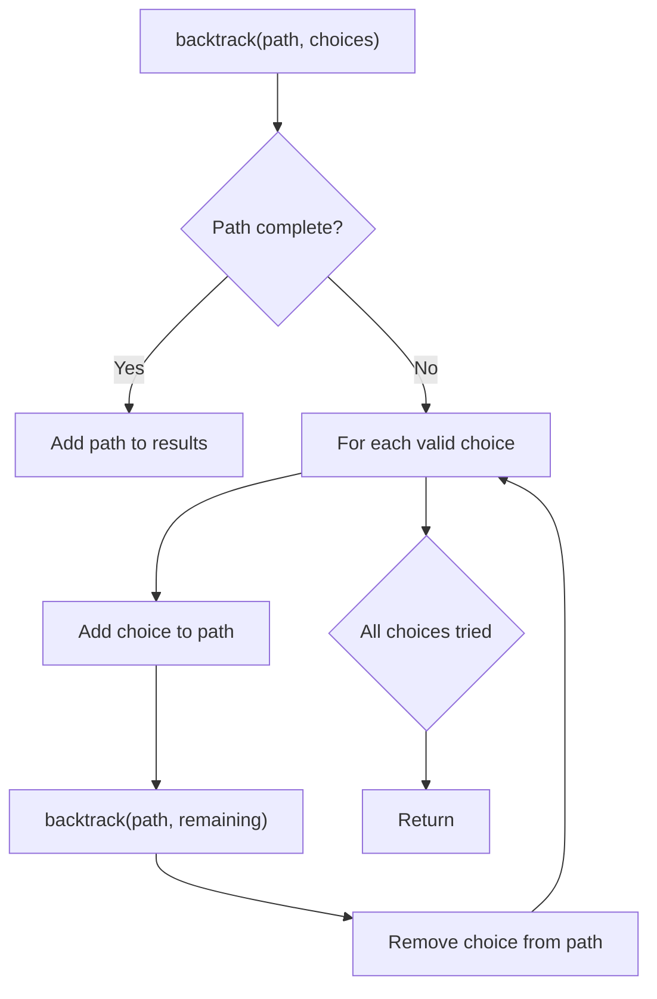
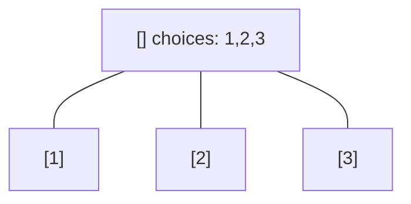
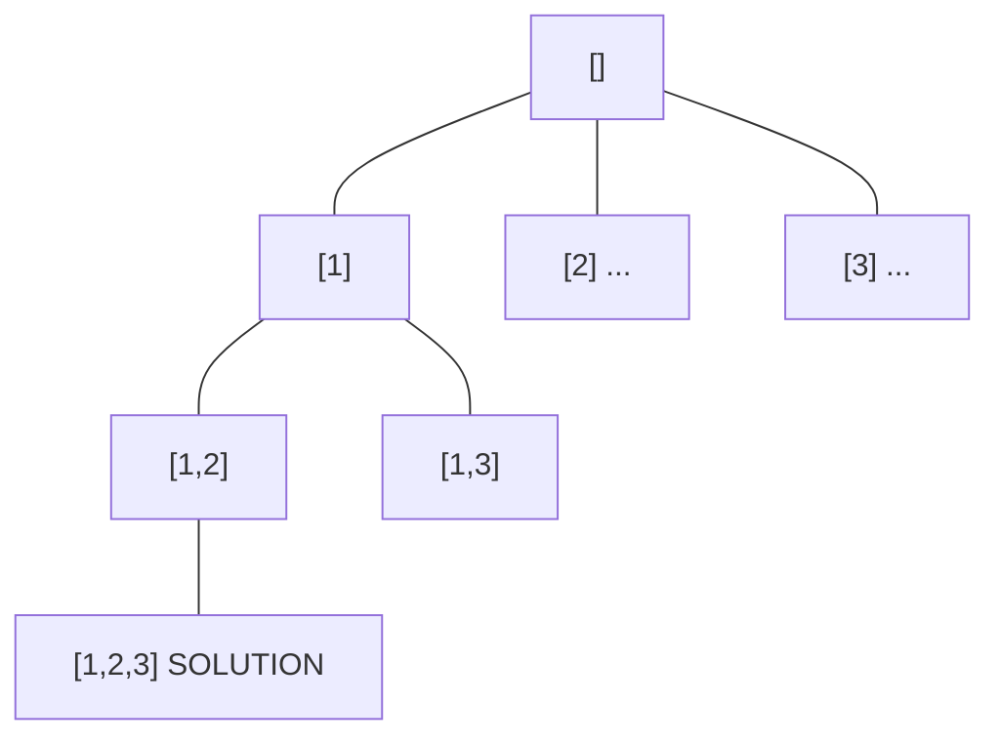
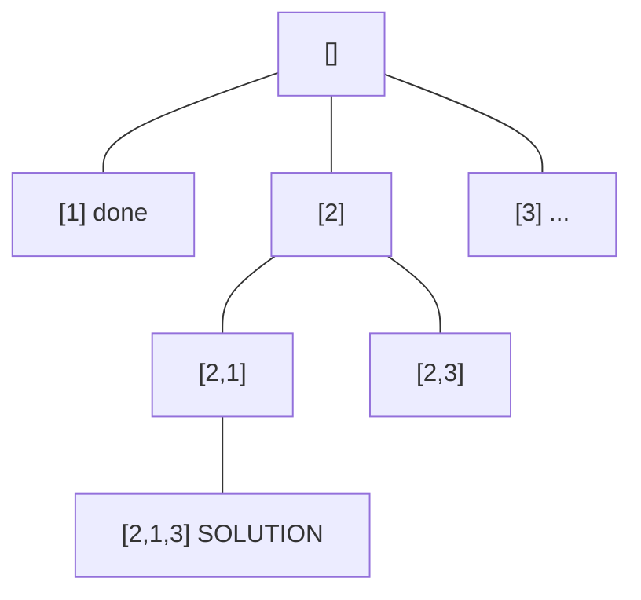
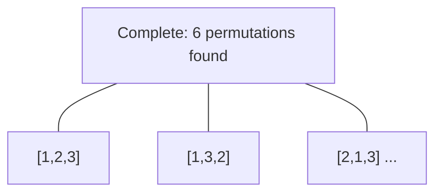

# Problem 257: Binary Tree Paths

**Difficulty:** Easy  
**Tags:** String, Backtracking, Tree, Depth-First Search, Binary Tree  
**Pattern:** Backtracking  
**Link:** [leetcode.com/problems/binary-tree-paths](https://leetcode.com/problems/binary-tree-paths/)

## Description

Given the `root` of a binary tree, return *all root-to-leaf paths in **any order***.

A **leaf** is a node with no children.

 

Example 1:

```

**Input:** root = [1,2,3,null,5]
**Output:** ["1->2->5","1->3"]

```

Example 2:

```

**Input:** root = [1]
**Output:** ["1"]

```

 

**Constraints:**

	- The number of nodes in the tree is in the range `[1, 100]`.
	- `-100 <= Node.val <= 100`

## Approach: Backtracking

Explore all possible solutions by building candidates incrementally. At each step, make a choice and recurse. If the choice leads to a dead end, undo the choice (backtrack) and try the next option.

## Pseudocode

```
1. Define backtrack(path, choices):
   a. If path is a complete solution: add to results
   b. For each choice in choices:
      - If choice is valid:
        * Add choice to path
        * backtrack(path, remaining_choices)
        * Remove choice from path (backtrack)
2. Call backtrack([], all_choices)
```

## Algorithm Flow



## Visual State Transitions

**Backtracking Decision Tree:**

**Frame 1: Root - start with empty path**


**Frame 2: Explore branch [1]**


**Frame 3: Backtrack, explore [2]**


**Frame 4: All solutions found**



## Complexity Analysis

- **Time:** O(k^n) or O(n!)
- **Space:** O(n)

## Solution (Python3)

```python
class Solution:
    def binaryTreePaths(self, root: Optional[TreeNode]) -> List[str]:
        # Backtracking - O(2^n) or O(n!) time
        result = []
        
        def backtrack(path, start):
            result.append(path[:])
            for i in range(start, len(root)):
                path.append(root[i])
                backtrack(path, i + 1)
                path.pop()
        
        backtrack([], 0)
        return result
```

## Solution (C++)

```cpp
#include <functional>
#include <string>
#include <vector>
using namespace std;

class Solution {
public:
    vector<string> binaryTreePaths(TreeNode* root) {
        // Backtracking - O(2^n) or O(n!) time
        vector<vector<int>> result;
        vector<int> path;
        function<void(int)> backtrack = [&](int start) {
            result.push_back(path);
            for (int i = start; i < (int)root.size(); i++) {
                path.push_back(root[i]);
                backtrack(i + 1);
                path.pop_back();
            }
        };
        backtrack(0);
        return result;
    }
};
```
