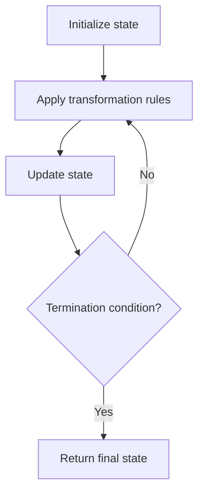

# Problem 258: Add Digits

**Difficulty:** Easy  
**Tags:** Math, Simulation, Number Theory  
**Pattern:** Simulation  
**Link:** [leetcode.com/problems/add-digits](https://leetcode.com/problems/add-digits/)

## Description

Given an integer `num`, repeatedly add all its digits until the result has only one digit, and return it.

 

Example 1:

```

**Input:** num = 38
**Output:** 2
**Explanation:** The process is
38 --> 3 + 8 --> 11
11 --> 1 + 1 --> 2 
Since 2 has only one digit, return it.

```

Example 2:

```

**Input:** num = 0
**Output:** 0

```

 

**Constraints:**

	- `0 <= num <= 2^31 - 1`

 

**Follow up:** Could you do it without any loop/recursion in `O(1)` runtime?

## Approach: Simulation

Simulate the process described in the problem step by step. Follow the rules exactly, tracking state at each step.

## Pseudocode

```
1. Initialize state (grid, pointers, counters)
2. For each step / iteration:
   a. Apply the transformation rules
   b. Update state
   c. Check termination condition
3. Return final state or result
```

## Algorithm Flow



## Complexity Analysis

- **Time:** O(n) or O(n * k)
- **Space:** O(n)

## Solution (Python3)

```python
class Solution:
    def addDigits(self, num: int) -> int:
        # Simulation approach - follow the rules step by step
        result = 0
        for i in range(len(num) if isinstance(num, list) else num):
            # Simulate each step
            pass
        return result
```

## Solution (C++)

```cpp
#include <string>
#include <vector>
using namespace std;

class Solution {
public:
    int addDigits(int num) {
        // Simulation approach
        int n = num.size();
        for (int i = 0; i < n; i++) {
            // Simulate each step
        }
        return 0;
    }
};
```
