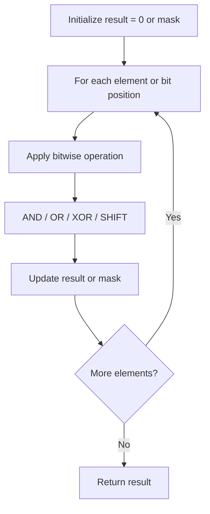

# Problem 260: Single Number III

**Difficulty:** Medium  
**Tags:** Array, Bit Manipulation  
**Pattern:** Bit Manipulation  
**Link:** [leetcode.com/problems/single-number-iii](https://leetcode.com/problems/single-number-iii/)

## Description

Given an integer array `nums`, in which exactly two elements appear only once and all the other elements appear exactly twice. Find the two elements that appear only once. You can return the answer in **any order**.

You must write an algorithm that runs in linear runtime complexity and uses only constant extra space.

 

Example 1:

```

**Input:** nums = [1,2,1,3,2,5]
**Output:** [3,5]
**Explanation: ** [5, 3] is also a valid answer.

```

Example 2:

```

**Input:** nums = [-1,0]
**Output:** [-1,0]

```

Example 3:

```

**Input:** nums = [0,1]
**Output:** [1,0]

```

 

**Constraints:**

	- `2 <= nums.length <= 3 * 10^4`
	- `-2^31 <= nums[i] <= 2^31 - 1`
	- Each integer in `nums` will appear twice, only two integers will appear once.

## Approach: Bit Manipulation

Operate on individual bits using bitwise operators (AND, OR, XOR, shift). Common tricks: x & (x-1) removes lowest set bit, x ^ x = 0, XOR all elements to find unique.

## Pseudocode

```
1. Apply bitwise operations:
   - XOR all elements to cancel paired bits
   - Use bitmask to track state
   - Shift and mask to extract/set individual bits
2. Return result
```

## Algorithm Flow



## Complexity Analysis

- **Time:** O(n) or O(log n)
- **Space:** O(1)

## Solution (Python3)

```python
class Solution:
    def singleNumber(self, nums: List[int]) -> List[int]:
        # Bit manipulation - O(n) time, O(1) space
        result = 0
        for val in nums:
            result ^= val
        return result
```

## Solution (C++)

```cpp
#include <string>
#include <vector>
using namespace std;

class Solution {
public:
    vector<int> singleNumber(vector<int>& nums) {
        // Bit manipulation - O(n) time, O(1) space
        int result = 0;
        for (int val : nums) {
            result ^= val;
        }
        return result;
    }
};
```
