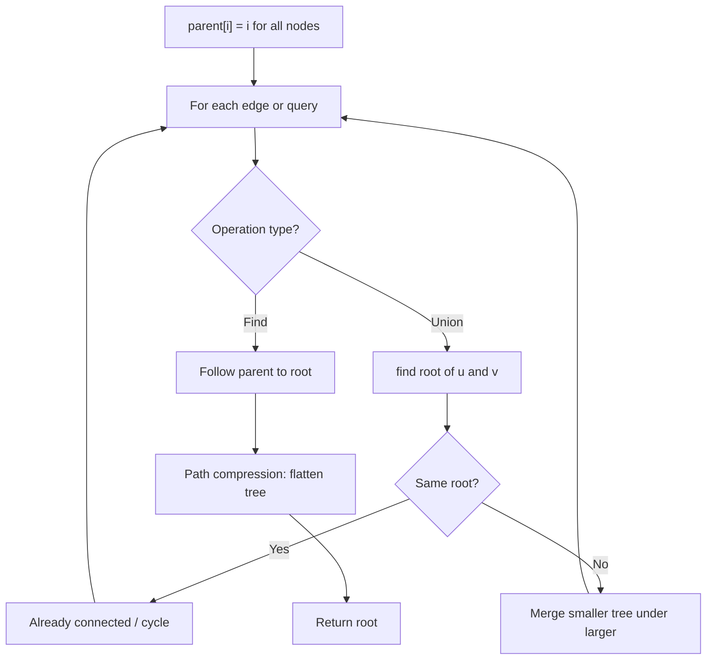
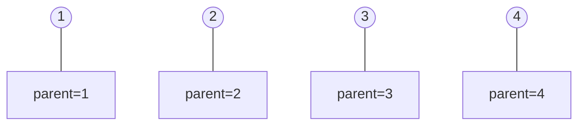
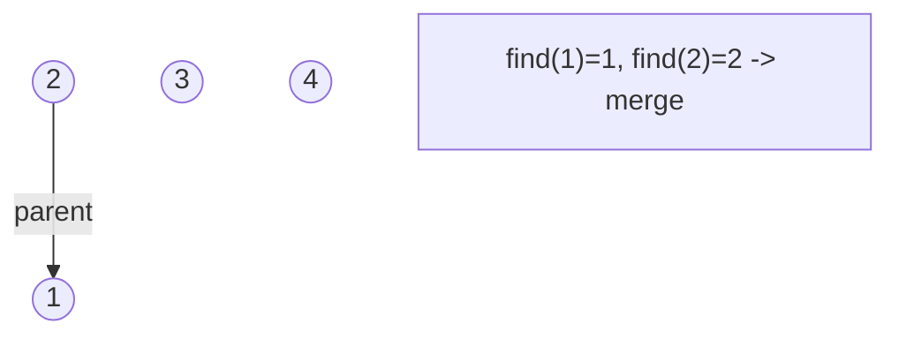
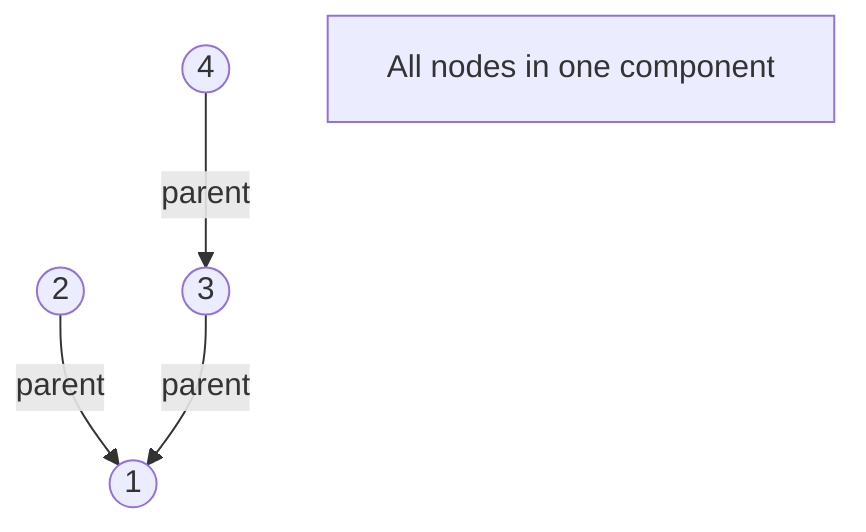
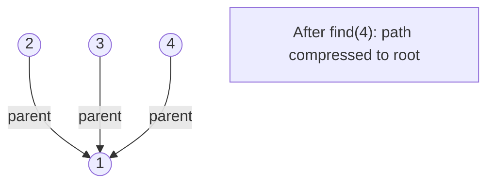

# Problem 261: Graph Valid Tree

**Difficulty:** Medium  
**Tags:** Depth-First Search, Breadth-First Search, Union-Find, Graph Theory  
**Pattern:** Union Find  
**Link:** [leetcode.com/problems/graph-valid-tree](https://leetcode.com/problems/graph-valid-tree/)

## Description

*(Premium problem -- description requires LeetCode subscription)*

## Approach: Union Find

A graph is a tree if it has n-1 edges and no cycles. Use Union-Find to detect cycles.

## Pseudocode

```
1. If edges != n-1: False
2. Union-Find: for each edge, if same root: cycle
3. Return True if no cycle
```

## Algorithm Flow



## Visual State Transitions

**Union-Find Step-by-Step:**

**Frame 1: Initial - each node is own parent**


**Frame 2: Union(1,2) - merge components**


**Frame 3: Union(3,4) then Union(2,3)**


**Frame 4: Path compression on find(4)**



## Complexity Analysis

- **Time:** O(n * alpha(n))
- **Space:** O(n)

## Solution (Python3)

```python
class Solution:
    def validTree(self, n: int, edges: list[list[int]]) -> bool:
        if len(edges) != n - 1:
            return False
        parent = list(range(n))
        def find(x):
            while parent[x] != x:
                parent[x] = parent[parent[x]]
                x = parent[x]
            return x
        for a, b in edges:
            ra, rb = find(a), find(b)
            if ra == rb:
                return False
            parent[ra] = rb
        return True
```

## Solution (C++)

```cpp
class Solution {
public:
    // Design problem stub
};
```
