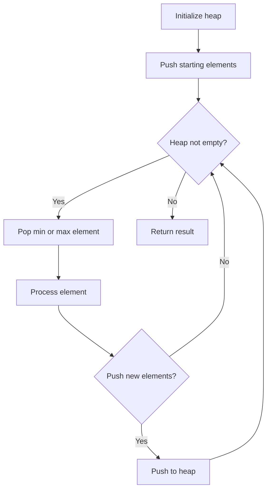
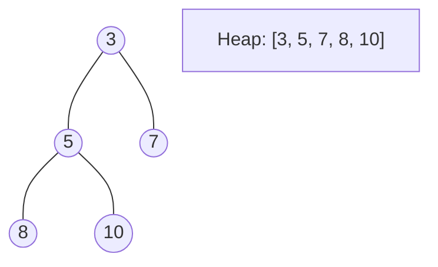
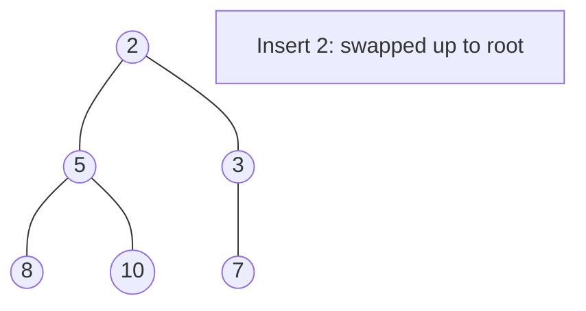
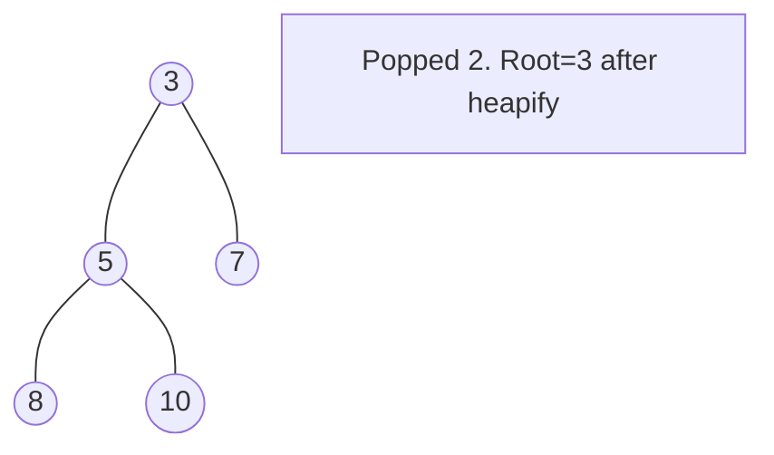

# Problem 264: Ugly Number II

**Difficulty:** Medium  
**Tags:** Hash Table, Math, Dynamic Programming, Heap (Priority Queue)  
**Pattern:** Heap / Priority Queue  
**Link:** [leetcode.com/problems/ugly-number-ii](https://leetcode.com/problems/ugly-number-ii/)

## Description

An **ugly number** is a positive integer whose prime factors are limited to `2`, `3`, and `5`.

Given an integer `n`, return *the* `n^th` ***ugly number***.

 

Example 1:

```

**Input:** n = 10
**Output:** 12
**Explanation:** [1, 2, 3, 4, 5, 6, 8, 9, 10, 12] is the sequence of the first 10 ugly numbers.

```

Example 2:

```

**Input:** n = 1
**Output:** 1
**Explanation:** 1 has no prime factors, therefore all of its prime factors are limited to 2, 3, and 5.

```

 

**Constraints:**

	- `1 <= n <= 1690`

## Approach: Heap / Priority Queue

Use a min-heap or max-heap to efficiently access the smallest/largest element. Push elements and pop the top to process in priority order.

## Pseudocode

```
1. Initialize heap (min or max)
2. Push initial elements onto heap
3. While heap not empty and condition:
   a. Pop top element (min or max)
   b. Process element
   c. Push new elements if needed
4. Return result
```

## Algorithm Flow



## Visual State Transitions

**Heap Operations (Min-Heap):**

**Frame 1: Initial heap**


**Frame 2: Insert 2 - bubble up**


**Frame 3: Pop minimum (2) - heapify down**



## Complexity Analysis

- **Time:** O(n log n)
- **Space:** O(n)

## Solution (Python3)

```python
class Solution:
    def nthUglyNumber(self, n: int) -> int:
        # Heap/Priority Queue - O(n log k) time
        import heapq
        if not n:
            return 0
        # Min heap (negate for max heap)
        heap = []
        for val in n:
            heapq.heappush(heap, val)
            if len(heap) > (n if isinstance(n, int) else len(n)):
                heapq.heappop(heap)
        return heap[0] if heap else 0
```

## Solution (C++)

```cpp
#include <queue>
#include <string>
#include <vector>
using namespace std;

class Solution {
public:
    int nthUglyNumber(int n) {
        // Heap/Priority Queue - O(n log k) time
        priority_queue<int, vector<int>, greater<int>> pq;
        for (int val : n) {
            pq.push(val);
            if ((int)pq.size() > n)
                pq.pop();
        }
        return pq.empty() ? 0 : pq.top();
    }
};
```
