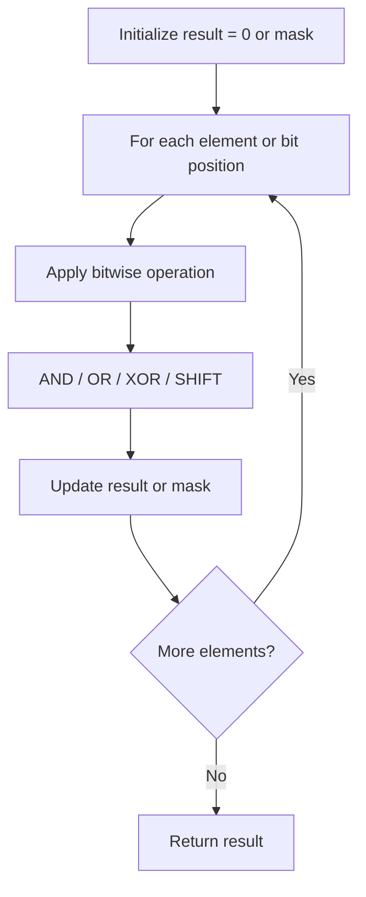

# Problem 266: Palindrome Permutation

**Difficulty:** Easy  
**Tags:** Hash Table, String, Bit Manipulation  
**Pattern:** Bit Manipulation  
**Link:** [leetcode.com/problems/palindrome-permutation](https://leetcode.com/problems/palindrome-permutation/)

## Description

*(Premium problem -- description requires LeetCode subscription)*

## Approach: Bit Manipulation

Operate on individual bits using bitwise operators (AND, OR, XOR, shift). Common tricks: x & (x-1) removes lowest set bit, x ^ x = 0, XOR all elements to find unique.

## Pseudocode

```
1. Apply bitwise operations:
   - XOR all elements to cancel paired bits
   - Use bitmask to track state
   - Shift and mask to extract/set individual bits
2. Return result
```

## Algorithm Flow



## Complexity Analysis

- **Time:** O(n) or O(log n)
- **Space:** O(1)

## Solution (Python3)

```python
class Solution:
    pass
```

## Solution (C++)

```cpp
class Solution {
public:
    // Design problem stub
};
```
