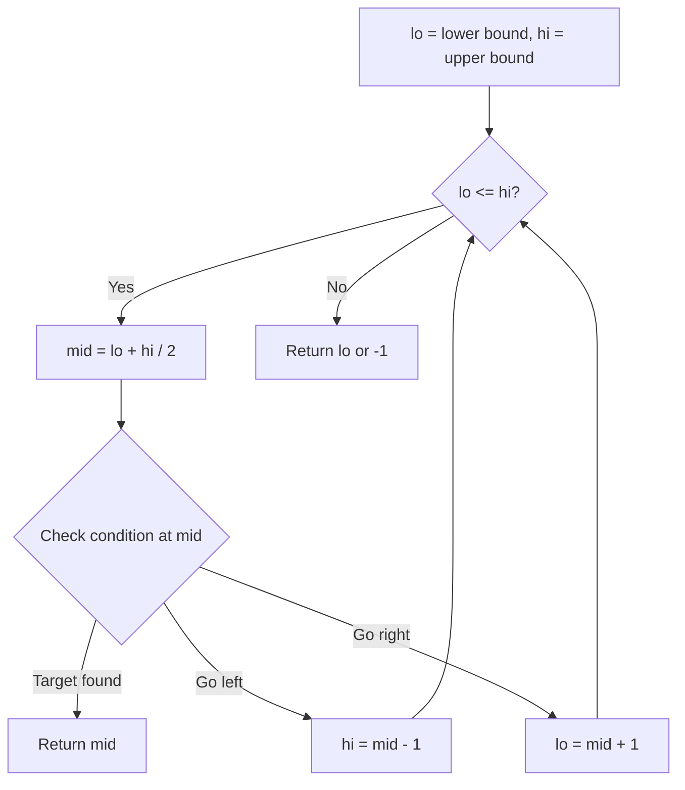
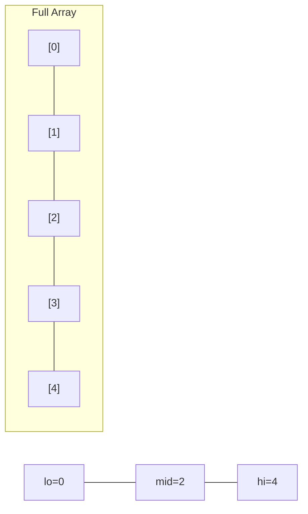
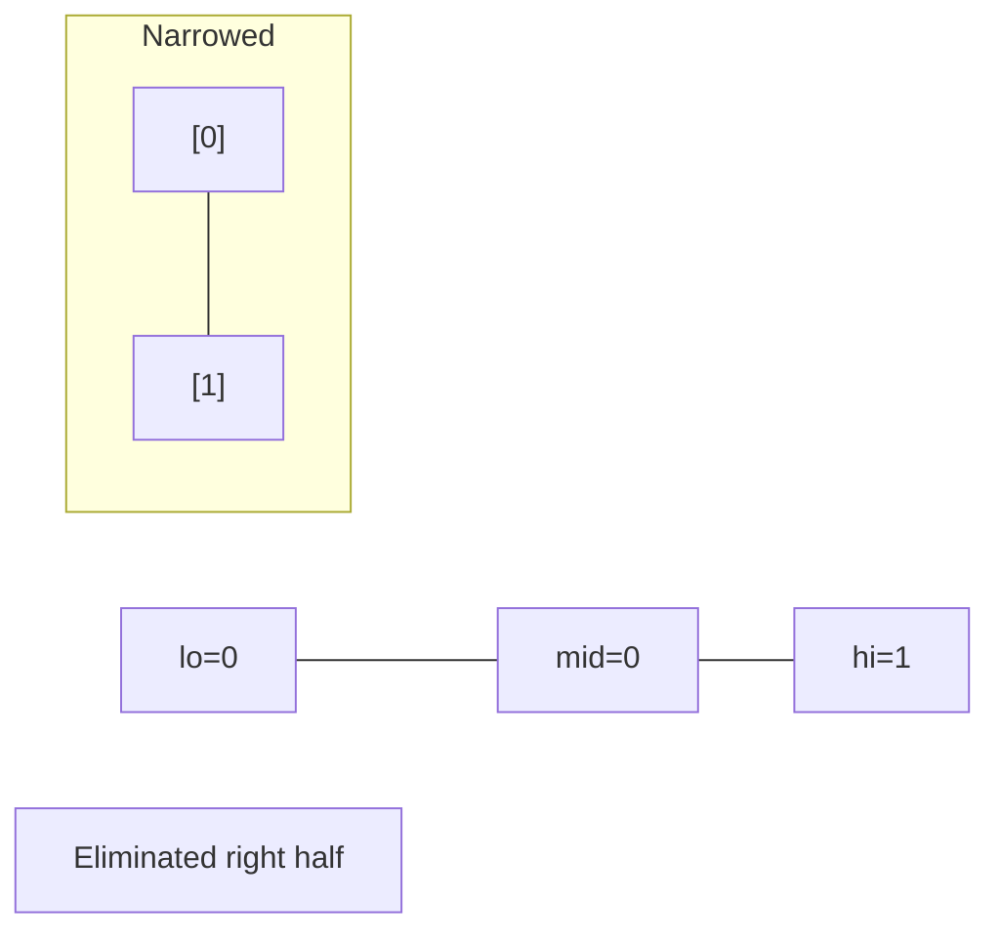
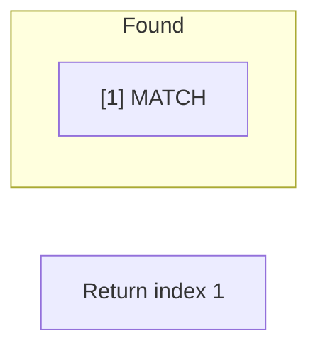

# Problem 268: Missing Number

**Difficulty:** Easy  
**Tags:** Array, Hash Table, Math, Binary Search, Bit Manipulation, Sorting  
**Pattern:** Math / XOR  
**Link:** [leetcode.com/problems/missing-number](https://leetcode.com/problems/missing-number/)

## Description

Given an array `nums` containing `n` distinct numbers in the range `[0, n]`, return *the only number in the range that is missing from the array.*

 

Example 1:

**Input:** nums = [3,0,1]

**Output:** 2

**Explanation:**

`n = 3` since there are 3 numbers, so all numbers are in the range `[0,3]`. 2 is the missing number in the range since it does not appear in `nums`.

Example 2:

**Input:** nums = [0,1]

**Output:** 2

**Explanation:**

`n = 2` since there are 2 numbers, so all numbers are in the range `[0,2]`. 2 is the missing number in the range since it does not appear in `nums`.

Example 3:

**Input:** nums = [9,6,4,2,3,5,7,0,1]

**Output:** 8

**Explanation:**

`n = 9` since there are 9 numbers, so all numbers are in the range `[0,9]`. 8 is the missing number in the range since it does not appear in `nums`.

 

 

 

 

 

**Constraints:**

	- `n == nums.length`
	- `1 <= n <= 10^4`
	- `0 <= nums[i] <= n`
	- All the numbers of `nums` are **unique**.

 

**Follow up:** Could you implement a solution using only `O(1)` extra space complexity and `O(n)` runtime complexity?

## Approach: Math / XOR

Expected sum of 0..n minus actual sum gives the missing number.

## Pseudocode

```
1. expected = n*(n+1)/2
2. Return expected - sum(nums)
```

## Algorithm Flow



## Visual State Transitions

**Binary Search Step-by-Step:**

**Frame 1: Initial search space**


**Frame 2: Compare mid, narrow search**


**Frame 3: Found target**



## Complexity Analysis

- **Time:** O(n)
- **Space:** O(1)

## Solution (Python3)

```python
class Solution:
    def missingNumber(self, nums: list[int]) -> int:
        n = len(nums)
        return n * (n + 1) // 2 - sum(nums)
```

## Solution (C++)

```cpp
#include <string>
#include <vector>
using namespace std;

class Solution {
public:
    int missingNumber(vector<int>& nums) {
        // Binary search - O(log n) time, O(1) space
        int lo = 0, hi = nums.size() - 1;
        while (lo <= hi) {
            int mid = lo + (hi - lo) / 2;
            if (nums[mid] == nums) {
                return mid;
            } else if (nums[mid] < nums) {
                lo = mid + 1;
            } else {
                hi = mid - 1;
            }
        }
        return 0;
    }
};
```
