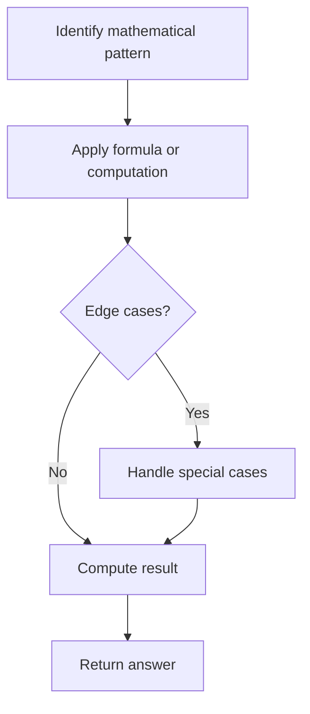

# Problem 273: Integer to English Words

**Difficulty:** Hard  
**Tags:** Math, String, Recursion  
**Pattern:** Math  
**Link:** [leetcode.com/problems/integer-to-english-words](https://leetcode.com/problems/integer-to-english-words/)

## Description

Convert a non-negative integer `num` to its English words representation.

 

Example 1:

```

**Input:** num = 123
**Output:** "One Hundred Twenty Three"

```

Example 2:

```

**Input:** num = 12345
**Output:** "Twelve Thousand Three Hundred Forty Five"

```

Example 3:

```

**Input:** num = 1234567
**Output:** "One Million Two Hundred Thirty Four Thousand Five Hundred Sixty Seven"

```

 

**Constraints:**

	- `0 <= num <= 2^31 - 1`

## Approach: Math

Apply mathematical properties, formulas, or number-theoretic concepts. Look for patterns, modular arithmetic, or closed-form solutions.

## Pseudocode

```
1. Identify the mathematical pattern or formula
2. Apply computation:
   - Modular arithmetic for large numbers
   - GCD/LCM for divisibility
   - Sieve for primes
3. Handle edge cases
4. Return result
```

## Algorithm Flow



## Complexity Analysis

- **Time:** O(n) or O(sqrt(n))
- **Space:** O(1)

## Solution (Python3)

```python
class Solution:
    def numberToWords(self, num: int) -> str:
        # Mathematical approach
        result = 0
        x = num
        while x != 0:
            result = result * 10 + x % 10
            x //= 10 if isinstance(x, int) else 1
        return result
```

## Solution (C++)

```cpp
#include <string>
#include <vector>
using namespace std;

class Solution {
public:
    string numberToWords(int num) {
        // Mathematical approach
        long long result = 0;
        int x = num;
        while (x != 0) {
            result = result * 10 + x % 10;
            x /= 10;
        }
        return (int)result;
    }
};
```
