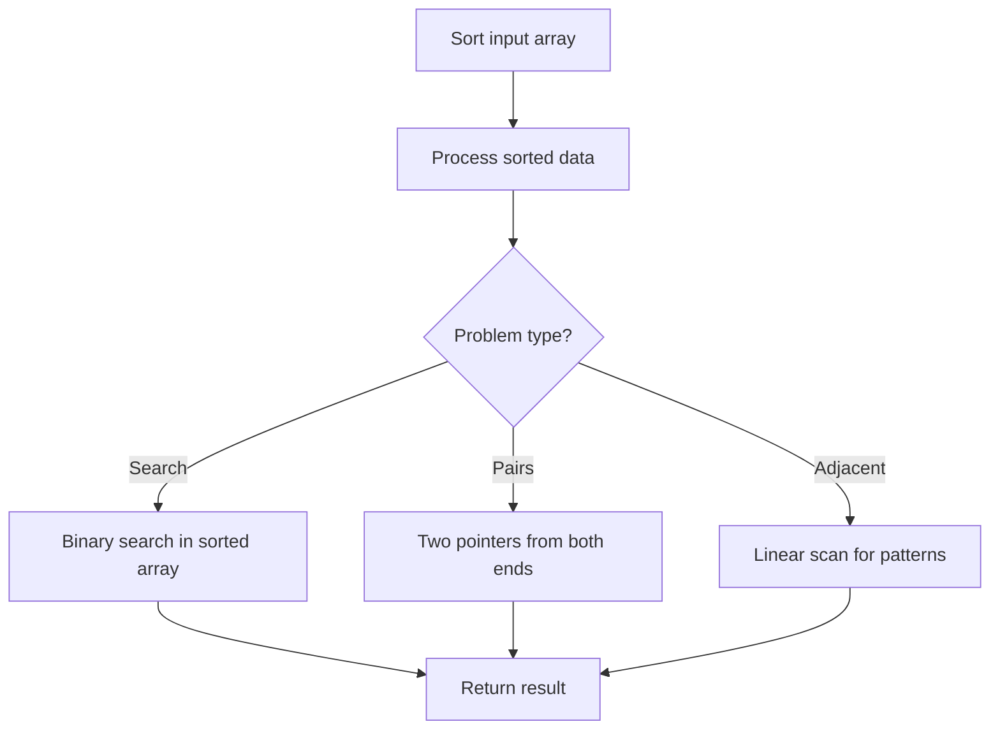

# Problem 274: H-Index

**Difficulty:** Medium  
**Tags:** Array, Sorting, Counting Sort  
**Pattern:** Sorting  
**Link:** [leetcode.com/problems/h-index](https://leetcode.com/problems/h-index/)

## Description

Given an array of integers `citations` where `citations[i]` is the number of citations a researcher received for their `i^th` paper, return *the researcher's h-index*.

According to the definition of h-index on Wikipedia: The h-index is defined as the maximum value of `h` such that the given researcher has published at least `h` papers that have each been cited at least `h` times.

 

Example 1:

```

**Input:** citations = [3,0,6,1,5]
**Output:** 3
**Explanation:** [3,0,6,1,5] means the researcher has 5 papers in total and each of them had received 3, 0, 6, 1, 5 citations respectively.
Since the researcher has 3 papers with at least 3 citations each and the remaining two with no more than 3 citations each, their h-index is 3.

```

Example 2:

```

**Input:** citations = [1,3,1]
**Output:** 1

```

 

**Constraints:**

	- `n == citations.length`
	- `1 <= n <= 5000`
	- `0 <= citations[i] <= 1000`

## Approach: Sorting

Sort the data to enable efficient processing. After sorting, use techniques like binary search, two pointers, or linear scan to solve the problem.

## Pseudocode

```
1. Sort the input array
2. Process sorted data:
   - Use binary search for lookups
   - Use two pointers for pair finding
   - Scan for adjacent patterns
3. Return result
```

## Algorithm Flow



## Complexity Analysis

- **Time:** O(n log n)
- **Space:** O(n)

## Solution (Python3)

```python
class Solution:
    def hIndex(self, citations: List[int]) -> int:
        # Sort-based approach - O(n log n) time
        citations.sort(key=lambda x: x[0] if isinstance(x, (list, tuple)) else x)
        result = [citations[0]]
        for i in range(1, len(citations)):
            curr = citations[i]
            if isinstance(curr, (list, tuple)) and isinstance(result[-1], (list, tuple)):
                if curr[0] <= result[-1][1]:
                    result[-1] = [result[-1][0], max(result[-1][1], curr[1])]
                else:
                    result.append(curr)
            else:
                result.append(curr)
        return result
```

## Solution (C++)

```cpp
#include <algorithm>
#include <string>
#include <vector>
using namespace std;

class Solution {
public:
    int hIndex(vector<int>& citations) {
        // Sort-based approach - O(n log n) time
        sort(citations.begin(), citations.end());
        vector<vector<int>> result;
        result.push_back(citations[0]);
        for (int i = 1; i < (int)citations.size(); i++) {
            if (citations[i][0] <= result.back()[1]) {
                result.back()[1] = max(result.back()[1], citations[i][1]);
            } else {
                result.push_back(citations[i]);
            }
        }
        return result;
    }
};
```
