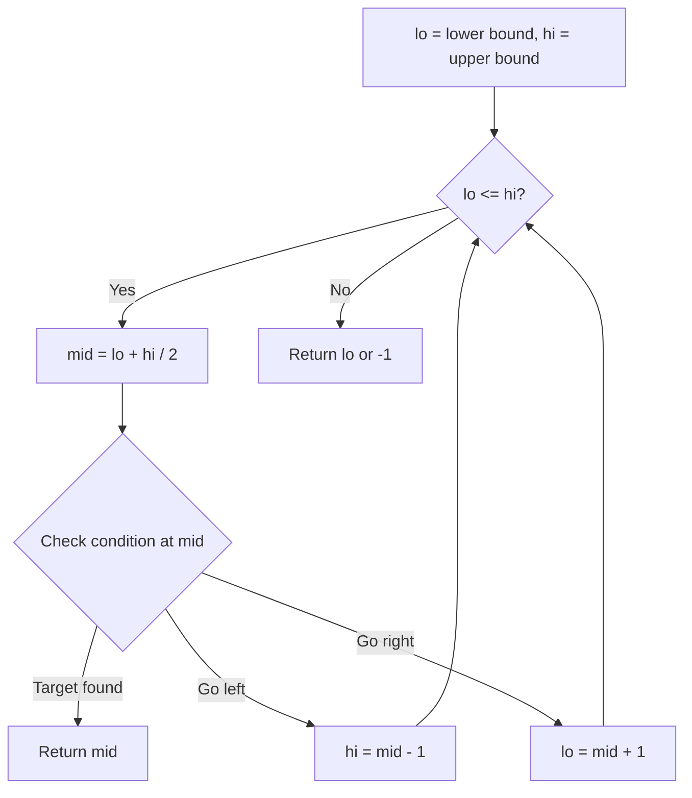
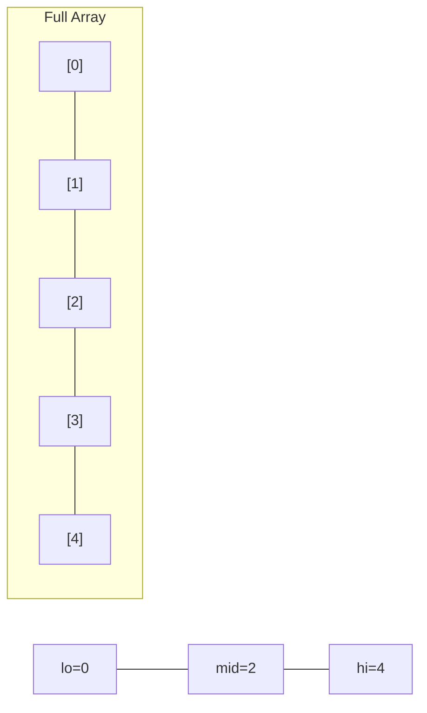
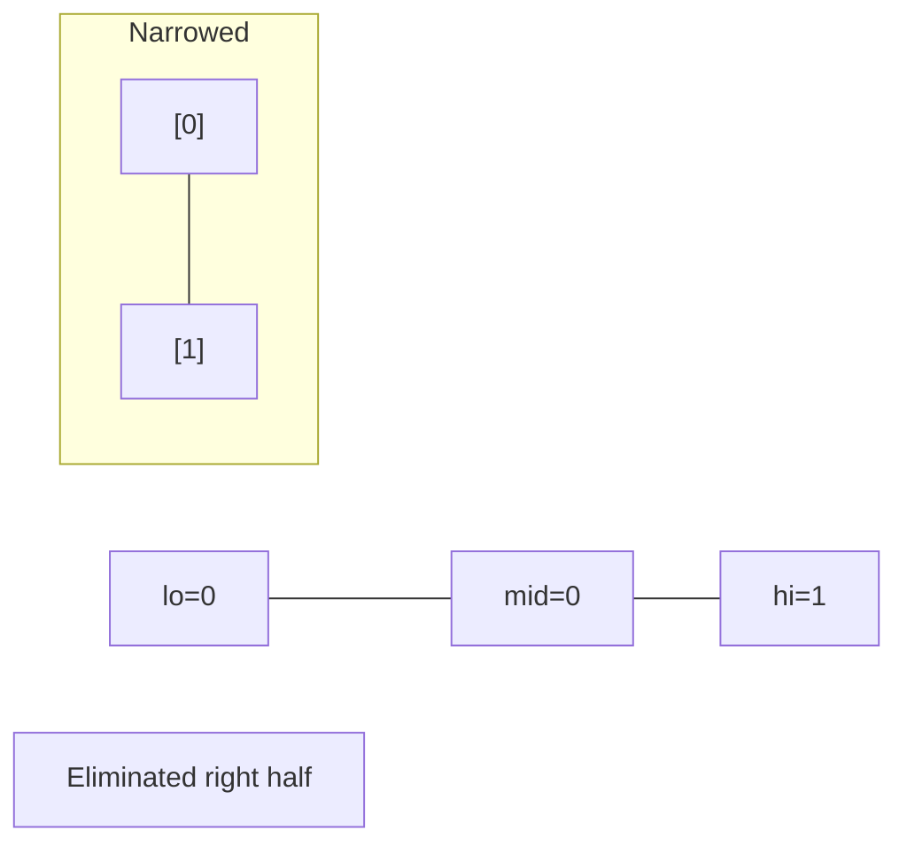
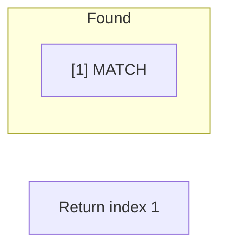

# Problem 275: H-Index II

**Difficulty:** Medium  
**Tags:** Array, Binary Search  
**Pattern:** Binary Search  
**Link:** [leetcode.com/problems/h-index-ii](https://leetcode.com/problems/h-index-ii/)

## Description

Given an array of integers `citations` where `citations[i]` is the number of citations a researcher received for their `i^th` paper and `citations` is sorted in **non-descending order**, return *the researcher's h-index*.

According to the definition of h-index on Wikipedia: The h-index is defined as the maximum value of `h` such that the given researcher has published at least `h` papers that have each been cited at least `h` times.

You must write an algorithm that runs in logarithmic time.

 

Example 1:

```

**Input:** citations = [0,1,3,5,6]
**Output:** 3
**Explanation:** [0,1,3,5,6] means the researcher has 5 papers in total and each of them had received 0, 1, 3, 5, 6 citations respectively.
Since the researcher has 3 papers with at least 3 citations each and the remaining two with no more than 3 citations each, their h-index is 3.

```

Example 2:

```

**Input:** citations = [1,2,100]
**Output:** 2

```

 

**Constraints:**

	- `n == citations.length`
	- `1 <= n <= 10^5`
	- `0 <= citations[i] <= 1000`
	- `citations` is sorted in **ascending order**.

## Approach: Binary Search

Use binary search to halve the search space each iteration. Define the search range [lo, hi], compute mid, and decide which half to keep based on the problem's monotonic condition.

## Pseudocode

```
1. lo = lower_bound, hi = upper_bound
2. While lo <= hi (or lo < hi):
   a. mid = (lo + hi) // 2
   b. If condition(mid) is satisfied: record answer, search left half
   c. Else: search right half
3. Return answer
```

## Algorithm Flow



## Visual State Transitions

**Binary Search Step-by-Step:**

**Frame 1: Initial search space**


**Frame 2: Compare mid, narrow search**


**Frame 3: Found target**



## Complexity Analysis

- **Time:** O(log n)
- **Space:** O(1)

## Solution (Python3)

```python
class Solution:
    def hIndex(self, citations: List[int]) -> int:
        # Binary search - O(log n) time, O(1) space
        lo, hi = 0, len(citations) - 1
        while lo <= hi:
            mid = lo + (hi - lo) // 2
            if citations[mid] == citations:
                return mid
            elif citations[mid] < citations:
                lo = mid + 1
            else:
                hi = mid - 1
        return 0
```

## Solution (C++)

```cpp
#include <string>
#include <vector>
using namespace std;

class Solution {
public:
    int hIndex(vector<int>& citations) {
        // Binary search - O(log n) time, O(1) space
        int lo = 0, hi = citations.size() - 1;
        while (lo <= hi) {
            int mid = lo + (hi - lo) / 2;
            if (citations[mid] == citations) {
                return mid;
            } else if (citations[mid] < citations) {
                lo = mid + 1;
            } else {
                hi = mid - 1;
            }
        }
        return 0;
    }
};
```
