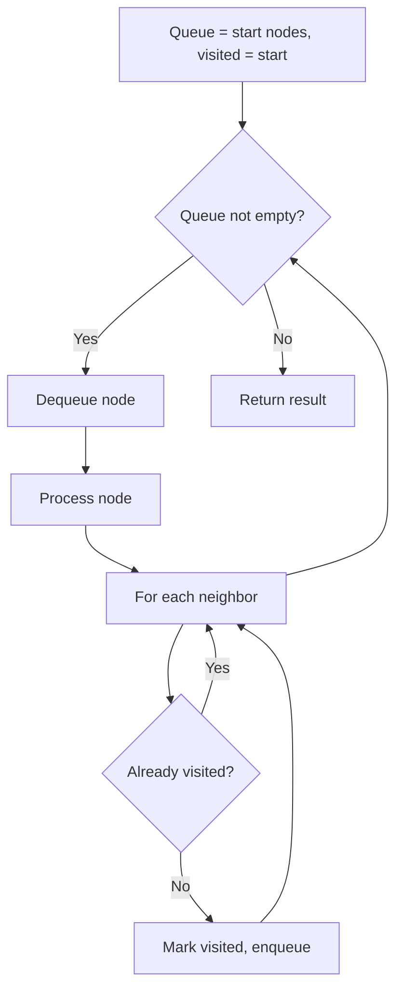
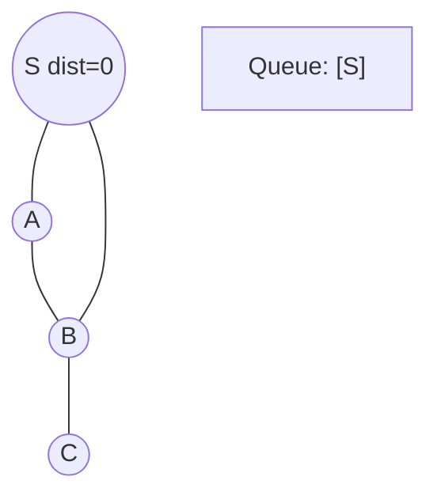
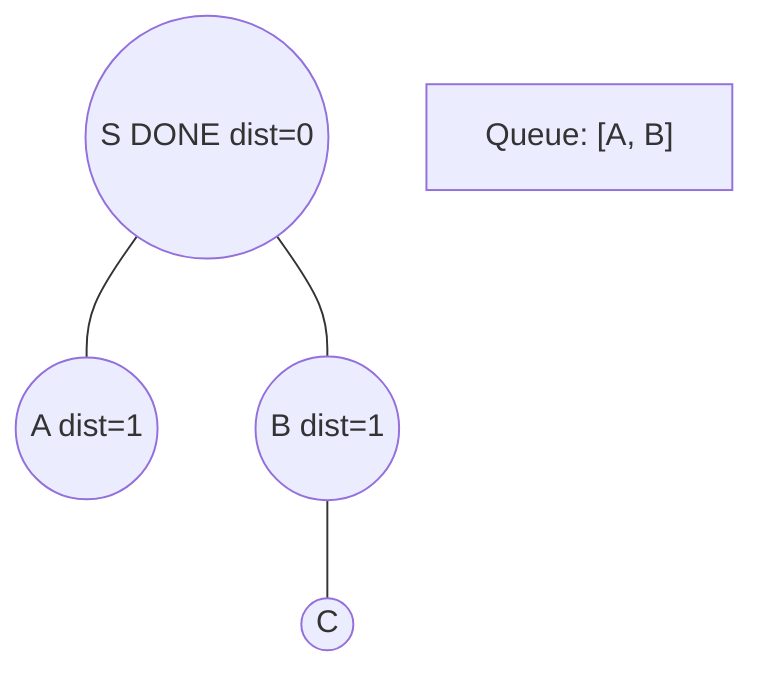
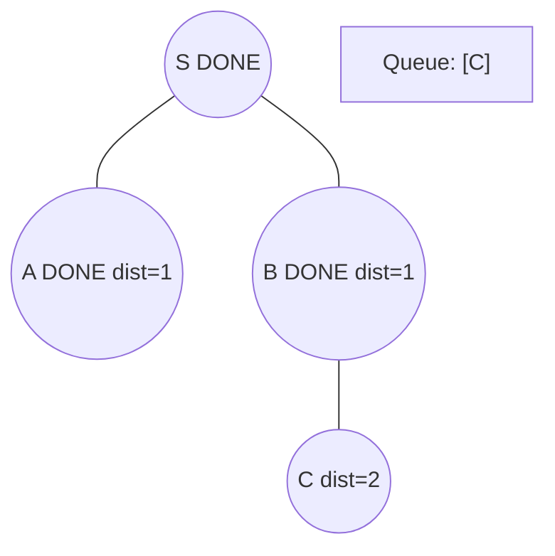
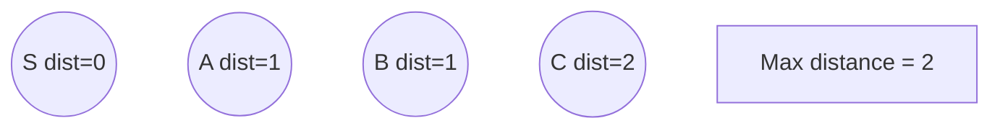

# Problem 279: Perfect Squares

**Difficulty:** Medium  
**Tags:** Math, Dynamic Programming, Breadth-First Search  
**Pattern:** BFS Graph Traversal  
**Link:** [leetcode.com/problems/perfect-squares](https://leetcode.com/problems/perfect-squares/)

## Description

Given an integer `n`, return *the least number of perfect square numbers that sum to* `n`.

A **perfect square** is an integer that is the square of an integer; in other words, it is the product of some integer with itself. For example, `1`, `4`, `9`, and `16` are perfect squares while `3` and `11` are not.

 

Example 1:

```

**Input:** n = 12
**Output:** 3
**Explanation:** 12 = 4 + 4 + 4.

```

Example 2:

```

**Input:** n = 13
**Output:** 2
**Explanation:** 13 = 4 + 9.

```

 

**Constraints:**

	- `1 <= n <= 10^4`

## Approach: BFS Graph Traversal

Explore the graph breadth-first using a queue. Process nodes level by level; BFS finds shortest paths in unweighted graphs.

## Pseudocode

```
1. Initialize queue with start node(s), visited set
2. While queue not empty:
   a. Dequeue node
   b. Process node
   c. For each unvisited neighbor:
      - Mark visited, enqueue
3. Return result
```

## Algorithm Flow



## Visual State Transitions

**BFS Level-by-Level Traversal:**

**Frame 1: Start BFS from source**


**Frame 2: Process level 0, enqueue neighbors**


**Frame 3: Process level 1**


**Frame 4: All nodes reached**



## Complexity Analysis

- **Time:** O(V + E)
- **Space:** O(V)

## Solution (Python3)

```python
class Solution:
    def numSquares(self, n: int) -> int:
        # BFS on graph - O(V+E) time
        from collections import deque
        if not n:
            return 0
        visited = set()
        queue = deque([0])
        visited.add(0)
        dist = 0
        while queue:
            for _ in range(len(queue)):
                node = queue.popleft()
                # Process node
            dist += 1
        return dist
```

## Solution (C++)

```cpp
#include <queue>
#include <string>
#include <unordered_set>
#include <vector>
using namespace std;

class Solution {
public:
    int numSquares(int n) {
        // BFS on graph - O(V+E) time
        if (n.empty()) return 0;
        queue<int> q;
        unordered_set<int> visited;
        q.push(0);
        visited.insert(0);
        int dist = 0;
        while (!q.empty()) {
            int sz = q.size();
            for (int i = 0; i < sz; i++) {
                int node = q.front(); q.pop();
                // Process node
            }
            dist++;
        }
        return dist;
    }
};
```
