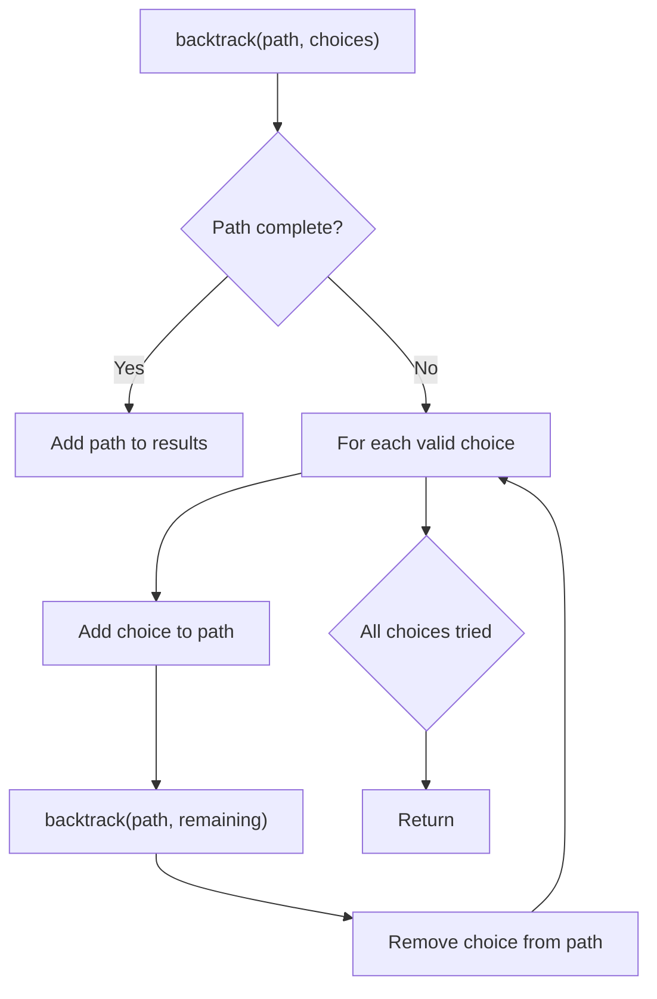
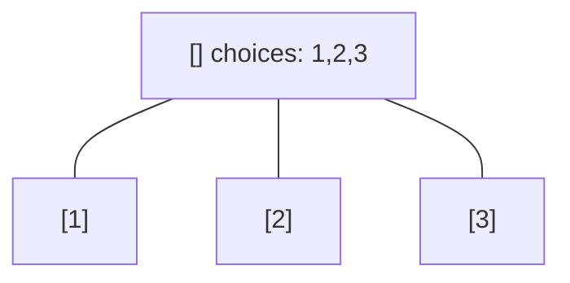
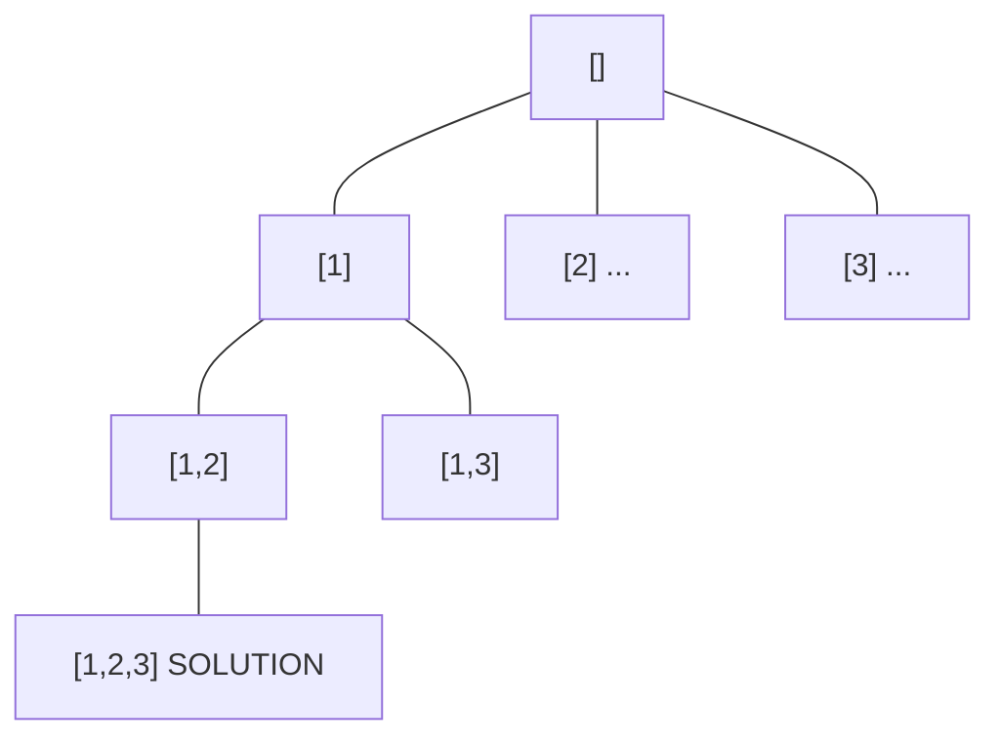
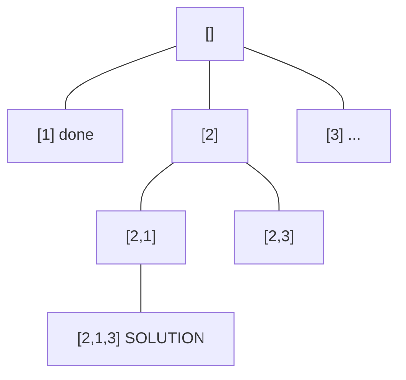
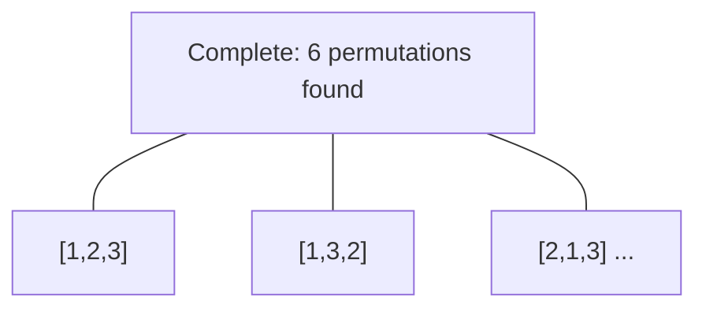

# Problem 282: Expression Add Operators

**Difficulty:** Hard  
**Tags:** Math, String, Backtracking  
**Pattern:** Backtracking  
**Link:** [leetcode.com/problems/expression-add-operators](https://leetcode.com/problems/expression-add-operators/)

## Description

Given a string `num` that contains only digits and an integer `target`, return ***all possibilities** to insert the binary operators *`'+'`*, *`'-'`*, and/or *`'*'`* between the digits of *`num`* so that the resultant expression evaluates to the *`target`* value*.

Note that operands in the returned expressions **should not** contain leading zeros.

**Note** that a number can contain multiple digits.

 

Example 1:

```

**Input:** num = "123", target = 6
**Output:** ["1*2*3","1+2+3"]
**Explanation:** Both "1*2*3" and "1+2+3" evaluate to 6.

```

Example 2:

```

**Input:** num = "232", target = 8
**Output:** ["2*3+2","2+3*2"]
**Explanation:** Both "2*3+2" and "2+3*2" evaluate to 8.

```

Example 3:

```

**Input:** num = "3456237490", target = 9191
**Output:** []
**Explanation:** There are no expressions that can be created from "3456237490" to evaluate to 9191.

```

 

**Constraints:**

	- `1 <= num.length <= 10`
	- `num` consists of only digits.
	- `-2^31 <= target <= 2^31 - 1`

## Approach: Backtracking

Explore all possible solutions by building candidates incrementally. At each step, make a choice and recurse. If the choice leads to a dead end, undo the choice (backtrack) and try the next option.

## Pseudocode

```
1. Define backtrack(path, choices):
   a. If path is a complete solution: add to results
   b. For each choice in choices:
      - If choice is valid:
        * Add choice to path
        * backtrack(path, remaining_choices)
        * Remove choice from path (backtrack)
2. Call backtrack([], all_choices)
```

## Algorithm Flow



## Visual State Transitions

**Backtracking Decision Tree:**

**Frame 1: Root - start with empty path**


**Frame 2: Explore branch [1]**


**Frame 3: Backtrack, explore [2]**


**Frame 4: All solutions found**



## Complexity Analysis

- **Time:** O(k^n) or O(n!)
- **Space:** O(n)

## Solution (Python3)

```python
class Solution:
    def addOperators(self, num: str, target: int) -> List[str]:
        # Backtracking - O(2^n) or O(n!) time
        result = []
        
        def backtrack(path, start):
            result.append(path[:])
            for i in range(start, len(num)):
                path.append(num[i])
                backtrack(path, i + 1)
                path.pop()
        
        backtrack([], 0)
        return result
```

## Solution (C++)

```cpp
#include <functional>
#include <string>
#include <vector>
using namespace std;

class Solution {
public:
    vector<string> addOperators(string& num, int target) {
        // Backtracking - O(2^n) or O(n!) time
        vector<vector<int>> result;
        vector<int> path;
        function<void(int)> backtrack = [&](int start) {
            result.push_back(path);
            for (int i = start; i < (int)num.size(); i++) {
                path.push_back(num[i]);
                backtrack(i + 1);
                path.pop_back();
            }
        };
        backtrack(0);
        return result;
    }
};
```
