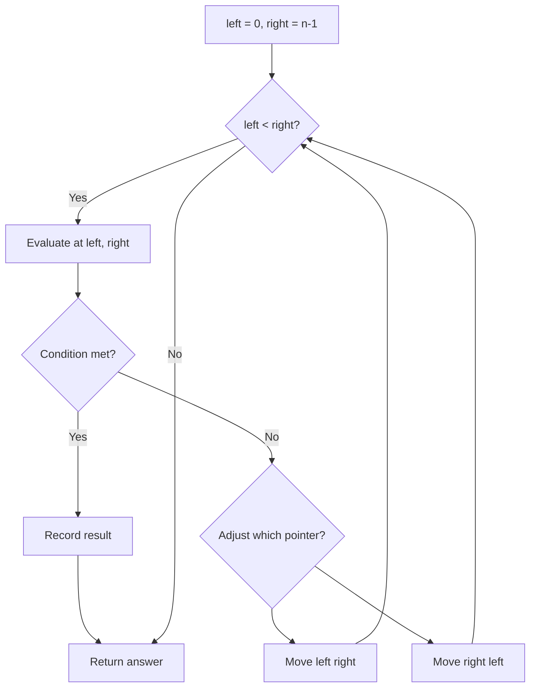
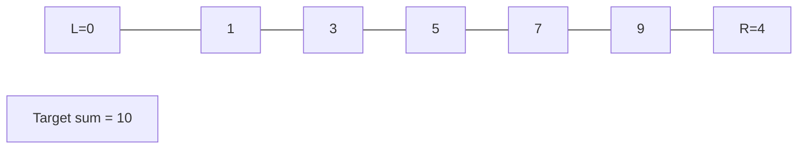
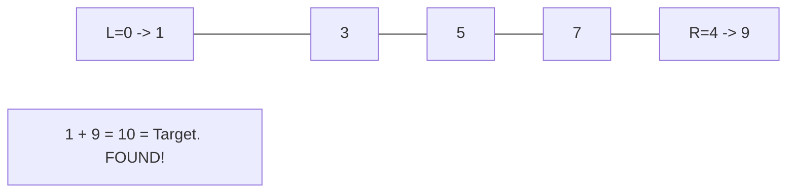

# Problem 283: Move Zeroes

**Difficulty:** Easy  
**Tags:** Array, Two Pointers  
**Pattern:** Two Pointers  
**Link:** [leetcode.com/problems/move-zeroes](https://leetcode.com/problems/move-zeroes/)

## Description

Given an integer array `nums`, move all `0`'s to the end of it while maintaining the relative order of the non-zero elements.

**Note** that you must do this in-place without making a copy of the array.

 

Example 1:

```
**Input:** nums = [0,1,0,3,12]
**Output:** [1,3,12,0,0]

```
Example 2:

```
**Input:** nums = [0]
**Output:** [0]

```

 

**Constraints:**

	- `1 <= nums.length <= 10^4`
	- `-2^31 <= nums[i] <= 2^31 - 1`

 

**Follow up:** Could you minimize the total number of operations done?

## Approach: Two Pointers

Write non-zero elements to front, fill rest with zeros.

## Pseudocode

```
1. Write pointer: copy non-zeros forward
2. Fill remaining with zeros
```

## Algorithm Flow



## Visual State Transitions

**Two Pointer Convergence:**

**Frame 1: Initialize pointers**


**Frame 2: Sum = 1+9 = 10, found!**



## Complexity Analysis

- **Time:** O(n)
- **Space:** O(1)

## Solution (Python3)

```python
class Solution:
    def moveZeroes(self, nums: list[int]) -> None:
        write = 0
        for num in nums:
            if num != 0:
                nums[write] = num
                write += 1
        for i in range(write, len(nums)):
            nums[i] = 0
```

## Solution (C++)

```cpp
#include <string>
#include <vector>
using namespace std;

class Solution {
public:
    void moveZeroes(vector<int>& nums) {
        // Two pointer approach - O(n) time, O(1) space
        int left = 0, right = nums.size() - 1;
        while (left < right) {
            int curr = nums[left] + nums[right];
            if (curr == nums) {
                return {left, right};
            } else if (curr < nums) {
                left++;
            } else {
                right--;
            }
        }
        return ;
    }
};
```
