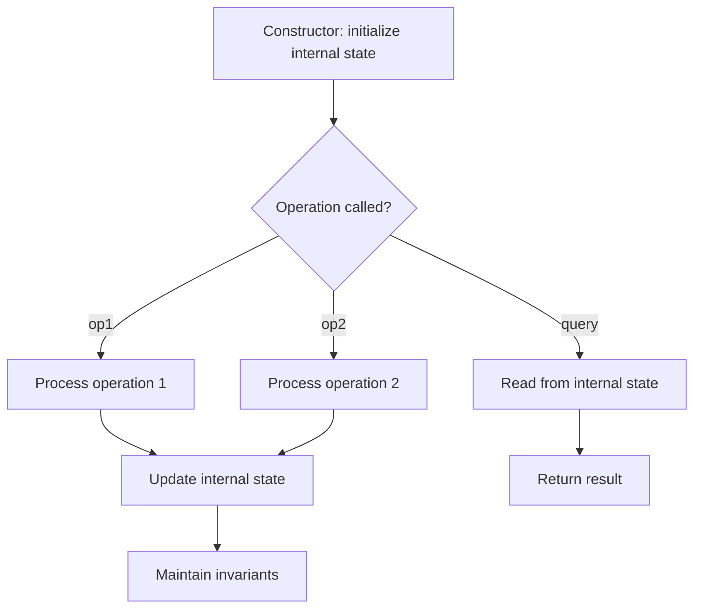

# Problem 284: Peeking Iterator

**Difficulty:** Medium  
**Tags:** Array, Design, Iterator  
**Pattern:** Design  
**Link:** [leetcode.com/problems/peeking-iterator](https://leetcode.com/problems/peeking-iterator/)

## Description

Design an iterator that supports the `peek` operation on an existing iterator in addition to the `hasNext` and the `next` operations.

Implement the `PeekingIterator` class:

	- `PeekingIterator(Iterator<int> nums)` Initializes the object with the given integer iterator `iterator`.
	- `int next()` Returns the next element in the array and moves the pointer to the next element.
	- `boolean hasNext()` Returns `true` if there are still elements in the array.
	- `int peek()` Returns the next element in the array **without** moving the pointer.

**Note:** Each language may have a different implementation of the constructor and `Iterator`, but they all support the `int next()` and `boolean hasNext()` functions.

 

Example 1:

```

**Input**
["PeekingIterator", "next", "peek", "next", "next", "hasNext"]
[[[1, 2, 3]], [], [], [], [], []]
**Output**
[null, 1, 2, 2, 3, false]

**Explanation**
PeekingIterator peekingIterator = new PeekingIterator([1, 2, 3]); // [**1**,2,3]
peekingIterator.next();    // return 1, the pointer moves to the next element [1,**2**,3].
peekingIterator.peek();    // return 2, the pointer does not move [1,**2**,3].
peekingIterator.next();    // return 2, the pointer moves to the next element [1,2,**3**]
peekingIterator.next();    // return 3, the pointer moves to the next element [1,2,3]
peekingIterator.hasNext(); // return False

```

 

**Constraints:**

	- `1 <= nums.length <= 1000`
	- `1 <= nums[i] <= 1000`
	- All the calls to `next` and `peek` are valid.
	- At most `1000` calls will be made to `next`, `hasNext`, and `peek`.

 

**Follow up:** How would you extend your design to be generic and work with all types, not just integer?

## Approach: Design

Design a data structure or system that supports specific operations efficiently. Choose appropriate underlying data structures (hash map, linked list, heap, etc.).

## Pseudocode

```
1. Choose data structures for internal state
2. Implement constructor: initialize state
3. Implement each operation:
   - Maintain invariants
   - Optimize for target time complexity
4. Handle edge cases
```

## Algorithm Flow



## Complexity Analysis

- **Time:** O(1) per operation
- **Space:** O(n)

## Solution (Python3)

```python
class PeekingIterator:
    def __init__(self, iterator: int):
        # Initialize data structure
        self.iterator = iterator

    def peek(self) -> None:
        return None

    def next(self) -> None:
        return None

    def hasNext(self) -> None:
        return None

```

## Solution (C++)

```cpp
#include <string>
#include <vector>
using namespace std;

class PeekingIterator {
public:
    PeekingIterator(int iterator) {
        // Initialize
    }

    void peek() {
        return ;
    }

    void next() {
        return ;
    }

    void hasNext() {
        return ;
    }

};
```
