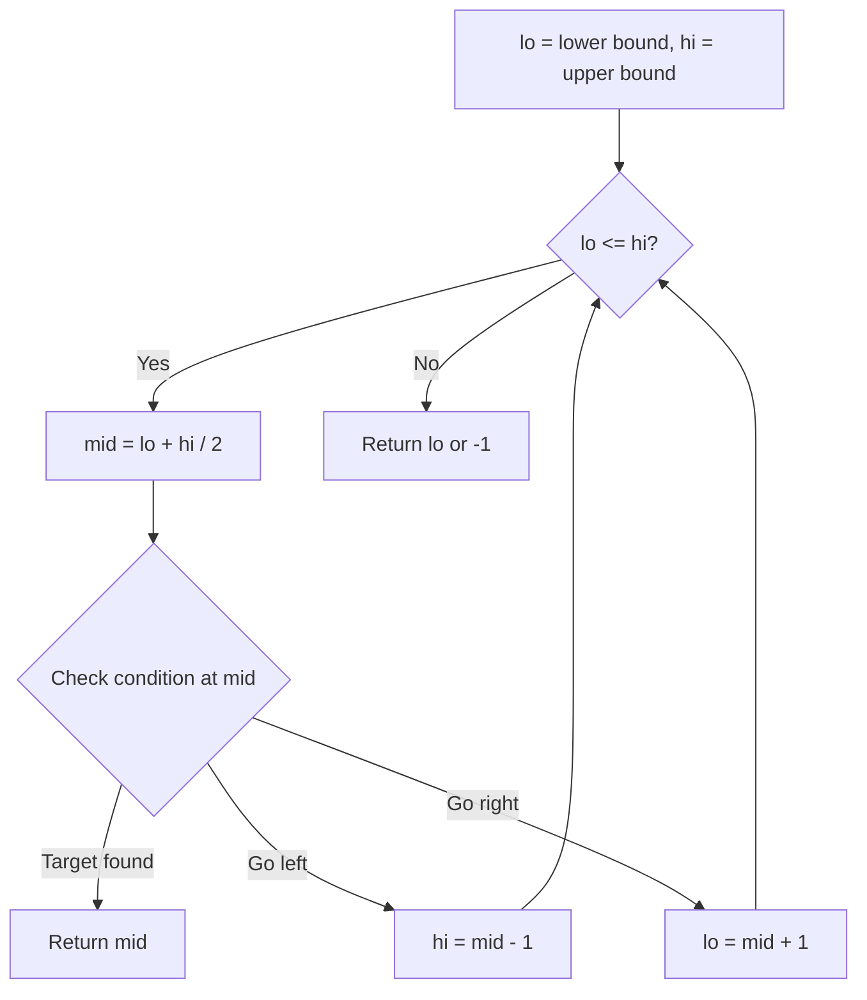
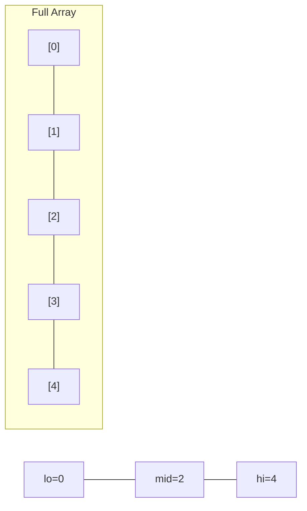
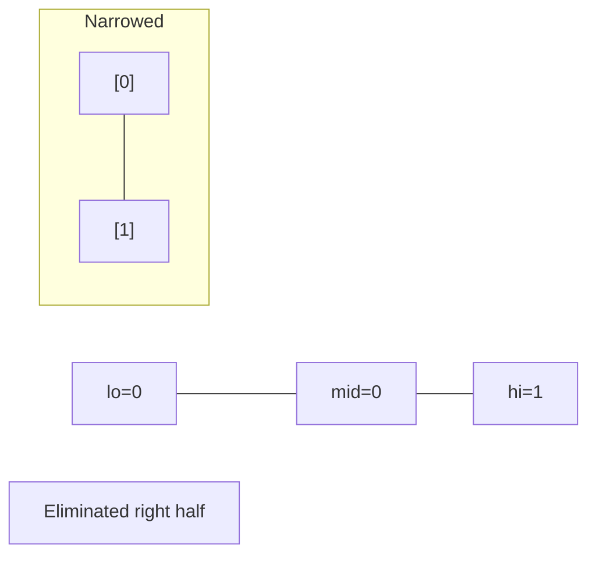
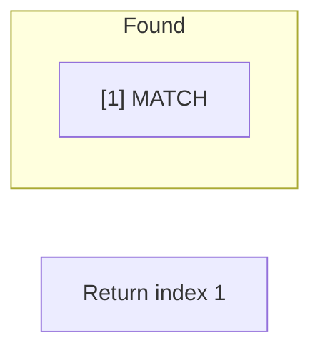

# Problem 287: Find the Duplicate Number

**Difficulty:** Medium  
**Tags:** Array, Two Pointers, Binary Search, Bit Manipulation  
**Pattern:** Binary Search  
**Link:** [leetcode.com/problems/find-the-duplicate-number](https://leetcode.com/problems/find-the-duplicate-number/)

## Description

Given an array of integers `nums` containing `n + 1` integers where each integer is in the range `[1, n]` inclusive.

There is only **one repeated number** in `nums`, return *this repeated number*.

You must solve the problem **without** modifying the array `nums` and using only constant extra space.

 

Example 1:

```

**Input:** nums = [1,3,4,2,2]
**Output:** 2

```

Example 2:

```

**Input:** nums = [3,1,3,4,2]
**Output:** 3

```

Example 3:

```

**Input:** nums = [3,3,3,3,3]
**Output:** 3
```

 

**Constraints:**

	- `1 <= n <= 10^5`
	- `nums.length == n + 1`
	- `1 <= nums[i] <= n`
	- All the integers in `nums` appear only **once** except for **precisely one integer** which appears **two or more** times.

 

**Follow up:**

	- How can we prove that at least one duplicate number must exist in `nums`?
	- Can you solve the problem in linear runtime complexity?

## Approach: Binary Search

Use binary search to halve the search space each iteration. Define the search range [lo, hi], compute mid, and decide which half to keep based on the problem's monotonic condition.

## Pseudocode

```
1. lo = lower_bound, hi = upper_bound
2. While lo <= hi (or lo < hi):
   a. mid = (lo + hi) // 2
   b. If condition(mid) is satisfied: record answer, search left half
   c. Else: search right half
3. Return answer
```

## Algorithm Flow



## Visual State Transitions

**Binary Search Step-by-Step:**

**Frame 1: Initial search space**


**Frame 2: Compare mid, narrow search**


**Frame 3: Found target**



## Complexity Analysis

- **Time:** O(log n)
- **Space:** O(1)

## Solution (Python3)

```python
class Solution:
    def findDuplicate(self, nums: List[int]) -> int:
        # Binary search - O(log n) time, O(1) space
        lo, hi = 0, len(nums) - 1
        while lo <= hi:
            mid = lo + (hi - lo) // 2
            if nums[mid] == nums:
                return mid
            elif nums[mid] < nums:
                lo = mid + 1
            else:
                hi = mid - 1
        return 0
```

## Solution (C++)

```cpp
#include <string>
#include <vector>
using namespace std;

class Solution {
public:
    int findDuplicate(vector<int>& nums) {
        // Binary search - O(log n) time, O(1) space
        int lo = 0, hi = nums.size() - 1;
        while (lo <= hi) {
            int mid = lo + (hi - lo) / 2;
            if (nums[mid] == nums) {
                return mid;
            } else if (nums[mid] < nums) {
                lo = mid + 1;
            } else {
                hi = mid - 1;
            }
        }
        return 0;
    }
};
```
