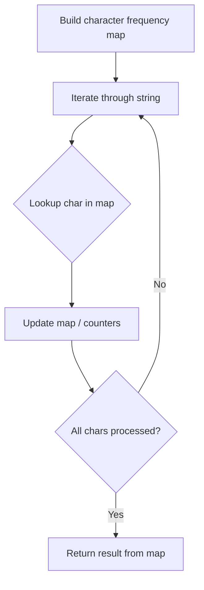

# Problem 290: Word Pattern

**Difficulty:** Easy  
**Tags:** Hash Table, String  
**Pattern:** Hash Map String Processing  
**Link:** [leetcode.com/problems/word-pattern](https://leetcode.com/problems/word-pattern/)

## Description

Given a `pattern` and a string `s`, find if `s` follows the same pattern.

Here **follow** means a full match, such that there is a bijection between a letter in `pattern` and a **non-empty** word in `s`. Specifically:

	- Each letter in `pattern` maps to **exactly** one unique word in `s`.
	- Each unique word in `s` maps to **exactly** one letter in `pattern`.
	- No two letters map to the same word, and no two words map to the same letter.

 

Example 1:

**Input:** pattern = "abba", s = "dog cat cat dog"

**Output:** true

**Explanation:**

The bijection can be established as:

	- `'a'` maps to `"dog"`.
	- `'b'` maps to `"cat"`.

Example 2:

**Input:** pattern = "abba", s = "dog cat cat fish"

**Output:** false

Example 3:

**Input:** pattern = "aaaa", s = "dog cat cat dog"

**Output:** false

 

**Constraints:**

	- `1 <= pattern.length <= 300`
	- `pattern` contains only lower-case English letters.
	- `1 <= s.length <= 3000`
	- `s` contains only lowercase English letters and spaces `' '`.
	- `s` **does not contain** any leading or trailing spaces.
	- All the words in `s` are separated by a **single space**.

## Approach: Hash Map String Processing

Use a hash map to count character frequencies or map characters/strings for O(1) lookups. Process the string in one or two passes.

## Pseudocode

```
1. Build frequency map / char-to-index map
2. Iterate through string:
   a. Look up character in map
   b. Update counts or mappings
3. Return result based on map state
```

## Algorithm Flow



## Complexity Analysis

- **Time:** O(n)
- **Space:** O(n)

## Solution (Python3)

```python
class Solution:
    def wordPattern(self, pattern: str, s: str) -> bool:
        # Hash map for string/character frequency - O(n) time
        freq = {}
        for ch in pattern:
            freq[ch] = freq.get(ch, 0) + 1
        # Process frequency map
        for ch, cnt in freq.items():
            if cnt == 1:
                return pattern.index(ch)
        return False
```

## Solution (C++)

```cpp
#include <string>
#include <unordered_map>
#include <vector>
using namespace std;

class Solution {
public:
    bool wordPattern(string& pattern, string& s) {
        // Hash map for string/character frequency - O(n) time
        unordered_map<char, int> freq;
        for (char ch : pattern) {
            freq[ch]++;
        }
        // Process frequency map
        for (int i = 0; i < pattern.size(); i++) {
            if (freq[pattern[i]] == 1) return i;
        }
        return false;
    }
};
```
