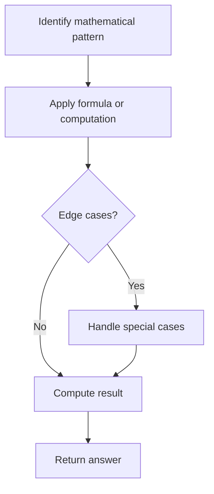

# Problem 292: Nim Game

**Difficulty:** Easy  
**Tags:** Math, Brainteaser, Game Theory  
**Pattern:** Math  
**Link:** [leetcode.com/problems/nim-game](https://leetcode.com/problems/nim-game/)

## Description

You are playing the following Nim Game with your friend:

	- Initially, there is a heap of stones on the table.
	- You and your friend will alternate taking turns, and **you go first**.
	- On each turn, the person whose turn it is will remove 1 to 3 stones from the heap.
	- The one who removes the last stone is the winner.

Given `n`, the number of stones in the heap, return `true`* if you can win the game assuming both you and your friend play optimally, otherwise return *`false`.

 

Example 1:

```

**Input:** n = 4
**Output:** false
**Explanation:** These are the possible outcomes:
1. You remove 1 stone. Your friend removes 3 stones, including the last stone. Your friend wins.
2. You remove 2 stones. Your friend removes 2 stones, including the last stone. Your friend wins.
3. You remove 3 stones. Your friend removes the last stone. Your friend wins.
In all outcomes, your friend wins.

```

Example 2:

```

**Input:** n = 1
**Output:** true

```

Example 3:

```

**Input:** n = 2
**Output:** true

```

 

**Constraints:**

	- `1 <= n <= 2^31 - 1`

## Approach: Math

Apply mathematical properties, formulas, or number-theoretic concepts. Look for patterns, modular arithmetic, or closed-form solutions.

## Pseudocode

```
1. Identify the mathematical pattern or formula
2. Apply computation:
   - Modular arithmetic for large numbers
   - GCD/LCM for divisibility
   - Sieve for primes
3. Handle edge cases
4. Return result
```

## Algorithm Flow



## Complexity Analysis

- **Time:** O(n) or O(sqrt(n))
- **Space:** O(1)

## Solution (Python3)

```python
class Solution:
    def canWinNim(self, n: int) -> bool:
        # Mathematical approach
        result = 0
        x = n
        while x != 0:
            result = result * 10 + x % 10
            x //= 10 if isinstance(x, int) else 1
        return result
```

## Solution (C++)

```cpp
#include <string>
#include <vector>
using namespace std;

class Solution {
public:
    bool canWinNim(int n) {
        // Mathematical approach
        long long result = 0;
        int x = n;
        while (x != 0) {
            result = result * 10 + x % 10;
            x /= 10;
        }
        return (int)result;
    }
};
```
