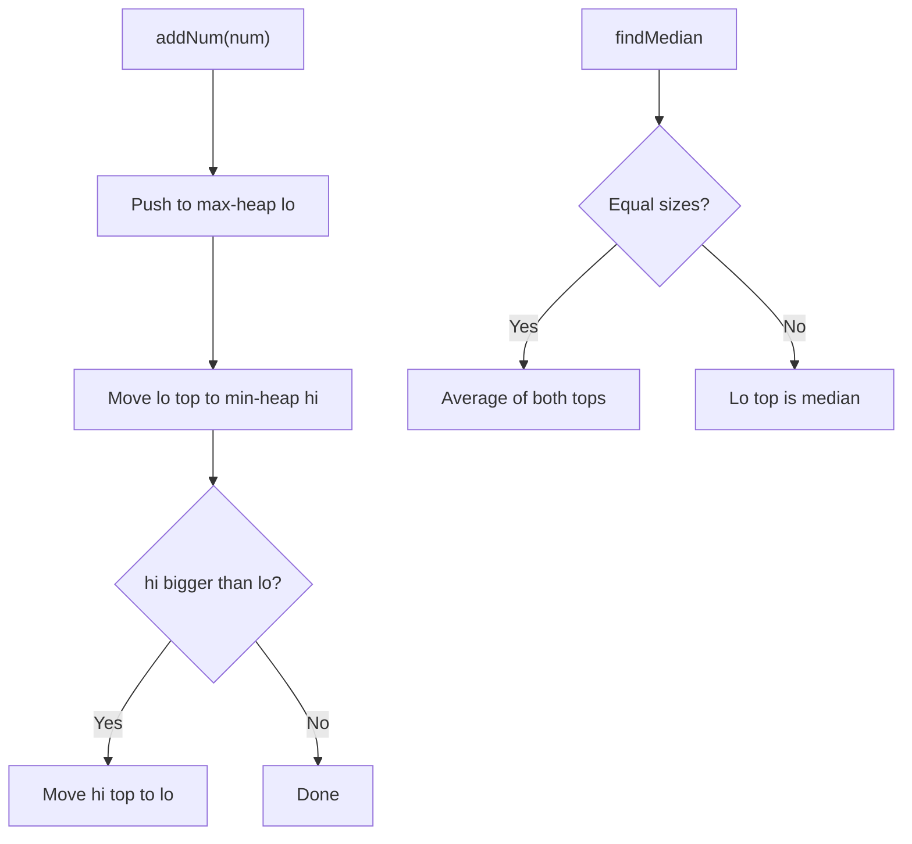
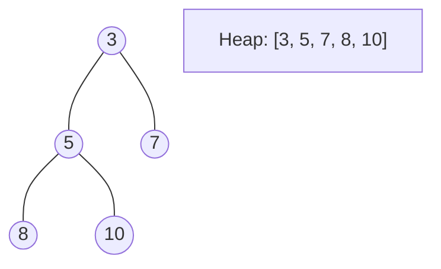
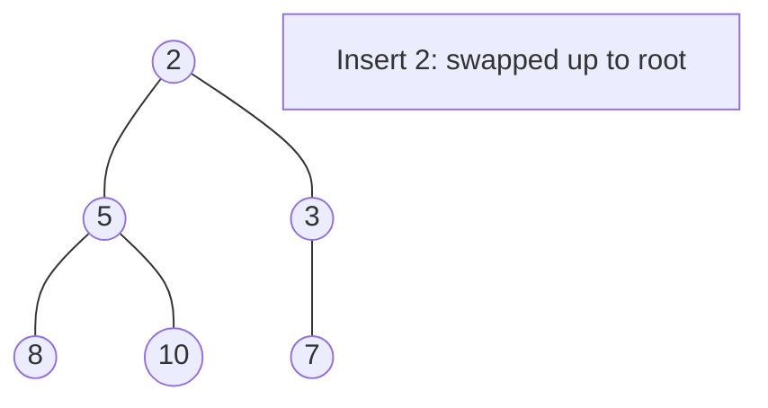
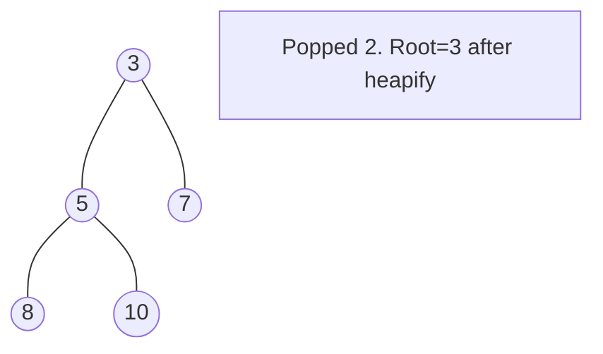

# Problem 295: Find Median from Data Stream

**Difficulty:** Hard  
**Tags:** Two Pointers, Design, Sorting, Heap (Priority Queue), Data Stream  
**Pattern:** Two Heaps / Design  
**Link:** [leetcode.com/problems/find-median-from-data-stream](https://leetcode.com/problems/find-median-from-data-stream/)

## Description

The **median** is the middle value in an ordered integer list. If the size of the list is even, there is no middle value, and the median is the mean of the two middle values.

	- For example, for `arr = [2,3,4]`, the median is `3`.
	- For example, for `arr = [2,3]`, the median is `(2 + 3) / 2 = 2.5`.

Implement the MedianFinder class:

	- `MedianFinder()` initializes the `MedianFinder` object.
	- `void addNum(int num)` adds the integer `num` from the data stream to the data structure.
	- `double findMedian()` returns the median of all elements so far. Answers within `10^-5` of the actual answer will be accepted.

 

Example 1:

```

**Input**
["MedianFinder", "addNum", "addNum", "findMedian", "addNum", "findMedian"]
[[], [1], [2], [], [3], []]
**Output**
[null, null, null, 1.5, null, 2.0]

**Explanation**
MedianFinder medianFinder = new MedianFinder();
medianFinder.addNum(1);    // arr = [1]
medianFinder.addNum(2);    // arr = [1, 2]
medianFinder.findMedian(); // return 1.5 (i.e., (1 + 2) / 2)
medianFinder.addNum(3);    // arr[1, 2, 3]
medianFinder.findMedian(); // return 2.0

```

 

**Constraints:**

	- `-10^5 <= num <= 10^5`
	- There will be at least one element in the data structure before calling `findMedian`.
	- At most `5 * 10^4` calls will be made to `addNum` and `findMedian`.

 

**Follow up:**

	- If all integer numbers from the stream are in the range `[0, 100]`, how would you optimize your solution?
	- If `99%` of all integer numbers from the stream are in the range `[0, 100]`, how would you optimize your solution?

## Approach: Two Heaps / Design

**Two Heaps:** Max-heap for lower half, min-heap for upper half. Balance sizes.

## Pseudocode

```
1. addNum: push to lo, rebalance to hi, keep lo >= hi size
2. findMedian: if unequal sizes, lo top; else average of tops
```

## Algorithm Flow



## Visual State Transitions

**Heap Operations (Min-Heap):**

**Frame 1: Initial heap**


**Frame 2: Insert 2 - bubble up**


**Frame 3: Pop minimum (2) - heapify down**



## Complexity Analysis

- **Time:** O(log n) add, O(1) find
- **Space:** O(n)

## Solution (Python3)

```python
import heapq

class Solution:
    pass

class MedianFinder:
    def __init__(self):
        self.lo = []  # max-heap (negated)
        self.hi = []  # min-heap

    def addNum(self, num: int) -> None:
        heapq.heappush(self.lo, -num)
        heapq.heappush(self.hi, -heapq.heappop(self.lo))
        if len(self.hi) > len(self.lo):
            heapq.heappush(self.lo, -heapq.heappop(self.hi))

    def findMedian(self) -> float:
        if len(self.lo) > len(self.hi):
            return -self.lo[0]
        return (-self.lo[0] + self.hi[0]) / 2
```

## Solution (C++)

```cpp
#include <queue>
#include <string>
#include <vector>
using namespace std;

class MedianFinder {
public:
    MedianFinder() {
        // Initialize
    }

    void addNum(int num) {
        return ;
    }

    double findMedian() {
        return 0.0;
    }

};
```
