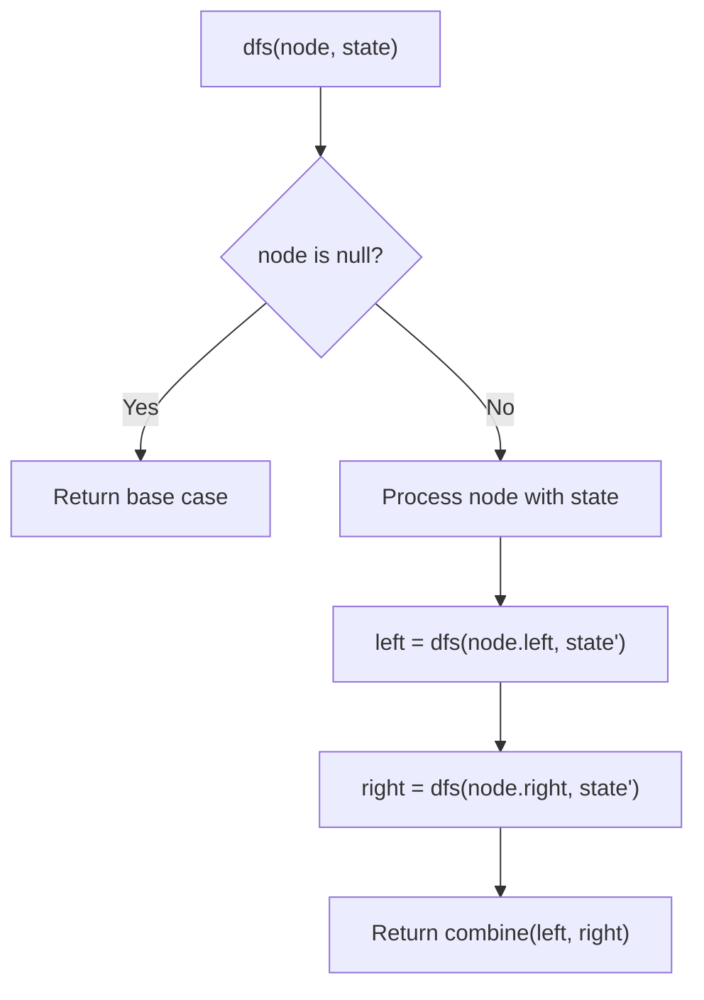
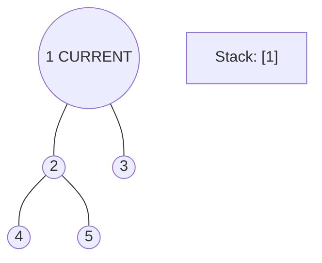
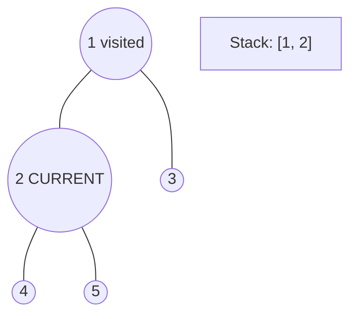
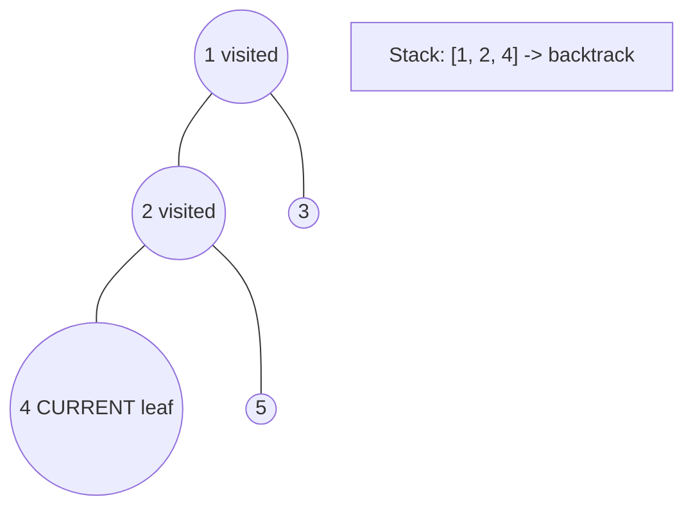
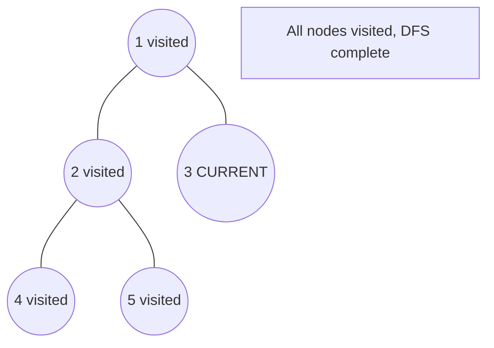

# Problem 297: Serialize and Deserialize Binary Tree

**Difficulty:** Hard  
**Tags:** String, Tree, Depth-First Search, Breadth-First Search, Design, Binary Tree  
**Pattern:** Tree / DFS / Serialization  
**Link:** [leetcode.com/problems/serialize-and-deserialize-binary-tree](https://leetcode.com/problems/serialize-and-deserialize-binary-tree/)

## Description

Serialization is the process of converting a data structure or object into a sequence of bits so that it can be stored in a file or memory buffer, or transmitted across a network connection link to be reconstructed later in the same or another computer environment.

Design an algorithm to serialize and deserialize a binary tree. There is no restriction on how your serialization/deserialization algorithm should work. You just need to ensure that a binary tree can be serialized to a string and this string can be deserialized to the original tree structure.

**Clarification:** The input/output format is the same as how LeetCode serializes a binary tree. You do not necessarily need to follow this format, so please be creative and come up with different approaches yourself.

 

Example 1:

```

**Input:** root = [1,2,3,null,null,4,5]
**Output:** [1,2,3,null,null,4,5]

```

Example 2:

```

**Input:** root = []
**Output:** []

```

 

**Constraints:**

	- The number of nodes in the tree is in the range `[0, 10^4]`.
	- `-1000 <= Node.val <= 1000`

## Approach: Tree / DFS / Serialization

Preorder DFS with '#' for nulls. Deserialize by consuming tokens in same order.

## Pseudocode

```
1. Serialize: preorder DFS, '#' for null
2. Deserialize: consume tokens, reconstruct tree recursively
```

## Algorithm Flow



## Visual State Transitions

**DFS Tree Traversal Step-by-Step:**

**Frame 1: Start at root**


**Frame 2: Go left - visit node 2**


**Frame 3: Go left - visit node 4 (leaf)**


**Frame 4: Backtrack, visit node 5, then node 3**



## Complexity Analysis

- **Time:** O(n)
- **Space:** O(n)

## Solution (Python3)

```python
class Codec:
    def serialize(self, root):
        vals = []
        def dfs(node):
            if not node:
                vals.append('#')
                return
            vals.append(str(node.val))
            dfs(node.left)
            dfs(node.right)
        dfs(root)
        return ','.join(vals)

    def deserialize(self, data):
        vals = iter(data.split(','))
        def dfs():
            val = next(vals)
            if val == '#':
                return None
            node = TreeNode(int(val))
            node.left = dfs()
            node.right = dfs()
            return node
        return dfs()
```

## Solution (C++)

```cpp
#include <algorithm>
#include <functional>
#include <string>
#include <vector>
using namespace std;

class Codec {
public:
    void serialize(int root) {
        return ;
    }

    void deserialize(int data) {
        return ;
    }

};
```
