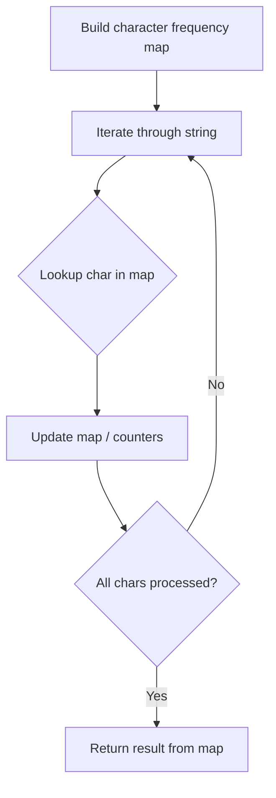

# Problem 299: Bulls and Cows

**Difficulty:** Medium  
**Tags:** Hash Table, String, Counting  
**Pattern:** Hash Map String Processing  
**Link:** [leetcode.com/problems/bulls-and-cows](https://leetcode.com/problems/bulls-and-cows/)

## Description

You are playing the **Bulls and Cows** game with your friend.

You write down a secret number and ask your friend to guess what the number is. When your friend makes a guess, you provide a hint with the following info:

	- The number of "bulls", which are digits in the guess that are in the correct position.
	- The number of "cows", which are digits in the guess that are in your secret number but are located in the wrong position. Specifically, the non-bull digits in the guess that could be rearranged such that they become bulls.

Given the secret number `secret` and your friend's guess `guess`, return *the hint for your friend's guess*.

The hint should be formatted as `"xAyB"`, where `x` is the number of bulls and `y` is the number of cows. Note that both `secret` and `guess` may contain duplicate digits.

 

Example 1:

```

**Input:** secret = "1807", guess = "7810"
**Output:** "1A3B"
**Explanation:** Bulls are connected with a '|' and cows are underlined:
"1807"
  |
"7810"
```

Example 2:

```

**Input:** secret = "1123", guess = "0111"
**Output:** "1A1B"
**Explanation:** Bulls are connected with a '|' and cows are underlined:
"1123"        "1123"
  |      or     |
"0111"        "0111"
Note that only one of the two unmatched 1s is counted as a cow since the non-bull digits can only be rearranged to allow one 1 to be a bull.

```

 

**Constraints:**

	- `1 <= secret.length, guess.length <= 1000`
	- `secret.length == guess.length`
	- `secret` and `guess` consist of digits only.

## Approach: Hash Map String Processing

Use a hash map to count character frequencies or map characters/strings for O(1) lookups. Process the string in one or two passes.

## Pseudocode

```
1. Build frequency map / char-to-index map
2. Iterate through string:
   a. Look up character in map
   b. Update counts or mappings
3. Return result based on map state
```

## Algorithm Flow



## Complexity Analysis

- **Time:** O(n)
- **Space:** O(n)

## Solution (Python3)

```python
class Solution:
    def getHint(self, secret: str, guess: str) -> str:
        # Hash map for string/character frequency - O(n) time
        freq = {}
        for ch in secret:
            freq[ch] = freq.get(ch, 0) + 1
        # Process frequency map
        for ch, cnt in freq.items():
            if cnt == 1:
                return secret.index(ch)
        return ""
```

## Solution (C++)

```cpp
#include <string>
#include <unordered_map>
#include <vector>
using namespace std;

class Solution {
public:
    string getHint(string& secret, string& guess) {
        // Hash map for string/character frequency - O(n) time
        unordered_map<char, int> freq;
        for (char ch : secret) {
            freq[ch]++;
        }
        // Process frequency map
        for (int i = 0; i < secret.size(); i++) {
            if (freq[secret[i]] == 1) return i;
        }
        return "";
    }
};
```
