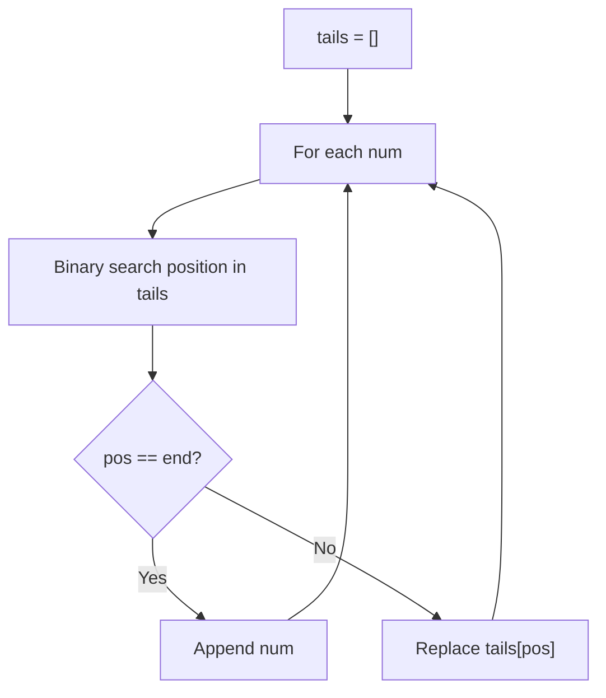
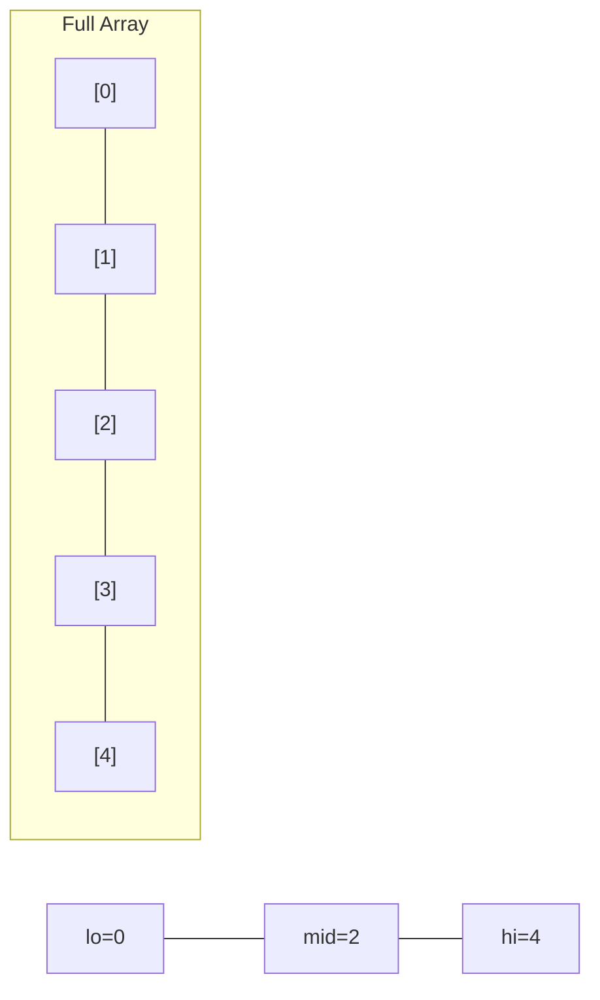
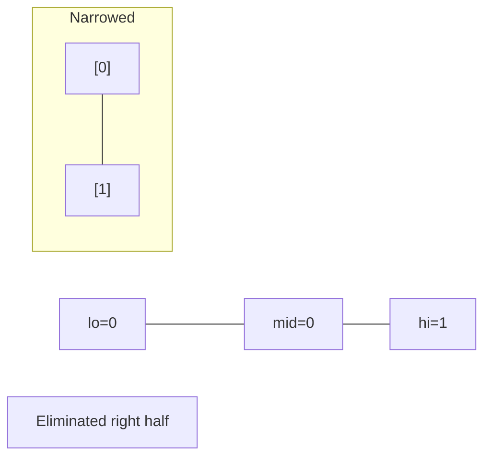
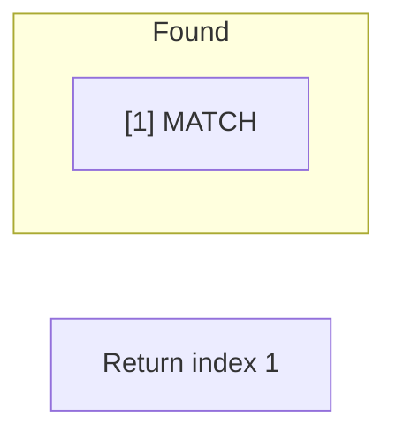

# Problem 300: Longest Increasing Subsequence

**Difficulty:** Medium  
**Tags:** Array, Binary Search, Dynamic Programming  
**Pattern:** Binary Search / DP  
**Link:** [leetcode.com/problems/longest-increasing-subsequence](https://leetcode.com/problems/longest-increasing-subsequence/)

## Description

Given an integer array `nums`, return *the length of the longest **strictly increasing ******subsequence***.

 

Example 1:

```

**Input:** nums = [10,9,2,5,3,7,101,18]
**Output:** 4
**Explanation:** The longest increasing subsequence is [2,3,7,101], therefore the length is 4.

```

Example 2:

```

**Input:** nums = [0,1,0,3,2,3]
**Output:** 4

```

Example 3:

```

**Input:** nums = [7,7,7,7,7,7,7]
**Output:** 1

```

 

**Constraints:**

	- `1 <= nums.length <= 2500`
	- `-10^4 <= nums[i] <= 10^4`

 

**Follow up:** Can you come up with an algorithm that runs in `O(n log(n))` time complexity?

## Approach: Binary Search / DP

**Patience Sorting:** Maintain tails array. Binary search for insertion point.

## Pseudocode

```
1. tails = []
2. For each num: binary search position in tails
   If pos == end: append
   Else: replace tails[pos]
3. Return len(tails)
```

## Algorithm Flow



## Visual State Transitions

**Binary Search Step-by-Step:**

**Frame 1: Initial search space**


**Frame 2: Compare mid, narrow search**


**Frame 3: Found target**



## Complexity Analysis

- **Time:** O(n log n)
- **Space:** O(n)

## Solution (Python3)

```python
class Solution:
    def lengthOfLIS(self, nums: list[int]) -> int:
        from bisect import bisect_left
        tails = []
        for num in nums:
            pos = bisect_left(tails, num)
            if pos == len(tails):
                tails.append(num)
            else:
                tails[pos] = num
        return len(tails)
```

## Solution (C++)

```cpp
#include <string>
#include <vector>
using namespace std;

class Solution {
public:
    int lengthOfLIS(vector<int>& nums) {
        // Binary search - O(log n) time, O(1) space
        int lo = 0, hi = nums.size() - 1;
        while (lo <= hi) {
            int mid = lo + (hi - lo) / 2;
            if (nums[mid] == nums) {
                return mid;
            } else if (nums[mid] < nums) {
                lo = mid + 1;
            } else {
                hi = mid - 1;
            }
        }
        return 0;
    }
};
```
