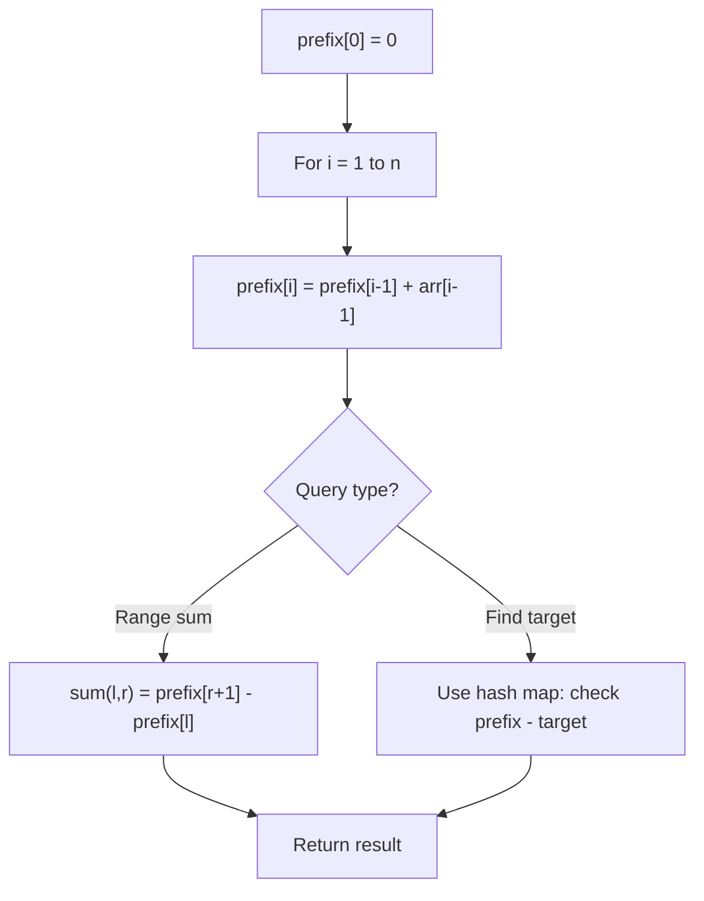

# Problem 303: Range Sum Query - Immutable

**Difficulty:** Easy  
**Tags:** Array, Design, Prefix Sum  
**Pattern:** Prefix Sum  
**Link:** [leetcode.com/problems/range-sum-query-immutable](https://leetcode.com/problems/range-sum-query-immutable/)

## Description

Given an integer array `nums`, handle multiple queries of the following type:

	- Calculate the **sum** of the elements of `nums` between indices `left` and `right` **inclusive** where `left <= right`.

Implement the `NumArray` class:

	- `NumArray(int[] nums)` Initializes the object with the integer array `nums`.
	- `int sumRange(int left, int right)` Returns the **sum** of the elements of `nums` between indices `left` and `right` **inclusive** (i.e. `nums[left] + nums[left + 1] + ... + nums[right]`).

 

Example 1:

```

**Input**
["NumArray", "sumRange", "sumRange", "sumRange"]
[[[-2, 0, 3, -5, 2, -1]], [0, 2], [2, 5], [0, 5]]
**Output**
[null, 1, -1, -3]

**Explanation**
NumArray numArray = new NumArray([-2, 0, 3, -5, 2, -1]);
numArray.sumRange(0, 2); // return (-2) + 0 + 3 = 1
numArray.sumRange(2, 5); // return 3 + (-5) + 2 + (-1) = -1
numArray.sumRange(0, 5); // return (-2) + 0 + 3 + (-5) + 2 + (-1) = -3

```

 

**Constraints:**

	- `1 <= nums.length <= 10^4`
	- `-10^5 <= nums[i] <= 10^5`
	- `0 <= left <= right < nums.length`
	- At most `10^4` calls will be made to `sumRange`.

## Approach: Prefix Sum

Build a prefix sum array where prefix[i] = sum of elements 0..i-1. Any subarray sum [l..r] = prefix[r+1] - prefix[l]. Combine with hash map for O(n) subarray sum queries.

## Pseudocode

```
1. Build prefix sum array: prefix[0]=0, prefix[i]=prefix[i-1]+arr[i-1]
2. Use prefix sums to answer queries:
   - Subarray sum [l..r] = prefix[r+1] - prefix[l]
   - Or use hash map to find prefix[j]-prefix[i] == target
3. Return result
```

## Algorithm Flow



## Complexity Analysis

- **Time:** O(n)
- **Space:** O(n)

## Solution (Python3)

```python
class NumArray:
    def __init__(self, nums: List[int]):
        # Initialize data structure
        self.nums = nums

    def sumRange(self, left: int, right: int) -> int:
        return 0

```

## Solution (C++)

```cpp
#include <algorithm>
#include <string>
#include <unordered_map>
#include <vector>
using namespace std;

class NumArray {
public:
    NumArray(vector<int>& nums) {
        // Initialize
    }

    int sumRange(int left, int right) {
        return 0;
    }

};
```
