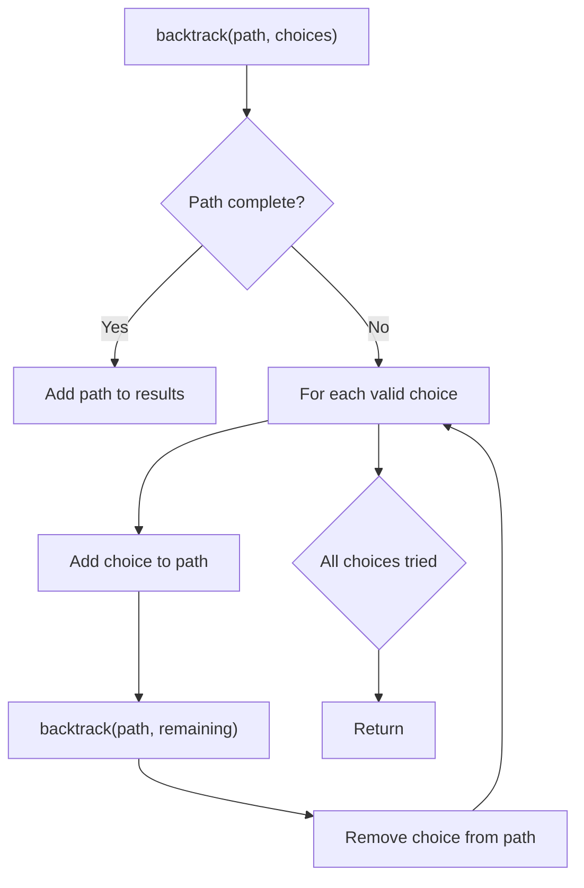
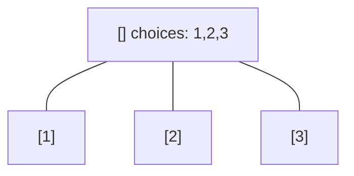
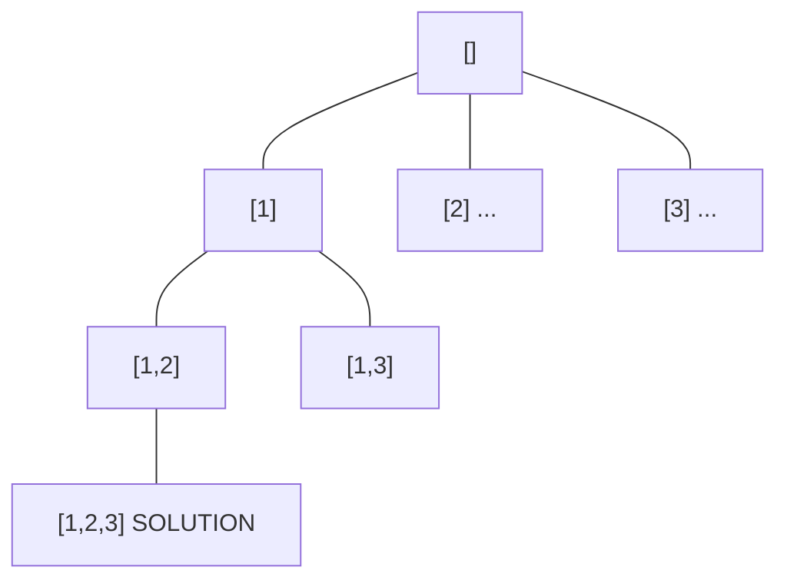
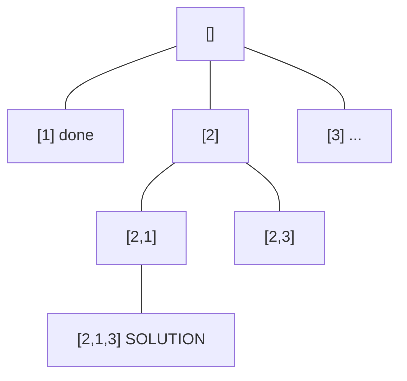
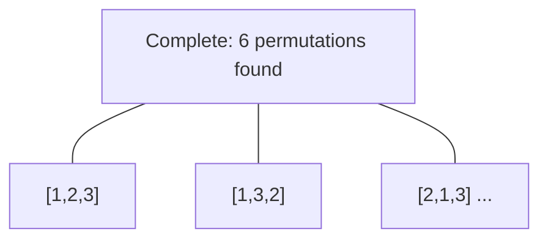

# Problem 306: Additive Number

**Difficulty:** Medium  
**Tags:** String, Backtracking  
**Pattern:** Backtracking  
**Link:** [leetcode.com/problems/additive-number](https://leetcode.com/problems/additive-number/)

## Description

An **additive number** is a string whose digits can form an **additive sequence**.

A valid **additive sequence** should contain **at least** three numbers. Except for the first two numbers, each subsequent number in the sequence must be the sum of the preceding two.

Given a string containing only digits, return `true` if it is an **additive number** or `false` otherwise.

**Note:** Numbers in the additive sequence **cannot** have leading zeros, so sequence `1, 2, 03` or `1, 02, 3` is invalid.

 

Example 1:

```

**Input:** "112358"
**Output:** true
**Explanation:** 
The digits can form an additive sequence: 1, 1, 2, 3, 5, 8. 
1 + 1 = 2, 1 + 2 = 3, 2 + 3 = 5, 3 + 5 = 8

```

Example 2:

```

**Input:** "199100199"
**Output:** true
**Explanation:** 
The additive sequence is: 1, 99, 100, 199. 
1 + 99 = 100, 99 + 100 = 199

```

 

**Constraints:**

	- `1 <= num.length <= 35`
	- `num` consists only of digits.

 

**Follow up:** How would you handle overflow for very large input integers?

## Approach: Backtracking

Explore all possible solutions by building candidates incrementally. At each step, make a choice and recurse. If the choice leads to a dead end, undo the choice (backtrack) and try the next option.

## Pseudocode

```
1. Define backtrack(path, choices):
   a. If path is a complete solution: add to results
   b. For each choice in choices:
      - If choice is valid:
        * Add choice to path
        * backtrack(path, remaining_choices)
        * Remove choice from path (backtrack)
2. Call backtrack([], all_choices)
```

## Algorithm Flow



## Visual State Transitions

**Backtracking Decision Tree:**

**Frame 1: Root - start with empty path**


**Frame 2: Explore branch [1]**


**Frame 3: Backtrack, explore [2]**


**Frame 4: All solutions found**



## Complexity Analysis

- **Time:** O(k^n) or O(n!)
- **Space:** O(n)

## Solution (Python3)

```python
class Solution:
    def isAdditiveNumber(self, num: str) -> bool:
        # Backtracking - O(2^n) or O(n!) time
        result = []
        
        def backtrack(path, start):
            result.append(path[:])
            for i in range(start, len(num)):
                path.append(num[i])
                backtrack(path, i + 1)
                path.pop()
        
        backtrack([], 0)
        return result
```

## Solution (C++)

```cpp
#include <functional>
#include <string>
#include <vector>
using namespace std;

class Solution {
public:
    bool isAdditiveNumber(string& num) {
        // Backtracking - O(2^n) or O(n!) time
        vector<vector<int>> result;
        vector<int> path;
        function<void(int)> backtrack = [&](int start) {
            result.push_back(path);
            for (int i = start; i < (int)num.size(); i++) {
                path.push_back(num[i]);
                backtrack(i + 1);
                path.pop_back();
            }
        };
        backtrack(0);
        return result;
    }
};
```
