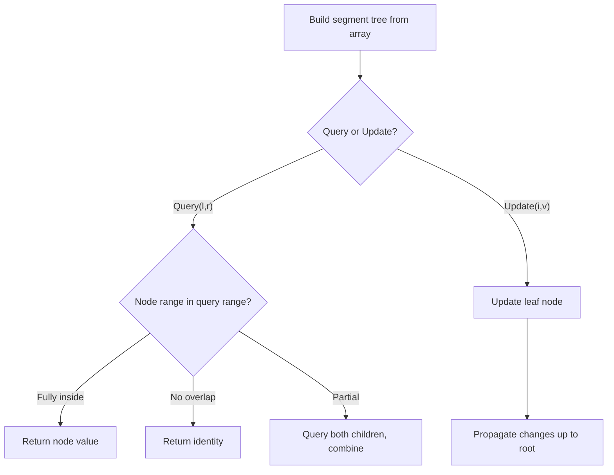

# Problem 307: Range Sum Query - Mutable

**Difficulty:** Medium  
**Tags:** Array, Divide and Conquer, Design, Binary Indexed Tree, Segment Tree  
**Pattern:** Segment Tree  
**Link:** [leetcode.com/problems/range-sum-query-mutable](https://leetcode.com/problems/range-sum-query-mutable/)

## Description

Given an integer array `nums`, handle multiple queries of the following types:

	- **Update** the value of an element in `nums`.
	- Calculate the **sum** of the elements of `nums` between indices `left` and `right` **inclusive** where `left <= right`.

Implement the `NumArray` class:

	- `NumArray(int[] nums)` Initializes the object with the integer array `nums`.
	- `void update(int index, int val)` **Updates** the value of `nums[index]` to be `val`.
	- `int sumRange(int left, int right)` Returns the **sum** of the elements of `nums` between indices `left` and `right` **inclusive** (i.e. `nums[left] + nums[left + 1] + ... + nums[right]`).

 

Example 1:

```

**Input**
["NumArray", "sumRange", "update", "sumRange"]
[[[1, 3, 5]], [0, 2], [1, 2], [0, 2]]
**Output**
[null, 9, null, 8]

**Explanation**
NumArray numArray = new NumArray([1, 3, 5]);
numArray.sumRange(0, 2); // return 1 + 3 + 5 = 9
numArray.update(1, 2);   // nums = [1, 2, 5]
numArray.sumRange(0, 2); // return 1 + 2 + 5 = 8

```

 

**Constraints:**

	- `1 <= nums.length <= 3 * 10^4`
	- `-100 <= nums[i] <= 100`
	- `0 <= index < nums.length`
	- `-100 <= val <= 100`
	- `0 <= left <= right < nums.length`
	- At most `3 * 10^4` calls will be made to `update` and `sumRange`.

## Approach: Segment Tree

Build a segment tree for range queries (sum, min, max) with point or range updates. Each node covers a range; queries are answered by combining relevant segments.

## Pseudocode

```
1. Build segment tree from array (O(n))
2. Query(l, r):
   - If node range within [l,r]: return node value
   - If no overlap: return identity
   - Else: combine query(left_child) and query(right_child)
3. Update(i, val): update leaf and propagate up
```

## Algorithm Flow



## Complexity Analysis

- **Time:** O(n log n) build, O(log n) query/update
- **Space:** O(n)

## Solution (Python3)

```python
class NumArray:
    def __init__(self, nums: List[int]):
        # Initialize data structure
        self.nums = nums

    def update(self, index: int, val: int) -> None:
        return None

    def sumRange(self, left: int, right: int) -> int:
        return 0

```

## Solution (C++)

```cpp
#include <functional>
#include <string>
#include <vector>
using namespace std;

class NumArray {
public:
    NumArray(vector<int>& nums) {
        // Initialize
    }

    void update(int index, int val) {
        return ;
    }

    int sumRange(int left, int right) {
        return 0;
    }

};
```
