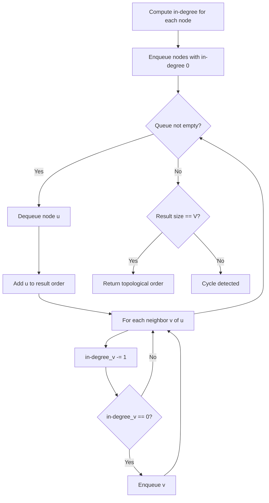
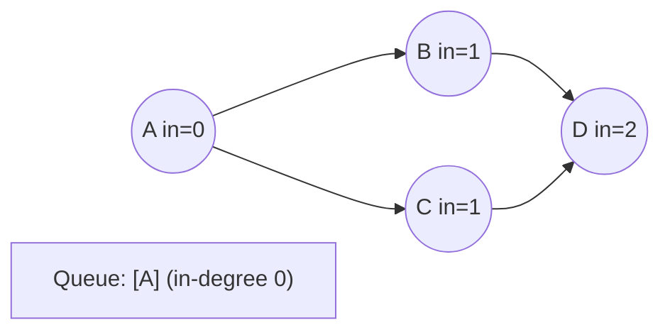
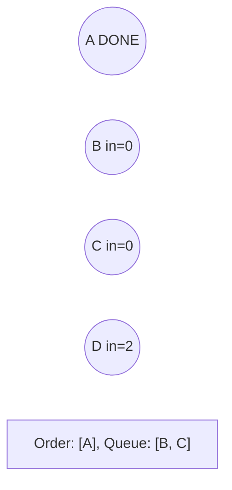
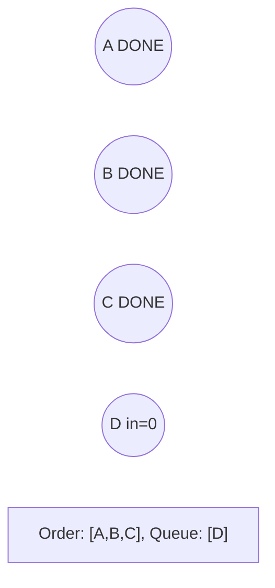
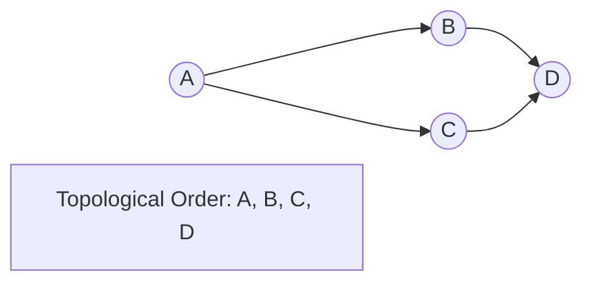

# Problem 310: Minimum Height Trees

**Difficulty:** Medium  
**Tags:** Depth-First Search, Breadth-First Search, Graph Theory, Topological Sort  
**Pattern:** Topological Sort  
**Link:** [leetcode.com/problems/minimum-height-trees](https://leetcode.com/problems/minimum-height-trees/)

## Description

A tree is an undirected graph in which any two vertices are connected by *exactly* one path. In other words, any connected graph without simple cycles is a tree.

Given a tree of `n` nodes labelled from `0` to `n - 1`, and an array of `n - 1` `edges` where `edges[i] = [ai, bi]` indicates that there is an undirected edge between the two nodes `ai` and `bi` in the tree, you can choose any node of the tree as the root. When you select a node `x` as the root, the result tree has height `h`. Among all possible rooted trees, those with minimum height (i.e. `min(h)`)  are called **minimum height trees** (MHTs).

Return *a list of all **MHTs'** root labels*. You can return the answer in **any order**.

The **height** of a rooted tree is the number of edges on the longest downward path between the root and a leaf.

 

Example 1:

```

**Input:** n = 4, edges = [[1,0],[1,2],[1,3]]
**Output:** [1]
**Explanation:** As shown, the height of the tree is 1 when the root is the node with label 1 which is the only MHT.

```

Example 2:

```

**Input:** n = 6, edges = [[3,0],[3,1],[3,2],[3,4],[5,4]]
**Output:** [3,4]

```

 

**Constraints:**

	- `1 <= n <= 2 * 10^4`
	- `edges.length == n - 1`
	- `0 <= ai, bi < n`
	- `ai != bi`
	- All the pairs `(ai, bi)` are distinct.
	- The given input is **guaranteed** to be a tree and there will be **no repeated** edges.

## Approach: Topological Sort

Order nodes in a DAG so every edge u->v has u before v. Use Kahn's algorithm (BFS with in-degree tracking) or DFS-based ordering.

## Pseudocode

```
1. Compute in-degree for every node
2. Enqueue all nodes with in-degree 0
3. While queue not empty:
   a. Dequeue node u, add to result order
   b. For each neighbor v of u:
      - Decrease in-degree of v
      - If in-degree becomes 0: enqueue v
4. If result size != V: cycle exists
5. Return topological order
```

## Algorithm Flow



## Visual State Transitions

**Topological Sort (Kahn's Algorithm):**

**Frame 1: Compute in-degrees**


**Frame 2: Process A, reduce neighbors**


**Frame 3: Process B and C**


**Frame 4: Complete**



## Complexity Analysis

- **Time:** O(V + E)
- **Space:** O(V + E)

## Solution (Python3)

```python
class Solution:
    def findMinHeightTrees(self, n: int, edges: List[List[int]]) -> List[int]:
        # Topological sort (Kahn's algorithm) - O(V+E)
        from collections import deque, defaultdict
        graph = defaultdict(list)
        n = n if isinstance(n, int) else len(n)
        indegree = [0] * n
        # Build graph from prerequisites
        prereqs = edges if isinstance(edges, list) else n
        for edge in prereqs:
            if isinstance(edge, (list, tuple)) and len(edge) >= 2:
                graph[edge[1]].append(edge[0])
                indegree[edge[0]] += 1
        queue = deque([i for i in range(n) if indegree[i] == 0])
        order = []
        while queue:
            node = queue.popleft()
            order.append(node)
            for neighbor in graph[node]:
                indegree[neighbor] -= 1
                if indegree[neighbor] == 0:
                    queue.append(neighbor)
        return len(order) == n if isinstance([], bool) else order
```

## Solution (C++)

```cpp
#include <queue>
#include <string>
#include <vector>
using namespace std;

class Solution {
public:
    vector<int> findMinHeightTrees(int n, vector<vector<int>>& edges) {
        // Topological sort (Kahn's) - O(V+E)
        int n = n;
        vector<vector<int>> graph(n);
        vector<int> indegree(n, 0);
        for (auto& edge : edges) {
            graph[edge[1]].push_back(edge[0]);
            indegree[edge[0]]++;
        }
        queue<int> q;
        for (int i = 0; i < n; i++)
            if (indegree[i] == 0) q.push(i);
        vector<int> order;
        while (!q.empty()) {
            int node = q.front(); q.pop();
            order.push_back(node);
            for (int neighbor : graph[node]) {
                if (--indegree[neighbor] == 0) q.push(neighbor);
            }
        }
        return order.size() == n;
    }
};
```
