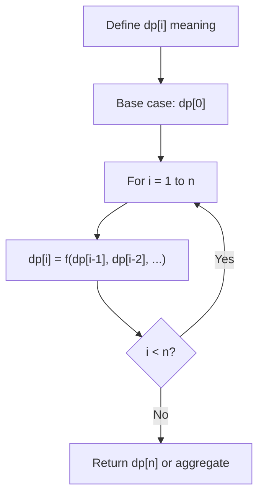
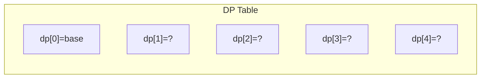
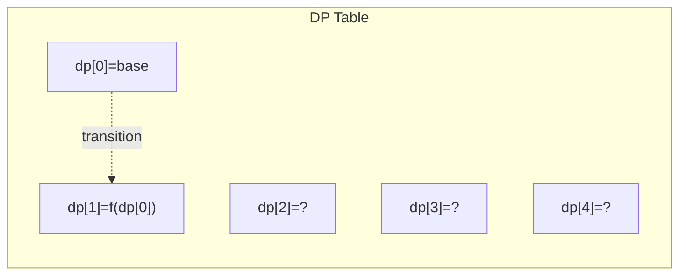
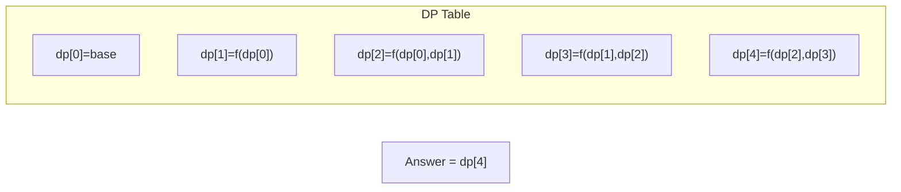

# Problem 312: Burst Balloons

**Difficulty:** Hard  
**Tags:** Array, Dynamic Programming  
**Pattern:** Dynamic Programming (1D)  
**Link:** [leetcode.com/problems/burst-balloons](https://leetcode.com/problems/burst-balloons/)

## Description

You are given `n` balloons, indexed from `0` to `n - 1`. Each balloon is painted with a number on it represented by an array `nums`. You are asked to burst all the balloons.

If you burst the `i^th` balloon, you will get `nums[i - 1] * nums[i] * nums[i + 1]` coins. If `i - 1` or `i + 1` goes out of bounds of the array, then treat it as if there is a balloon with a `1` painted on it.

Return *the maximum coins you can collect by bursting the balloons wisely*.

 

Example 1:

```

**Input:** nums = [3,1,5,8]
**Output:** 167
**Explanation:**
nums = [3,1,5,8] --> [3,5,8] --> [3,8] --> [8] --> []
coins =  3*1*5    +   3*5*8   +  1*3*8  + 1*8*1 = 167
```

Example 2:

```

**Input:** nums = [1,5]
**Output:** 10

```

 

**Constraints:**

	- `n == nums.length`
	- `1 <= n <= 300`
	- `0 <= nums[i] <= 100`

## Approach: Dynamic Programming (1D)

Break the problem into overlapping subproblems. Define dp[i] as the optimal value for the subproblem ending at or considering index i. Build the solution bottom-up, using previously computed dp values.

## Pseudocode

```
1. Define dp[i] = optimal value for subproblem i
2. Base case: dp[0] = initial value
3. For i from 1 to n:
   a. dp[i] = recurrence(dp[i-1], dp[i-2], ...)
4. Return dp[n] or max/min of dp
```

## Algorithm Flow



## Visual State Transitions

**1D Dynamic Programming Table Build:**

**Frame 1: Initialize base cases**


**Frame 2: Fill dp[1] from dp[0]**


**Frame 3: Fill remaining cells**



## Complexity Analysis

- **Time:** O(n)
- **Space:** O(n)

## Solution (Python3)

```python
class Solution:
    def maxCoins(self, nums: List[int]) -> int:
        # Dynamic programming (1D) - O(n) time, O(n) space
        if not nums:
            return 0
        n = len(nums) if isinstance(nums, list) else nums
        dp = [0] * (n + 1)
        dp[0] = 1  # base case
        for i in range(1, n + 1):
            dp[i] = dp[i-1]  # transition (customize per problem)
            if i >= 2:
                dp[i] += dp[i-2]
        return dp[n]
```

## Solution (C++)

```cpp
#include <string>
#include <vector>
using namespace std;

class Solution {
public:
    int maxCoins(vector<int>& nums) {
        // Dynamic programming (1D) - O(n) time, O(n) space
        int n = nums;
        if (n <= 0) return 0;
        vector<int> dp(n + 1, 0);
        dp[0] = 1;
        for (int i = 1; i <= n; i++) {
            dp[i] = dp[i-1];
            if (i >= 2) dp[i] += dp[i-2];
        }
        return dp[n];
    }
};
```
