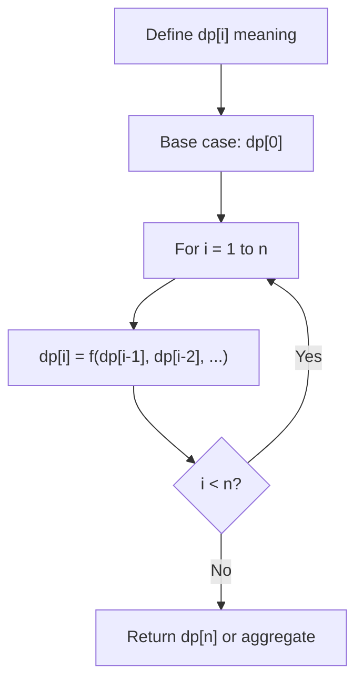
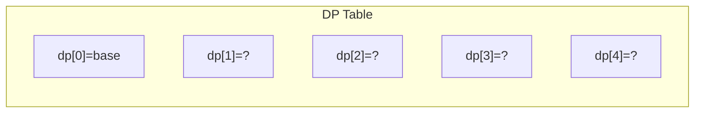
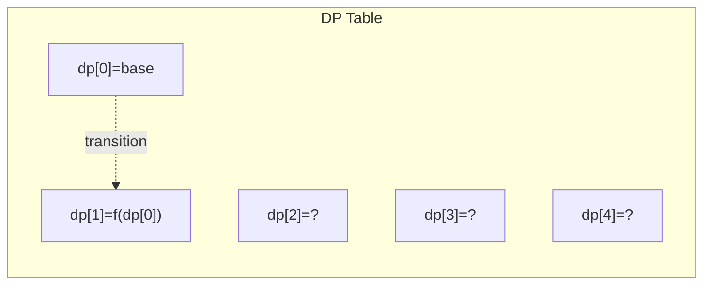
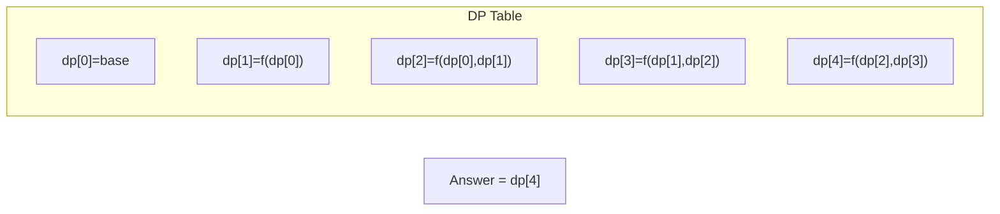

# Problem 313: Super Ugly Number

**Difficulty:** Medium  
**Tags:** Array, Math, Dynamic Programming  
**Pattern:** Dynamic Programming (1D)  
**Link:** [leetcode.com/problems/super-ugly-number](https://leetcode.com/problems/super-ugly-number/)

## Description

A **super ugly number** is a positive integer whose prime factors are in the array `primes`.

Given an integer `n` and an array of integers `primes`, return *the* `n^th` ***super ugly number***.

The `n^th` **super ugly number** is **guaranteed** to fit in a **32-bit** signed integer.

 

Example 1:

```

**Input:** n = 12, primes = [2,7,13,19]
**Output:** 32
**Explanation:** [1,2,4,7,8,13,14,16,19,26,28,32] is the sequence of the first 12 super ugly numbers given primes = [2,7,13,19].

```

Example 2:

```

**Input:** n = 1, primes = [2,3,5]
**Output:** 1
**Explanation:** 1 has no prime factors, therefore all of its prime factors are in the array primes = [2,3,5].

```

 

**Constraints:**

	- `1 <= n <= 10^5`
	- `1 <= primes.length <= 100`
	- `2 <= primes[i] <= 1000`
	- `primes[i]` is **guaranteed** to be a prime number.
	- All the values of `primes` are **unique** and sorted in **ascending order**.

## Approach: Dynamic Programming (1D)

Break the problem into overlapping subproblems. Define dp[i] as the optimal value for the subproblem ending at or considering index i. Build the solution bottom-up, using previously computed dp values.

## Pseudocode

```
1. Define dp[i] = optimal value for subproblem i
2. Base case: dp[0] = initial value
3. For i from 1 to n:
   a. dp[i] = recurrence(dp[i-1], dp[i-2], ...)
4. Return dp[n] or max/min of dp
```

## Algorithm Flow



## Visual State Transitions

**1D Dynamic Programming Table Build:**

**Frame 1: Initialize base cases**


**Frame 2: Fill dp[1] from dp[0]**


**Frame 3: Fill remaining cells**



## Complexity Analysis

- **Time:** O(n)
- **Space:** O(n)

## Solution (Python3)

```python
class Solution:
    def nthSuperUglyNumber(self, n: int, primes: List[int]) -> int:
        # Dynamic programming (1D) - O(n) time, O(n) space
        if not n:
            return 0
        n = len(n) if isinstance(n, list) else n
        dp = [0] * (n + 1)
        dp[0] = 1  # base case
        for i in range(1, n + 1):
            dp[i] = dp[i-1]  # transition (customize per problem)
            if i >= 2:
                dp[i] += dp[i-2]
        return dp[n]
```

## Solution (C++)

```cpp
#include <string>
#include <vector>
using namespace std;

class Solution {
public:
    int nthSuperUglyNumber(int n, vector<int>& primes) {
        // Dynamic programming (1D) - O(n) time, O(n) space
        int n = n;
        if (n <= 0) return 0;
        vector<int> dp(n + 1, 0);
        dp[0] = 1;
        for (int i = 1; i <= n; i++) {
            dp[i] = dp[i-1];
            if (i >= 2) dp[i] += dp[i-2];
        }
        return dp[n];
    }
};
```
